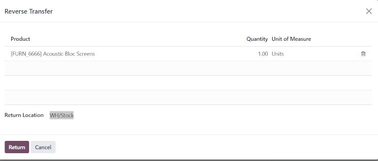
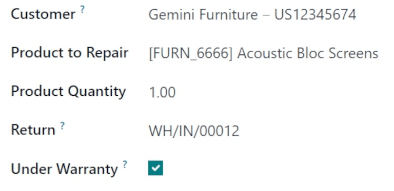
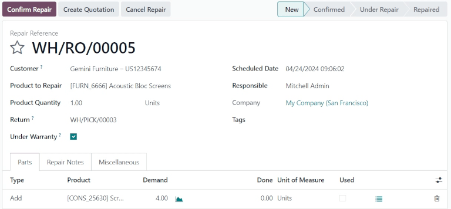
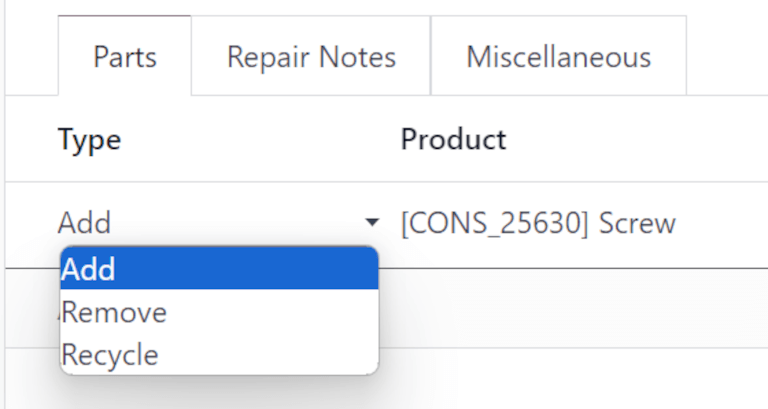
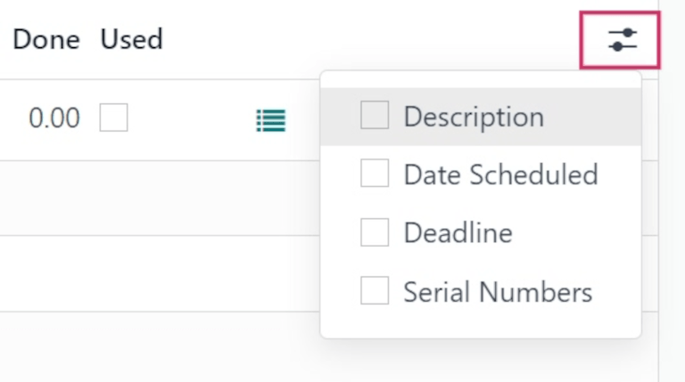
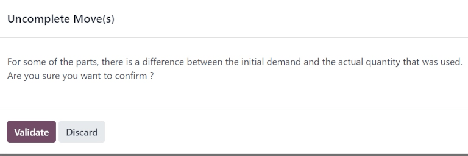
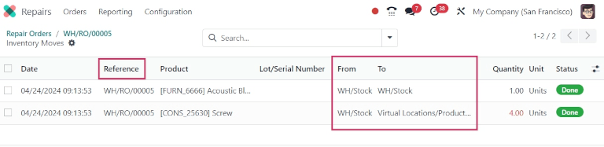
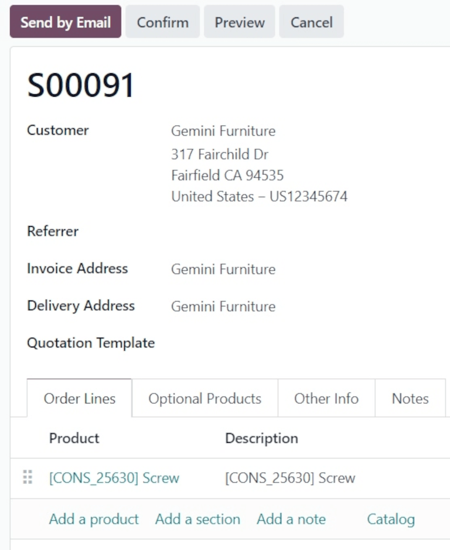

# Process repair orders

Sometimes, products delivered to customers can break or be damaged in transit, and need to be
returned for a refund, delivery of a replacement product, or repairs.

In Odoo, repairs for products returned by customers can be tracked in the *Repairs* app. Once
repaired, products can be redelivered to the customer.

The return and repair process for damaged products typically follows the below steps:

1. [Process return order for damaged product](#repairs-repair-orders-return-order)
2. [Create repair order for returned product](#repairs-repair-orders-repair)
3. [Return repaired product to customer](#repairs-repair-orders-return-customer)

## Return order

Returns can be processed in Odoo via *reverse transfers*, created directly from a sales order (SO)
once products have been delivered to a customer.

To create a return, navigate to the Sales app, and click into an  from which a
product should be returned. Then, from the  form, click the Delivery smart button.
Doing so opens the delivery order (DO) form.

From this form, click Return. This opens a Reverse Transfer pop-up window.

This pop-up lists the Product included in the order, the Quantity delivered
to the customer, and the Unit of Measure the product was in.

Click the value in the Quantity field to change the quantity of the product to be
returned, if necessary.

Click the 🗑️ (trash) icon at the far-right of the product line to remove it from the
return, if necessary.

Once ready, click Return to confirm the return. This creates a new receipt for the
returned products.

Once the product has been returned to the warehouse, receipt of the return can be registered in the
database by clicking Validate from the reverse transfer form.

## Create repair order

Once products have been returned, their repairs can be tracked by creating a repair order (RO).

To create a new , navigate to Repairs app, and click New. This
opens a blank  form.

On this form, begin by selecting a Customer. The customer selected should be for whom
the order will be invoiced and delivered.

In the Product to Repair field, click the drop-down menu to select the product that
needs repair. If necessary, click Search More... to open a Search: Product to
Repair pop-up window, and browse all products in the database.

Once a Product to Repair is selected, a new Product Quantity field appears
below it. In that field, enter the quantity (in a `0.00` format) of the product that requires
repair.

To the right of that value, click the drop-down list to select the unit of measure (UoM) for the
product.

In the Return field, click the drop-down menu and select the return order from which the
product to be repaired comes from.

Tick the Under Warranty checkbox, if the product being repaired is covered by a
warranty. If ticked, the Customer is not charged for all the parts used in the repair
order.

In the Scheduled Date field, click the date to reveal a calendar popover window. From
this calendar, select a date for the repair, and click Apply.

In the Responsible field, click the drop-down menu and select the user who should be
responsible for the repair.

In the Company field, if in a multi-company environment, select which company this 
belongs to.

In the Tags field, click the drop-down menu and select which tags should be applied to
this .

### Parts tab

Add, remove, or recycle parts in the Parts tab. To do so, click Add a line
at the bottom of the form.

In the Type column, click the box to reveal three options to choose from:
Add (selected by default), Remove, and Recycle.

Choosing Add adds this part to the . Adding parts lists components for use in the
repair. If the components are used, the user completing the repair can record they were used. If
they were not used, the user can indicate that, too, and the components can be saved for another
use.

Choosing Remove removes this part from the . Removing parts lists components that
should be removed from the product being repaired during the repair process. If the parts are
removed, the user completing the repair can indicate they were removed.

Choosing Recycle recycles this part from the , designating it for later use or to be
repurposed for another use in the warehouse.

In the Product column, select which product (part) should be added, removed, or
recycled. In the Demand column, change the quantity, if necessary, to indicate what
quantity of this part should be used in the repair process.

In the Done column, change the value (in a `0.00` format) once the part has been
successfully added, removed, or recycled.

In the Unit of Measure column, select the  for the part.

Finally, in the Used column, tick the checkbox once the part has been used in the repair
process.

To add additional columns to the line, click the (optional columns drop-down) icon, at
the far-right of the header row. Select the desired options to add to the line.

### Repair Notes and Miscellaneous tabs

Click the Repair Notes tab to add internal notes about this specific , and anything
the user performing the repair might need to know.

Click the blank text field to begin writing notes.

Click the Miscellaneous tab to see the Operation Type for this repair. By
default, this is set to YourCompany: Repairs, indicating this is a repair type
operation.

Once all desired configurations have been made on the  form, click Confirm Repair.
This moves the  to the Confirmed stage, and reserves the necessary components needed
for the repair.

A new Forecasted column appears on the product lines under the Parts tab,
displaying the availability of all components needed for the repair.

Once ready, click Start Repair. This moves the  to the Under Repair
stage (in the upper-right corner). If the  should be canceled, click Cancel Repair.

Once all products have been successfully repaired, the  is completed. To register this in the
database, click End Repair.

#### NOTE
If all parts added to the  were not used, clicking End Repair causes an
Uncomplete Move(s) pop-up window to appear.

The pop-up window informs the user that there is a difference between the initial demand and the
actual quantity used for the order.

If the Used quantity should be changed, click Discard or close the pop-up
window. If the order should be confirmed, click Validate.

This moves the  to the Repaired stage. A Product Moves smart button also
appears above the form.

Click the Product Moves smart button to view the product's moves history during and
after the repair process.

### Return product to customer

#### Product is under warranty

Once the product has been successfully repaired, it can be returned to the customer.

#### Product is not under warranty

If the product is not under warranty, or should the customer bear the repair costs, click
Create Quotation. This opens a new  form, pre-populated with the parts used in the
, with the total cost of the repair calculated.

If this  should be sent to the customer, click Confirm, and proceed to invoice the
customer for the repair.

To return the product to the customer, navigate to the Sales app, and select the
original  from which the initial return was processed. Then, click the Delivery
smart button.

From the resulting list of operations, click the reverse transfer, indicated by the
Source Document, which should read `Return of WH/OUT/XXXXX`.

This opens the return form. At the top of this form, a Repair Orders smart button now
appears, linking this return to the completed .

Click Return at the top of the form. This opens a Reverse Transfer pop-up
window.

This pop-up lists the Product included in the order, the Quantity delivered
to the customer, and the Unit of Measure the product was in.

Click the value in the Quantity field to change the quantity of the product to be
returned, if necessary.

Click the 🗑️ (trash) icon at the far-right of the product line to remove it from the
return, if necessary.

Once ready, click Return to confirm the return. This creates a new delivery for the
returned products.

When the delivery has been processed and the product has been returned to the customer, click
Validate to validate the delivery.

#### SEE ALSO
[Returns and refunds](../../sales/sales/products_prices/returns.md)
