# Email Marketing

The Odoo *Email Marketing* app provides drag-and-drop design tools, pre-built templates, and other
interactive features to create engaging email campaigns. The *Email Marketing* app also provides|
detailed reporting metrics to track the campaigns' overall effectiveness.

#### SEE ALSO
[Odoo Tutorial: Email Marketing](https://www.odoo.com/slides/slide/email-marketing-essentials-989?fullscreen=1)

## Email marketing dashboard

After installing the application, click the Email Marketing app icon from the main
Odoo dashboard. Doing so reveals the main Mailings dashboard in the default list view.

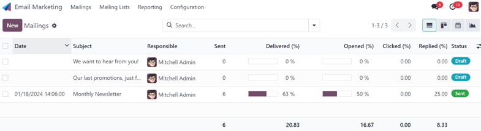

In the search bar, the default filter of My Mailings is present to show all the mailings
related to the current user. To remove that filter, click the ✖️ (remove) icon next to
the filter in the search bar. Doing so reveals all the mailings in the database.

The information on the Mailings dashboard has four different view options, located in
the upper-right corner as individual icons.

The view options, from left-to-right, are:

- [List](#email-marketing-list-view) (default view)
- [Kanban](#email-marketing-kanban-view)
- [Lịch](#email-marketing-calendar-view)
- [Biểu đồ](#email-marketing-graph-view)

### Xem danh sách

The list view, represented by the ☰ (horizontal lines) icon in the upper-right corner,
is the default view of the Mailings dashboard in the Email Marketing app.

While in list view, there are columns dedicated to different aspects of information related to the
listed emails. Those columns are as follows:

- Date: the date the email was sent.
- Subject: the subject of the email.
- Responsible: the user who created the email, or the user who has been assigned to the
  email.
- Sent: how many times the email has been sent.
- Delivered (%): percentage of sent emails that have been successfully delivered.
- Opened (%): percentage of sent emails that have been opened by the recipients.
- Clicked (%): percentage of sent emails that have been clicked by the recipients.
- Replied (%): percentage of sent emails that have been replied to by the recipients.
- Status: the status of the email (Draft, In Queue, or
  Sent).

To add or remove columns, click the Additional Options (two horizontal lines with dots)
icon, located to the far-right of the column titles in list view. Doing so reveals a drop-down menu
of additional column options.

### Chế độ xem kanban

The Kanban view, represented by the (inverted bar graph) icon, can be accessed in the
upper-right corner of the Mailings dashboard in the Email Marketing app.

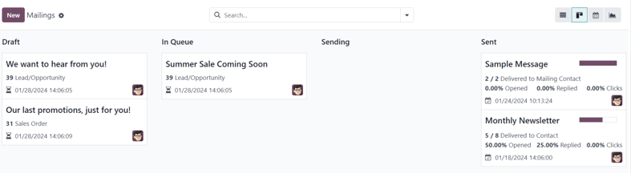

While in Kanban view, the email information is displayed in the various stages.

The stages are: Draft, In Queue, Sending, and Sent.

- Draft: the email is still being written/created.
- In Queue: the email is scheduled to be sent at a later date.
- Sending: the email is currently being sent to its recipients.
- Sent: the email has already been sent to its recipients.

In each stage, there are drag-and-drop cards representing the emails that have been created/sent,
and the stage they are in represents the current status of that mailing.

Each card on the Mailings dashboard provides key information related to that specific
email.

When the cursor hovers over the upper-right corner of an email campaign card, a ⋮ (three
vertical dots) icon appears. When clicked, a mini drop-down menu reveals the option to color-code
the email, Delete the email, or Archive the message for potential future
use.

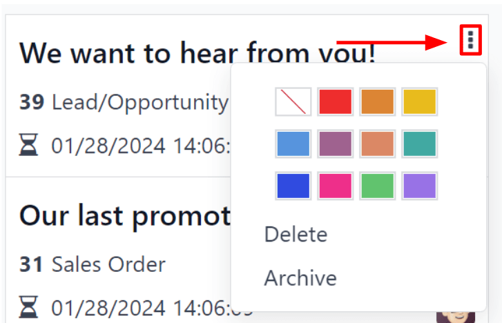

### Chế độ xem lịch

The calendar view, represented by a 📆 (calendar) icon, can be accessed in the
upper-right corner of the Mailings dashboard in the Email Marketing app.

While in calendar view, a monthly calendar (by default), shows when the mailings have been sent or
are scheduled to be sent.

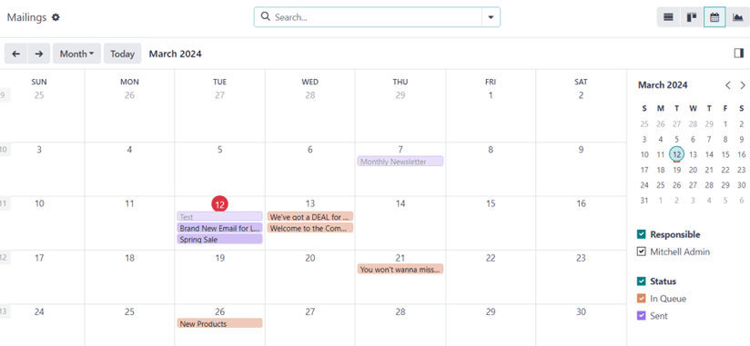

The current date is represented by a 🔴 (red circle) icon over the date on the calendar.

To the right of the calendar, the options to filter the results by Responsible and/or
Status are available, via checkboxes.

In the top-left corner, above the calendar, the option to change the time period being displayed is
available via a drop-down menu, which shows Month, by default. When clicked, the
drop-down menu that appears reveals the options: Day, Week,
Month (default), Year, and Show weekends (selected by default).

Clicking any of those options changes the calendar display to reflect that desired amount of time.

Clicking either ⬅️ (left arrow) icon or ➡️ (right arrow) icon changes the
calendar to a previous or future time, depending on what is clicked, based on the chosen amount of
time being represented.

To jump back to the current date, click the Today button.

### Chế độ xem biểu đồ

The graph view, represented by a (line graph) icon, can be accessed in the upper-right
corner of the Mailings dashboard in the Email Marketing app.

While in graph view, the status of the emails on the Mailings page is represented in a
bar graph, but other graph view options can be implemented, if needed.

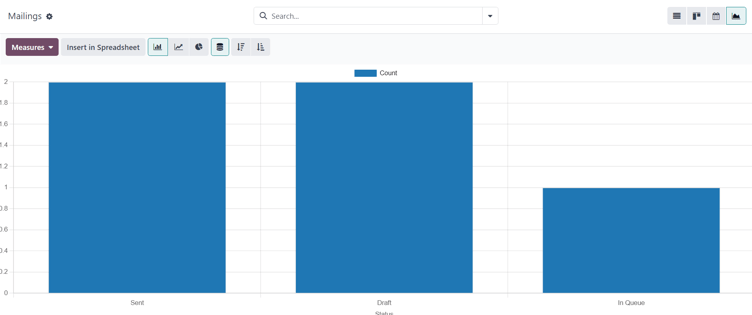

In the upper-left corner, above the graph, there is a Measures drop-down menu. When
clicked, different filter options become available to further customize the graph views.

Those Measures options are: A/B Testing percentage and Count
(default).

To the right of the Measures drop-down menu is an Insert in Spreadsheet
button, if the *Documents* application is installed. When clicked, a pop-up window appears, in which
the ability to add the graph to a spreadsheet or dashboard becomes available.

Beside the Measures drop-down menu and Insert in Spreadsheet button are
different graph view options. From left-to-right, those graph view options are: (bar
chart) (default), (line chart), and (pie chart).

#### NOTE
Each graph view option provides its own series of additional view options, which appear to the
right of the selected graph view option.

### Search options

Regardless of the view chosen for the Mailings dashboard in the Email
Marketing app, the Filters, Group by, and Favorites options are
always available to further customize the information being displayed.

To access those options, click the (downward arrow) icon, located to the right of the
search bar. Doing so reveals a drop-down mega menu featuring those filtering and grouping options.

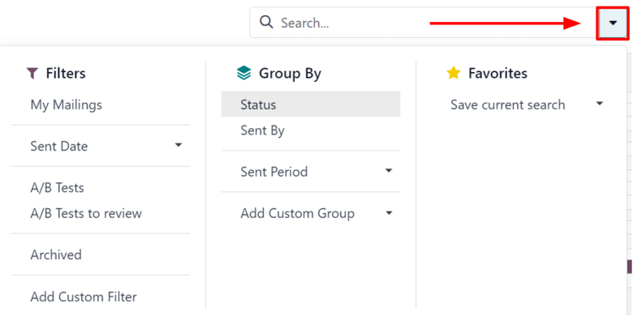

These options provide various ways to specify and organize the information seen on the
Mailings dashboard.

Bộ lọc

This section of the drop-down mega menu provides different ways to filter email results being
shown on the Mailings dashboard in the Email Marketing app.

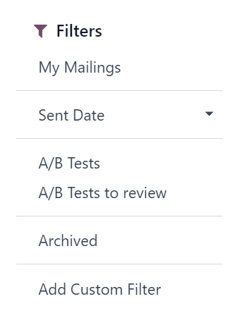

The options are: My Mailings, Sent Date, A/B Tests,
A/B Tests to review, Archived, and Add Custom Filter.

If Add Custom Filter is selected, Odoo reveals a pop-up window, with three
customizable fields to fill in, in order to create custom filter rules for Odoo to use to
retrieve results that fit more specific criteria.

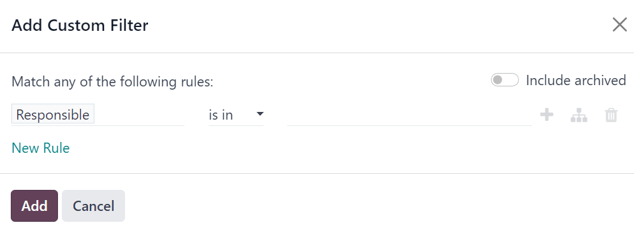

Nhóm theo

This section of the drop-down mega menu provides different ways to group email results being
shown on the Mailings dashboard in the Email Marketing app.

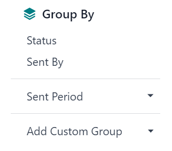

Using this section, the data can be grouped by the messages' Status, or who it was
Sent By.

There is also the option to group the data by Sent Period, which has its own
sub-menu of options to choose from. The Sent Period options are Year,
Quarter, Month, Week, and Day.

If none of the above Group By options deliver the desired results, click
Add Custom Group at the bottom of the Group By section. Doing so
reveals a drop-down menu, wherein custom criteria can be selected and applied, thus delivering
any grouping of data that may be desired.

Yêu thích

This section provides the opportunity to save custom filters and/or groupings for future use.
To utilize this section, click the Save current search field, which reveals
additional fields.

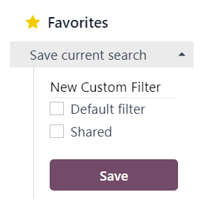

Give the favorited filter/grouping a title on the blank line above the checkboxes for
Default filter and Shared.

Ticking the box for Default filter makes this favorited filter/grouping the
default option. Ticking the box for Shared allows other users to see and use this
favorited filter/grouping.

When all desired options are configured, click Save to save the filter/grouping in
the Favorites section of the mega drop-down menu.

## Cài đặt

To view and modify the *Email Marketing* settings, navigate to Email Marketing app
‣ Configuration ‣ Settings.

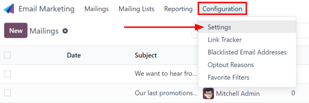

On the Settings page, there are four features available.

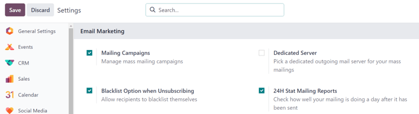

The features are:

- Mailing Campaigns: enables the option to manage mass mailing campaigns.
- Blacklist Option when Unsubscribing: allows recipients to blacklist themselves from
  future mailings during the unsubscribing process.
- Dedicated Server: provides the option to utilize a separate, dedicated server for
  mailings. When enabled, Odoo reveals a new field (and link), in which the specific server
  configurations must be entered, in order for it to connect properly to Odoo.
- 24H Stat Mailing Reports: allows users to check how well mailings have performed a day
  after it has been sent.

## Create an email

To create an email, open the Email Marketing application, and click the
New button in the upper-left corner of the Mailings dashboard page.

Clicking New reveals a blank email form.

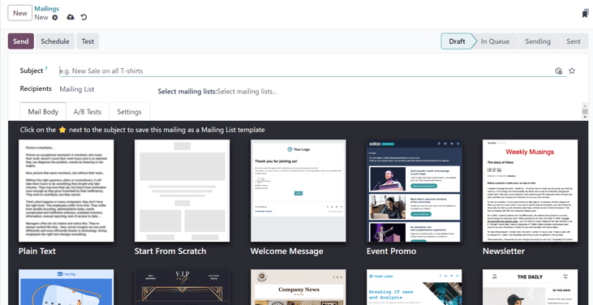

On the email form, there are fields for the [Subject](#email-marketing-subject) and
[Recipients](#email-marketing-recipients) of the email.

Beneath that, there are three tabs: [Mail Body](#email-marketing-mail-body), [A/B Tests](#email-marketing-ab-tests), and [Settings](#email-marketing-settings-tab).

### Tiêu đề

First, enter a Subject to the email. The Subject is visible in the
recipients' inbox, allowing them to quickly see what the message is about.

#### NOTE
The Subject field is mandatory. An email can **not** be sent without a
Subject.

The (smiley face with a plus sign) icon at the end of the Subject field
represents emojis that can be added to the Subject field. Clicking that icon reveals a
pop-up menu of emojis that can be used.

Beside the (smiley face with a plus sign) icon at the end of the Subject
field is an empty (star) icon. When clicked, the (star) icon turns gold, and
the email is saved as a template in the Mail Body tab, which can be used again in the
future.

### Người nhận

Beneath the Subject field on the email form is the Recipients field. In this
field, select the recipients of the email. By default, the Mailing List option is
selected, but clicking the field reveals a drop-down menu of other recipient options.

With the default Mailing List option selected, a specific mailing list **must** be
chosen from the adjacent Select mailing lists field drop-down menu.

Odoo then sends the email to contacts on that specific mailing list(s).

#### SEE ALSO
[Mailing lists](mailing_lists.md)

When the Recipients field is clicked, a drop-down menu of other options is revealed.
Each option provides different ways Odoo can create a target audience for the email.

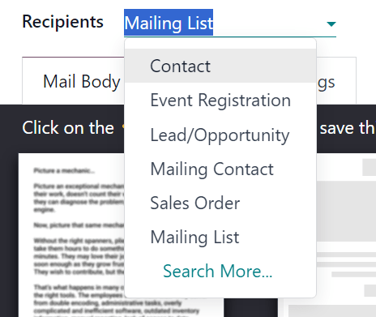

Those options (excluding the default Mailing List) provide the option to create a more
specified recipient filter, in an equation-like format, which appears beneath the
Recipients field.

The Recipients field options, other than the default Mailing List option,
are as follows:

- Contact: ties specifically to the *Contacts* app, and includes all the contacts
  entered in the database.
- Event Registration: ties specifically to the *Events* app, and provides opportunities
  to interact with event registrants, in order to communicate important information about the
  event(s), or nurture other valuable actions, such as post-event surveys, purchases, etc.
- Lead/Opportunity: ties specifically to records in the *CRM* application, which opens
  up a number of opportunities to influence sales or purchase decisions.
- Liên hệ gửi thư: liên kết cụ thể với ứng dụng *Marketing qua Email*, tập trung vào các liên hệ gửi thư đã được nhập trong ứng dụng đó và liên quan đến danh sách liên hệ cụ thể. Các liên hệ này cũng đặc biệt vì chúng *không* có thẻ liên hệ riêng trong ứng dụng *Liên hệ*. Bạn có thể truy cập danh sách này bằng cách đi đến Ứng dụng Marketing qua Email ‣ Danh sách liên hệ ‣ Liên hệ danh sách liên hệ.
- Sales Order: ties specifically to the *Sales* app, and focuses on a specific sales
  orders in the database.

#### Add recipient filter

To add a more specific recipient filter to any Recipient option, select any recipient
option (other than Mailing List), and click the Modify filter (right-facing
arrow) icon beneath the Recipient field to reveal three subsequent filter rule fields,
formatted like an equation.

It is highly recommended that users implement detailed targeting criteria for the
Recipients field. Typically, a single line of targeting logic is not sufficient enough
for an email campaign.

While the Mailing List option is adequate for the Recipients field, the
Lead/Opportunity and Event Registration options provide far more detailed
targeting criteria, which can be added on top of those seed sources.

To reveal the sub-menu options within the filter rule fields, click each field, and make the desired
selections, until the preferred configuration has been achieved.

The number of records in the database that match the configured rule(s) are indicated
beneath the configured filter rule(s), in green.

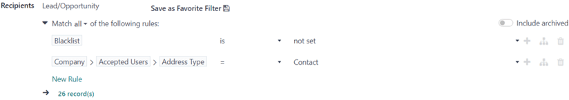

#### NOTE
Some sub-menu options in the first rule field allow for a second choice to provide even more
specificity.

To the right of each rule, there are three additional options, represented by ➕ (plus
sign), (sitemap), and 🗑️ (trash) icons.

- The ➕ (plus sign) icon adds a new node (line) to the overall targeting logic.
- The (sitemap) icon adds a branch to the node. A branch contains two additional,
  indented sub-nodes that are related to that specific rule, providing even more specificity to the
  parent line above it.
- The 🗑️ (trash) icon deletes a specific node (line) in the array of logic.

### Mail Body tab

In the Mail Body tab, there are a number of pre-configured message templates to choose
from.

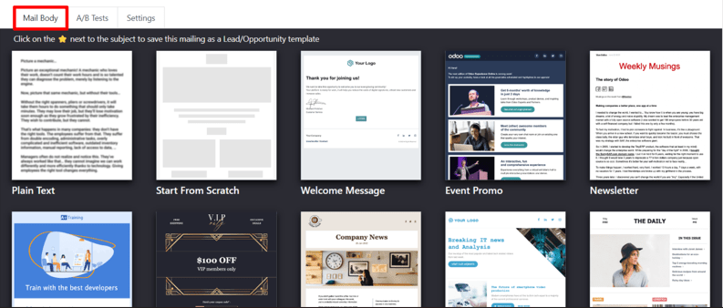

Select the desired template, and proceed to modify every element of its design details with Odoo's
drag-and-drop building blocks, which appear on the right sidebar when a template is chosen.

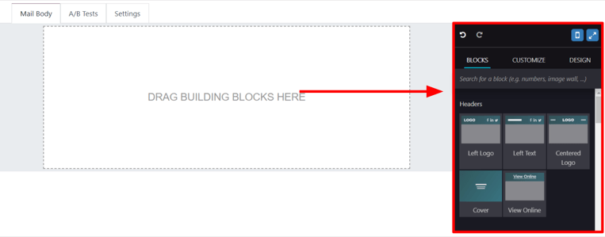

The features on the sidebar used to create and customize emails are separated into three sections:
Blocks, Customize, and Design.

Each building block provides unique features and professional design elements. To use a building
block, drag-and-drop the desired block element onto the body of the email being built. Once dropped,
various aspects of the building block can be customized.

### A/B Tests tab

Initially, when the A/B Tests tab is opened on an email form, the only option available
is Allow A/B Testing. This is **not** a required option.

If this option is enabled, recipients are only mailed *once* for the entirety of the campaign.

This allows the user to send different versions of the same mailing to randomly selected recipients
to gauge the effectiveness of various designs, formats, layouts, content, and so on -- without any
duplicate messages being sent.

When the checkbox beside Allow A/B Testing is ticked, an on (%) field
appears, in which the user determines the percentage of the pre-configured recipients that are going
to be sent this current version of the mailing as part of the test.

#### NOTE
The default figure in the on (%) field is `10`, but that figure can be changed at any
time.

Beneath that, two additional fields appear:

The Winner Selection field provides a drop-down menu of options, wherein the user
decides what criteria should be used to determine the "winning" version of the email tests that are
sent.

The options in the Winner Selection field are as follows:

- Manual: allows the user to determine the "winning" version of the mailing. This option
  removes the Send Final On field.
- Highest Open Rate (default): the mailing with the highest open rate is determined to
  be the "winning" version.
- Highest Click Rate: the mailing with the highest click rate is determined to be the
  "winning" version.
- Highest Reply Rate: the mailing with the highest reply rate is determined to be the
  "winning" version.
- Leads: the mailing with the most leads generated is determined to be the "winning"
  version.
- Quotations: the mailing with the most quotations generated is determined to be the
  "winning" version.
- Revenues: the mailing with the most revenue generated is determined to be the
  "winning" version.

The Send Final On field allows users to choose a date that is used to know *when* Odoo
should determine the "winning" email, and subsequently, send that version of the email to the
remaining recipients.

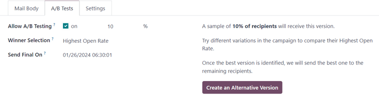

To the right of those fields is a Create an Alternative Version button. When clicked,
Odoo presents a new Mail Body tab for the user to create an alternate version of the
email to test.

### Tab Cài đặt

The options present in the Settings tab of the mail form are divided into two sections:
Email Content and Tracking.

#### NOTE
The options available in the Settings tab vary depending on if the *Mailing
Campaigns* feature is activated in Email Marketing ‣ Configuration ‣
Settings. See [Mailing campaigns](#email-marketing-mailing-campaigns) for more information.

Without the *Mailing Campaigns* feature activated, the Settings tab on the email form
only contains the Preview Text, Send From, Reply To,
Attachments, and Responsible fields.

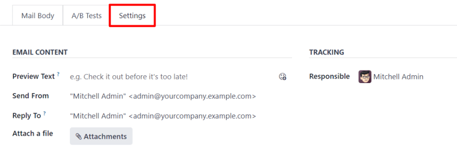

#### Nội dung email

- Văn bản xem trước: cho phép người dùng nhập một câu xem trước để khuyến khích người nhận mở email. Trong hầu hết hộp thư đến, nội dung này sẽ hiển thị bên cạnh tiêu đề. Nếu để trống, những ký tự đầu tiên của nội dung email sẽ được hiển thị thay thế. Bạn cũng có thể thêm biểu tượng cảm xúc vào trường này thông qua biểu tượng (mặt cười với dấu cộng).
- Send From: designate an email alias that displays as the sender of this particular
  email.
- Reply To: designate an email alias to whom all the replies of this particular email
  are sent.
- Attach a file: if any specific files are required (or helpful) for this email, click
  the Attachments button, and upload the desired file(s) to the email.

#### Theo dõi

- Responsible: designate a user in the database to be responsible for this particular
  email.

#### NOTE
If the *Mailing Campaign* feature *is* activated, an additional Campaign field
appears in the Tracking section of the Settings tab.

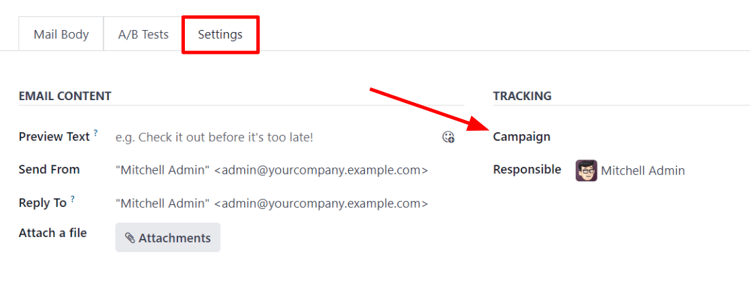

The additional Campaign field allows users to attach this particular email to a
mailing campaign, if desired.

If the desired campaign is not available in the initial drop-down menu, select Search
More to reveal a complete list of all mailing campaigns in the database.

Or, type the name of the desired mailing campaign in the Campaign field, until Odoo
reveals the desired campaign in the drop-down menu. Then, select the desired campaign.

## Send, schedule, test

Once the mailing is finalized, the following options can be utilized, via buttons located in the
upper-left corner of the email form: [Send](#email-marketing-send), [Schedule](#email-marketing-schedule), and [Test](#email-marketing-test).

### Gửi

The Send button reveals a Ready to unleash emails? pop-up window.

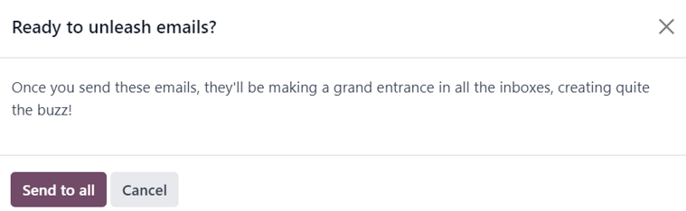

When the Send to all button is clicked, Odoo sends the email to the desired recipients.
Once Odoo has sent the mailing, the status changes to Sent.

### Lịch trình

The Schedule button reveals a When do you want to send your mailing? pop-up
window.

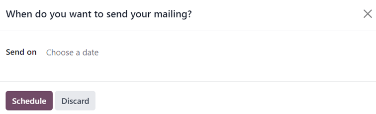

In this pop-up window, click the Send on field to reveal a calendar pop-up window.

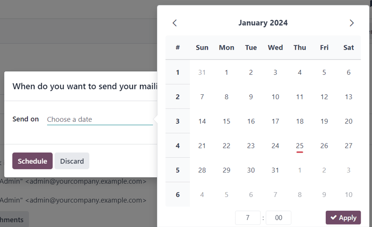

From the calendar pop-up window, select the future date and time for Odoo to send this email. Then,
click ✔️ Apply. When a date and time are chosen, click the Schedule button,
and the status of the mailing changes to In Queue.

### Kiểm thử

The Test button reveals a Test Mailing pop-up window.

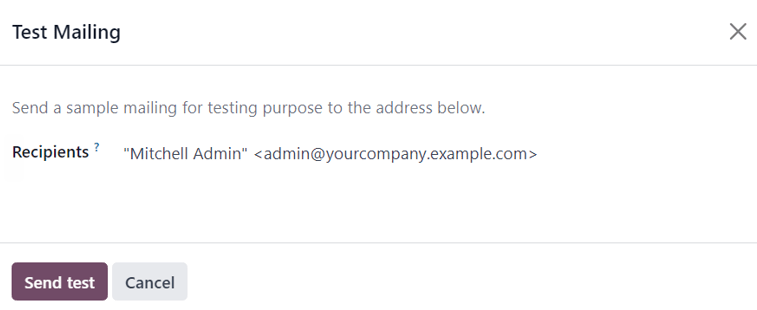

From this pop-up window, enter the email addresses of the contacts to whom Odoo should send this
test email in the Recipients field. Multiple contacts can be added in this field, if
desired.

Once all the desired email addresses have been entered in the Recipients field, click
the Send Test button.

#### WARNING
By default, there's a daily limit applied for **all emails** sent throughout **all
applications**. So, if there are remaining emails to be sent after a limit has been reached,
those mailings are **not** sent automatically the next day. The sending needs to be forced, by
opening the email and clicking Retry.

## Mailing campaigns

The *Email Marketing* application provides users with the ability to build mailing campaigns.

In order to create and customize mailing campaigns, the *Mailing Campaigns* feature **must** be
activated in the *Settings* page of the *Email Marketing* application. To do that, navigate to
Email Marketing app ‣ Configuration ‣ Settings, tick the box beside
Mailing Campaigns, and click the Save button.

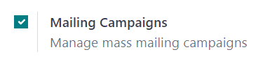

Once the Mailing Campaigns feature is activated, a new Campaigns menu option
appears in the header.

When that is clicked, Odoo reveals a separate Campaigns page, displaying all the mailing
campaigns in the database, and the current stage they are in, showcased in a default Kanban view.

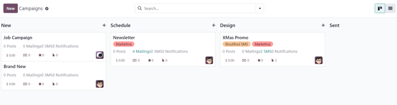

#### NOTE
This information can also be viewed in a list, by clicking the ☰ (horizontal lines)
icon in the upper-right corner.

Clicking any campaign from the Campaigns page reveals that campaign's form.

There are two different ways to create and customize campaigns in the *Email Marketing* application,
either directly from the [Campaigns page](#email-marketing-campaign-page) or through the
[Settings tab](#email-marketing-campaign-settings) on an email form.

### Create mailing campaign (from campaigns page)

When the *Mailing Campaigns* feature is activated, a new *Campaigns* option appears in the header of
the *Email Marketing* application. Campaigns can be created directly on the *Campaigns* page in the
*Email Marketing* app.

To do that, navigate to Email Marketing app ‣ Campaigns ‣ New.

#### Chế độ xem kanban

When the New button is clicked in the default Kanban view on the Campaigns
page, a Kanban card appears in the New stage.

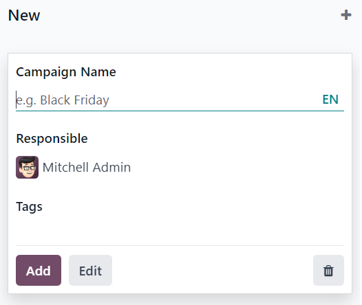

New campaign cards can also be made by clicking the ➕ (plus sign) at the top of any
Kanban stage on the Campaigns page.

When the new campaign Kanban card appears, the options to enter a Campaign Name, a
Responsible, and Tags become readily available.

To add the campaign to the Kanban stage, click the Add button.

To delete the campaign, click the 🗑️ (trash can) icon.

To further customize the campaign, click the Edit button, which reveals the campaign
form for additional modifications.

#### NOTE
A Campaign Name **must** be entered in the Kanban card, in order for the
Edit button to reveal the campaign form for further modifications.

#### Xem danh sách

To enter the list view on the Campaigns page, click the ☰ (horizontal lines)
icon in the upper-right corner. Doing so reveals all campaign information in a list format.

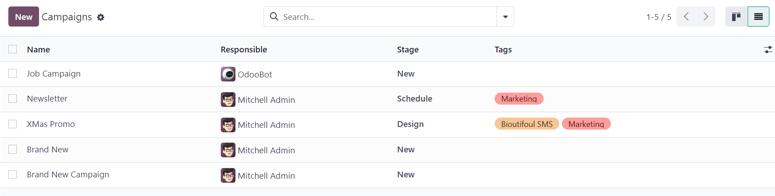

To create a campaign from the Campaigns page while in list view, click the
New button. Doing so reveals a blank campaign form.

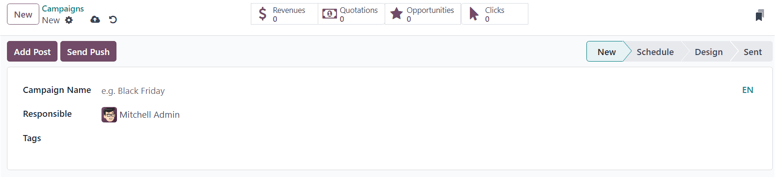

From this campaign form, a Campaign Name, a Responsible, and
Tags can be added.

At the top of the form, various metric-related smart buttons can be seen that showcase specific
analytics related to the campaign. Those smart buttons are: Revenues,
Quotations, Opportunities, and Clicks.

#### NOTE
Once a Campaign Name is entered and saved, additional buttons appear at the top of
the campaign form.

Those additional buttons are: Send Mailing and Send SMS.

### Campaign form

On the campaign form (after clicking Edit from the Kanban card, or selecting an existing
campaign from the Campaigns page) there are additional options and metrics available.

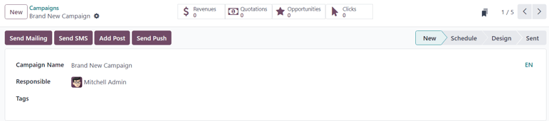

At the top of the form, various smart buttons can be seen that showcase specific analytics related
to the campaign. Those smart buttons are: Revenues, Quotations,
Opportunities, and Clicks.

There are also buttons to Send Mailing, Send SMS, Add Post, and
Add Push (push notification).

#### NOTE
If the Send Mailing and Send SMS buttons are not readily available, enter
a Campaign Name, then save (either manually or automatically). Doing so reveals those
buttons.

The status of the campaign can be viewed in the upper-right corner of the campaign form, as well.

### Create mailing campaign (from settings tab)

To create a new campaign from the Settings tab of a mailing form, click the
Campaign field, and start typing the name of the new campaign. Then, select either
Create "[Campaign Name]" or Create and edit... from the drop-down menu that
appears.

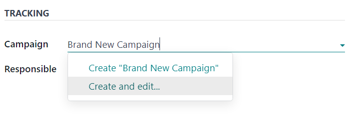

Select Create to add this new mailing campaign to the database, and modify its settings
in the future.

Select Create and Edit... to add this new mailing campaign to the database, and reveal a
Create Campaign pop-up window.

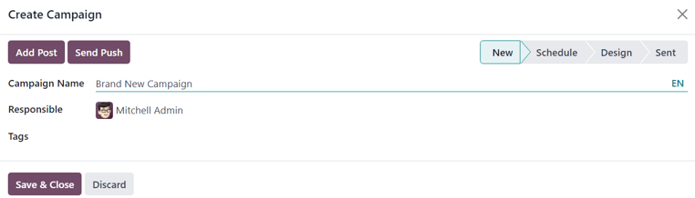

Here, the new mailing campaign can be further customized. Users can adjust the Campaign
Name, assign a Responsible, and add Tags.

Buttons to Add Post or Send Push (push notifications) are also available.

There is also a status located in the upper-right corner of the Create Campaign pop-up
window.

When all modifications are ready to be finalized, click Save & Close. To delete the
entire campaign, click Discard.

#### SEE ALSO
- [Mailing lists](mailing_lists.md)
- [Manage unsubscriptions (blacklist)](unsubscriptions.md)
- [Lost leads reactivation email](lost_leads_email.md)
- [Phân tích số liệu](analyze_metrics.md)

* [Mailing lists](mailing_lists.md)
* [Manage unsubscriptions (blacklist)](unsubscriptions.md)
* [Lost leads reactivation email](lost_leads_email.md)
* [Phân tích số liệu](analyze_metrics.md)
