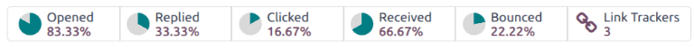

# Phân tích số liệu

In order to properly understand the success or failure of an email marketing campaign, it is
necessary to monitor several key metrics. The insights gained from these metrics can then be used to
optimize future campaigns. Odoo's **Email Marketing** application tracks several [key metrics](#email-marketing-view-metrics), that can be interpreted through [reports](#email-marketing-create-reports) to improve future campaigns.

## Xem chi tiết

After a mass mail has been sent, the results for that particular mailing are displayed in multiple
locations.

To access the metrics for an individual mailing, navigate to Email Marketing app
‣ Mailings. Locate the specific mailing in the list view, and use the column headings to view the
results for that mailing. Click on one of the mailings in the list to open the record.

At the top of the record, detailed metrics are displayed as smart buttons.

### Tỷ lệ mở

The percentage of emails opened by recipients, against the total number of sent emails.

In cases where a reply is expected, such as cold outreach emails, high open rate may indicate the
subject line was timely, compelling, and successfully prompted the recipients to view the message.

In cases where a reply is not expected, such as promotional emails, it may indicate an issue with
the email, such as incorrect product links or coupon codes.

In cases where a reply is expected, a low open rate may indicate the subject
line failed to capture the recipients' interest or the message ended up in a spam or junk folder. It
could also indicate the email ended up in a spam or junk folder.

#### NOTE
Emails that consistently land in recipient spam folders could be due to having a poor sender
reputation (i.e. high unsubscribe rate, high percentage of past emails marked as spam, etc.),
or failing to [configure the proper DNS records](../../general/email_communication/email_domain.md).

### Tỷ lệ trả lời

The percentage of recipients who responded to the email, against the total number of sent emails.

A high replied rate may indicate the email resonated with recipients, prompting them to take
action or provide feedback.

A low replied rate may suggest the message lacked relevance or did not contain a clear
call-to-action.

### Tỷ lệ nhấp

This represents the *Clicked through rate (CTR)*, which measures the
percentage of recipients who clicked on a link within the email, against the total number of sent
emails.

A high  may indicate the email content was relevant and appropriately targeted. Recipients
were motivated to click the links provided, and likely found the content engaging.

A low  may indicate issues with either the targeting, or the content itself. Recipients may
have been unmotivated by the calls-to-action, if there were any, or the message itself may have
been directed toward the wrong audience.

### Tỷ lệ nhận

This rate measures the percentage of emails that were **successfully** delivered, against the total
number of sent emails.

A high received rate can indicate the mailing list used is up-to-date, and the sender authentication
is trusted by email providers.

A low received rate may indicate issues, either with the mailing list used for the mailing, or with
the sender authentication. View the [Mass mailing analysis](#email-marketing-deliverability-issues) section for more
information.

### Tỷ lệ trả về

This rate measures the percentage of emails that were **unsuccessfully** delivered, and did not
enter a recipient's inbox, against the total number of sent emails.

A high bounce rate could indicate issues, either with the mailing list used for the mailing, or with
the sender authentication.

A low bounce rate may indicate that the mailing list used is up-to-date, and the sender
authentication is trusted by email providers. View the [Mass mailing analysis](#email-marketing-deliverability-issues)
section for more information.

## Create metrics reports

Individual metrics can be analyzed by creating a report. To begin, click on the smart button of the
desired metric.

Next, click the <i class="fa fa-caret-down"></i> (down arrow) to the right of the search bar to see
a drop-down menu of filtering and grouping parameters.

Filters, located in the left column of the search options, can be used to keep only the
results that fit the filter. For example, selecting the *Bounced* filter only shows emails
that could not be delivered.

Group By, found in the middle column, is used to organize the results into groups, and
can be used with or without filters.

#### NOTE
Thiết lập nhiều tùy chọn Nhóm theo sẽ tạo các nhóm lồng nhau, tùy thuộc vào tùy chọn được chọn trước. Ví dụ: chọn Kỳ gửi, sau đó chọn Thêm nhóm tùy chỉnh --> Người phụ trách trong cột Nhóm theo, sẽ sắp xếp tất cả kết quả  *đầu tiên* theo kỳ gửi, *sau đó* theo thành viên nhóm phụ trách. Đây là chỉ số hữu ích để phân tích ai trong nhóm đang gửi với khối lượng hoặc số lượng trong một khoảng thời gian nhất định.

This can be verified by looking at the direction, and order, of the selections in the group tile
that appears in the search bar after the selections are made.

#### SEE ALSO
View [Tìm kiếm, lọc, và nhóm bản ghi](../../essentials/search.md) for more information about making custom groups and
filters.

## Mass mailing analysis

It is also possible to analyze the success between mailing campaigns by creating a *Mass Mailing
Analysis* report. To begin, navigate to Email Marketing app ‣ Reporting ‣ Mass
Mailing Analysis.

A dashboard appears displaying a bar chart containing each mailing campaign. By default,
Sent is selected, displaying the number of sent records on the y-axis. To change the
measure, click the Measures button, and select the desired measure from the drop-down
menu.

## Deliverability issues

The following define possible reasons for a high bounce rate or low received rate:

- Using a mailing list that contains outdated contact information, or malformed email addresses are
  likely to result in a high bounce rate and/or a low received rate.
- Mailings sent using a *From* email address that differs from the sender's domain are likely to
  bounce with certain email providers due to failing [DMARC authentication](../../general/email_communication/email_domain.md#email-domain-dmarc).
- Failing to [configure the proper DNS records](../../general/email_communication/email_domain.md) can also result in a high bounce rate.

#### SEE ALSO
- [Mailing campaigns](../email_marketing.md#email-marketing-mailing-campaigns)
- [Manage unsubscriptions](unsubscriptions.md)
