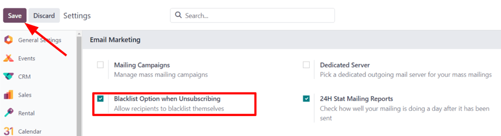
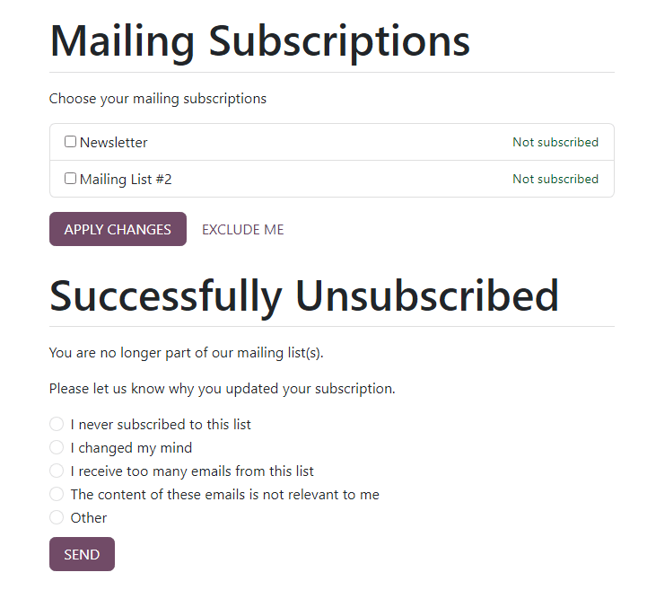
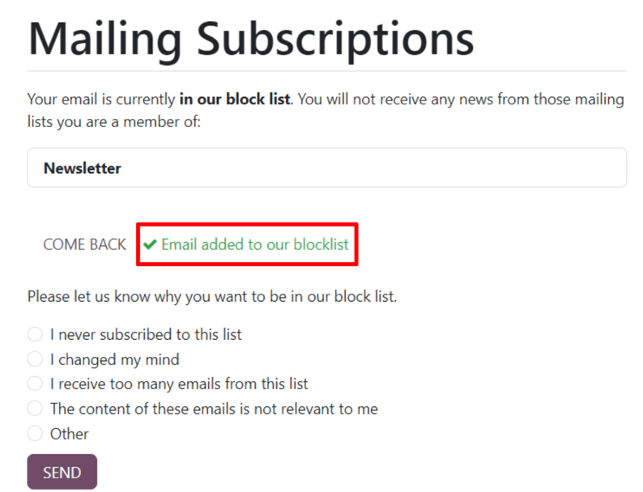
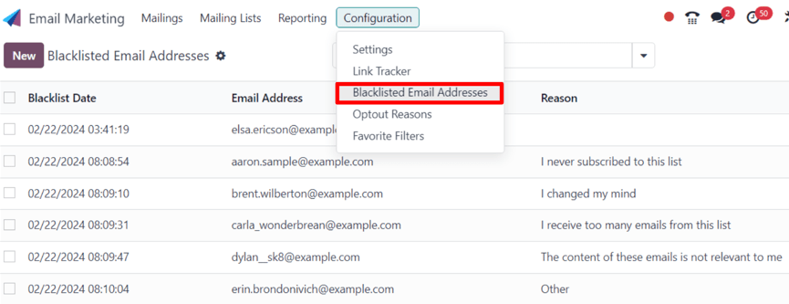
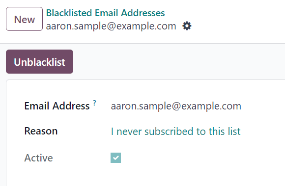
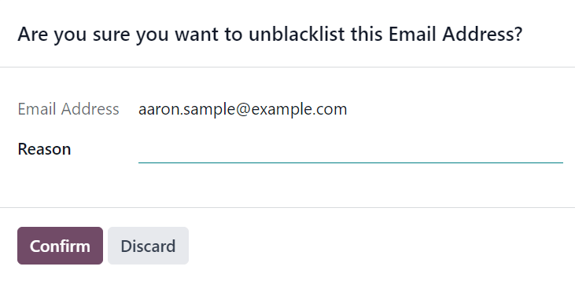

# Manage unsubscriptions (blacklist)

Providing recipients with the power to unsubscribe from mailing lists is not only a smart business\
practice, it's often a legal requirement. Allowing recipients to unsubscribe from a mailing list\
establishes a sense of trust and control with an audience. It also helps companies appear more\
genuine, and less _spammy_.

## Unsubscribe and blacklist

In addition to having the option to unsubscribe from specific mailing lists, the recipient can als&#x6F;_&#x62;lacklist_ themselves during the unsubscription process, meaning they will not receive _any_ more\
marketing emails from the Odoo database.

In order to provide recipients with the ability to blacklist themselves, a specific feature **must**\
be enabled in the _Email Marketing_ application.

Navigate to Email Marketing app ‣ Configuration ‣ Settings, and tick the\
checkbox next to the Blacklist Option when Unsubscribing feature. Then, click\
Save in the upper-left corner of the Settings page.

### Ngừng đăng ký

By default, an _Unsubscribe_ link appears at the bottom of all mailing templates.

#### WARNING

The _Unsubscribe_ link does **not** appear by default if the _Start From Scratch_ template is\
used to create a mailing. The user **must** manually add the specific unsubscribe link`/unsubscribe_from_list` in the body of the email, or use a block from the _Footers_ section of\
the email builder, which includes the unsubscribe link.

If a recipient clicks the _Unsubscribe_ link in a mailing, Odoo instantly unsubscribes them from the\
mailing list, presents them with a Mailing Subscriptions page where they can directly\
manage their subscriptions, and informs them that they've been Successfully\
Unsubscribed.

Beneath that, Odoo asks the former subscriber to Please let us know why you updated your\
subscription, and the user can proceed to choose the appropriate opt-out reason from a series of\
options presented to them.

#### NOTE

The opt-out answer options can be created and modified by navigating to Email\
Marketing app ‣ Configuration ‣ Optout Reasons.

Once they've chosen the appropriate opt-out reason from the options presented to them, they can\
click the Send button. Odoo then logs their reasoning for unsubscribing in the _Email_\
_Marketing_ app for future analysis.

### Danh sách hạn chế

For a recipient to remove (i.e. blacklist) themselves from **all** marketing emails during the\
unsubscription process, on the Mailing Subscriptions page, they must click\
Exclude Me.

Upon clicking Exclude Me, Odoo informs the recipient they have been successfully\
blacklisted, with a message reading: ✔️ Email added to our blocklist.

Beneath that, Odoo asks the former subscriber to Please let us know why you want to be\
added to our blocklist, and the user can proceed to choose the appropriate reason from a series of\
options presented to them.

Once they've chosen the appropriate reason from the options presented to them, they can click the\
Send button. Odoo then logs their reasoning for blacklisting themselves in the _Email_\
_Marketing_ app for future analysis.

## Blacklisted email addresses

To view a complete list of all blacklisted email addresses, navigate to Email\
Marketing app ‣ Configuration ‣ Blacklisted Email Addresses.

When a blacklisted record is selected from this list, Odoo reveals a separate page with the\
recipient's contact information, along with the provided Reason why they chose to\
blacklist themselves.

In the _chatter_ of the blacklisted record page, there's a time-stamped message, informing the user\
when the recipient blacklisted themselves (via a Mail Blacklist created log note).

#### NOTE

Blacklisted emails are excluded from all marketing mailings, however, these emails can still\
receive transactional emails, such as order confirmations, shipping notifications, etc.

## Unblacklist contacts

To _Unblacklist_ contacts, click the Unblacklist button in the upper-left corner of a\
blacklisted record's page to remove the contact from the blacklist, allowing them to receive\
mailings once again.

When Unblacklist is clicked, an Are you sure you want to unblacklist this\
Email Address? pop-up window appears.

In this pop-up window, the email address of the selected blacklisted record is shown, and there's a\
Reason field, in which a reason can be entered, explaining why this particular contact\
was removed from the blacklist.

After filling in the fields, click Confirm to officially remove that particular contact\
from the blacklist.

#### SEE ALSO
- [Email Marketing](../email_marketing.md)
- [Mailing lists](mailing_lists.md)
