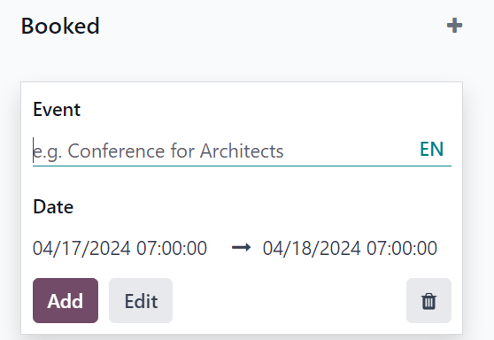
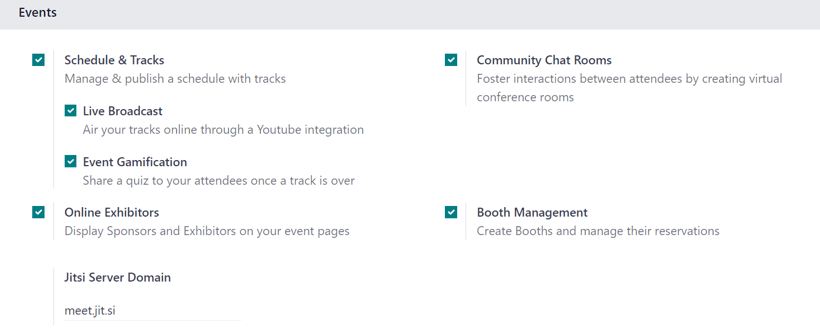
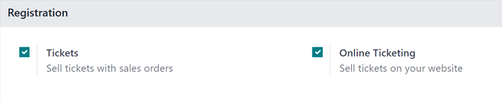
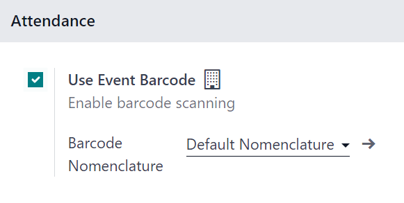

# Sự kiện

Explore the various aspects of the Odoo **Events** detailed dashboard, and useful settings, that can
be utilized to generate and gather valuable data about events (and their attendees), which can then
be used to improve decision-making and event-planning.

#### SEE ALSO
[Odoo Tutorials: Events](https://www.odoo.com/slides/surveys-63)

## Events dashboard

When the **Events** application is opened, Odoo reveals the main Events dashboard, which
can be viewed in a number of different ways. Those different view options are accessible from the
Events dashboard in the upper-right corner, via a series of view-related icon buttons.

By default, the Events dashboard is displayed in the <i class="oi oi-view-kanban"></i>
Kanban view, which is populated with a variety of pipeline stages.

This view showcases all the events in the database in their respective stages. By default, the
stages are: New, Booked, Announced, Ended, and
Cancelled.

#### NOTE
The Ended and Cancelled stages are folded, by default, and located to the
right of the other stages.

On each event card, find the scheduled date of the event, the name of the event, the location, the
number of expected Attendees, any scheduled activities related to the event, the status
of the event, and the person responsible for the event.

To quickly add a new event to a pipeline, click the <i class="fa fa-plus"></i> (plus) icon at the
top of the stage to which the event should be added to reveal a blank Kanban card to fill out.

In this blank Kanban card, enter the name of Event, along with the start and end
Date and time.

Then, either click Add to add it to the stage and edit it later, or click
Edit to add the event to stage and edit its configurations on a separate page.

Each event card can be dragged-and-dropped into any stage on the Kanban pipeline, providing easy
organizational access.

## Cài đặt

To access the event settings and feature options in Odoo **Events**, navigate to
Events app ‣ Configuration ‣ Settings. From here, tick the checkboxes beside
the desired settings and/or features, and click Save to activate them.

### Events section

In the Events section of the Settings page, there are selectable features
that can be enabled to add various elements to events created with the Odoo **Events** application.

The Schedule & Tracks feature allows users to manage and publish a schedule with tracks
for events. *Tracks* is a catch-all term that refers to talks, lectures, demonstrations,
presentations, and other similar elements that users may choose to include as part of an event.

When the Schedule & Tracks feature is enabled, two additional fields appear beneath it:
Live Broadcast and Event Gamification.

The Live Broadcast feature lets users air tracks online, via a *YouTube* integration.

Tính năng Trò chơi hoá sự kiện cho phép người dùng chia sẻ một quiz sau mỗi phần nội dung sự kiện, giúp người tham dự đánh giá mức độ hiểu biết của họ sau khi nghe/xem nội dung. Tính năng này mang lại lợi ích cho doanh nghiệp vì thông qua việc phân tích các câu trả lời và kết quả từ quiz, doanh nghiệp có thể xác định điểm mạnh và điểm yếu trong phần trình bày của mình.

Next, is the Online Exhibitors feature. This feature allows users to display sponsors
and exhibitors on event pages, which can serve as a valuable incentive to encourage partners and
businesses to participate in the event.

The Jitsi Server Domain field represents an external conferencing service that is
integrated with Odoo. It is what is used to create and host virtual conferences, community rooms,
and other similar elements for events.

The Community Chat Rooms feature allows users to create virtual conference rooms for
event attendees, providing them with a centralized place to meet and discuss anything related to the
event.

Lastly, there is the Booth Management feature. This feature provides users with the
ability to create and manage event booths and booth reservations. When enabled, users can create
different booth tiers, with individual price points, and sell them to interested parties.

### Registration section

The Registration section of the Settings page provides selectable settings
that are directly related to event registration.

The Tickets setting allows users to sell event tickets, via standard sales orders.

The Online Ticketing setting creates a selectable *Event Ticket* product type on product
forms, which provides users with the ability to sell event tickets online, via their
website/eCommerce store.

### Attendance section

In the Attendance section of the Settings page, there is a selectable
setting that is directly related to how attendees can attend/enter the event.

The Use Event Barcode setting, when activated, enables barcode (and QR code) scanning
for attendees to enter the event. This provides attendees with quick access, and helps Odoo users
easily track, manage, and analyze all event attendees.

The Barcode Nomenclature field, beneath the Use Event Barcode setting, is
set to Default Nomenclature, by default, but can be changed at any time.

## Create events

With Odoo **Events**, events can be manually created from scratch or built off of pre-made
templates.

Once launched, the **Events** application then integrates with the **Website** app for the front-end
promotion and registration of the event for attendees, the **Sales** app for the purchasing ability
of paid tickets, and the **CRM** application through customizable lead generation rules.

#### SEE ALSO
[Create events](applications/marketing/events/create_events.md)

## Sell event tickets

Create custom ticket tiers (with various price points) for potential event attendees to choose from,
directly on the event template form, under the *Tickets* tab.

Odoo simplifies the ticket-purchasing process by providing plenty of payment method options, as
well.

#### SEE ALSO
[Sell event tickets](applications/marketing/events/sell_tickets.md)

## Track and manage talks

Discover how to access various event tracks (talks, presentations, etc.), view entire agendas, and
learn how attendees can propose talks for the event.

#### SEE ALSO
[Talks, proposals, and agenda](applications/marketing/events/track_manage_talks.md)

## Event templates

Learn the process to customize and configure event templates, which can be used to expedite the
event-creation process.

#### SEE ALSO
[Event templates](applications/marketing/events/event_templates.md)

## Event booths

Explore the various ways to create, manage, and sell event booths with the Odoo **Events**
application.

#### SEE ALSO
[Event booths](applications/marketing/events/event_booths.md)

## Event tracks

Find out how to create, manage, and schedule different experiences (aka *Tracks*) for events with
Odoo.

#### SEE ALSO
[Event tracks](applications/marketing/events/event_tracks.md)

## Registration desk

Grant access to event attendees quickly and easily with the Odoo **Events** *Registration Desk*
feature.

#### SEE ALSO
[Bàn đăng ký](applications/marketing/events/registration_desk.md)

## Revenues report

Gain invaluable insight into event-related revenues with customizable reports and metrics.

#### SEE ALSO
[Revenues report](applications/marketing/events/revenues_report.md)

* [Create events](applications/marketing/events/create_events.md)
  * [New event](applications/marketing/events/create_events.md#new-event)
  * [Event form](applications/marketing/events/create_events.md#event-form)
    * [Tickets tab](applications/marketing/events/create_events.md#tickets-tab)
    * [Communication tab](applications/marketing/events/create_events.md#communication-tab)
      * [Mail](applications/marketing/events/create_events.md#mail)
    * [Questions tab](applications/marketing/events/create_events.md#questions-tab)
    * [Tab Ghi chú](applications/marketing/events/create_events.md#notes-tab)
  * [Publish events](applications/marketing/events/create_events.md#publish-events)
  * [Send event invites](applications/marketing/events/create_events.md#send-event-invites)
* [Sell event tickets](applications/marketing/events/sell_tickets.md)
  * [Cấu hình](applications/marketing/events/sell_tickets.md#configuration)
  * [Sell event tickets with the Sales app](applications/marketing/events/sell_tickets.md#sell-event-tickets-with-the-sales-app)
  * [Sell event tickets through the Website app](applications/marketing/events/sell_tickets.md#sell-event-tickets-through-the-website-app)
* [Talks, proposals, and agenda](applications/marketing/events/track_manage_talks.md)
  * [Event website](applications/marketing/events/track_manage_talks.md#event-website)
    * [Talks page](applications/marketing/events/track_manage_talks.md#talks-page)
    * [Talk Proposals page](applications/marketing/events/track_manage_talks.md#talk-proposals-page)
    * [Agenda page](applications/marketing/events/track_manage_talks.md#agenda-page)
* [Event templates](applications/marketing/events/event_templates.md)
  * [Event templates page](applications/marketing/events/event_templates.md#event-templates-page)
  * [Create event template](applications/marketing/events/event_templates.md#create-event-template)
    * [Event template form](applications/marketing/events/event_templates.md#event-template-form)
      * [Tab gian hàng](applications/marketing/events/event_templates.md#booths-tab)
  * [Use event templates](applications/marketing/events/event_templates.md#use-event-templates)
* [Event booths](applications/marketing/events/event_booths.md)
  * [Cấu hình](applications/marketing/events/event_booths.md#configuration)
  * [Booth categories](applications/marketing/events/event_booths.md#booth-categories)
    * [Create booth category](applications/marketing/events/event_booths.md#create-booth-category)
  * [Add booth to an event](applications/marketing/events/event_booths.md#add-booth-to-an-event)
    * [Booth form](applications/marketing/events/event_booths.md#booth-form)
  * [Sell event booths](applications/marketing/events/event_booths.md#sell-event-booths)
* [Event tracks](applications/marketing/events/event_tracks.md)
  * [Cấu hình](applications/marketing/events/event_tracks.md#configuration)
  * [Event Tracks page](applications/marketing/events/event_tracks.md#event-tracks-page)
    * [Create event track](applications/marketing/events/event_tracks.md#create-event-track)
      * [Tab diễn giả](applications/marketing/events/event_tracks.md#speaker-tab)
        * [Contact Details section](applications/marketing/events/event_tracks.md#contact-details-section)
        * [Speaker Bio section](applications/marketing/events/event_tracks.md#speaker-bio-section)
      * [Tab mô tả](applications/marketing/events/event_tracks.md#description-tab)
      * [Interactivity tab](applications/marketing/events/event_tracks.md#interactivity-tab)
      * [Add Quiz button](applications/marketing/events/event_tracks.md#add-quiz-button)
  * [Publish event track](applications/marketing/events/event_tracks.md#publish-event-track)
* [Bàn đăng ký](applications/marketing/events/registration_desk.md)
  * [Registration Desk page](applications/marketing/events/registration_desk.md#registration-desk-page)
  * [Quét huy hiệu](applications/marketing/events/registration_desk.md#scan-a-badge)
  * [Select attendee](applications/marketing/events/registration_desk.md#select-attendee)
* [Revenues report](applications/marketing/events/revenues_report.md)
  * [Revenues reporting page](applications/marketing/events/revenues_report.md#revenues-reporting-page)
    * [Đơn vị tính](applications/marketing/events/revenues_report.md#measures)
    * [Filters and grouping options](applications/marketing/events/revenues_report.md#filters-and-grouping-options)
      * [Filter options](applications/marketing/events/revenues_report.md#filter-options)
      * [Group By options](applications/marketing/events/revenues_report.md#group-by-options)
  * [Sample report: event ticket analysis (graph)](applications/marketing/events/revenues_report.md#sample-report-event-ticket-analysis-graph)
  * [Sample report: event type analysis (pivot table)](applications/marketing/events/revenues_report.md#sample-report-event-type-analysis-pivot-table)
