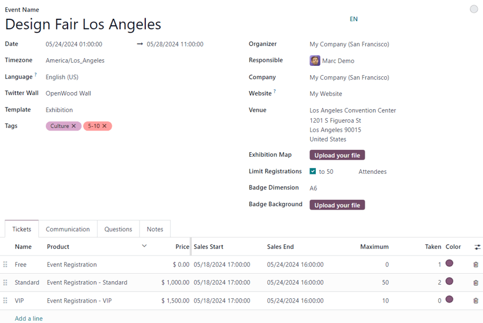
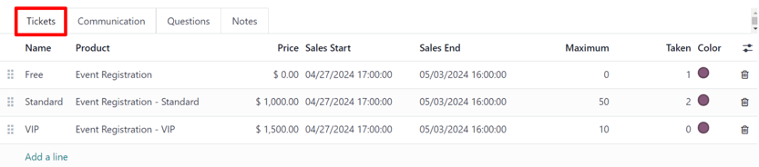
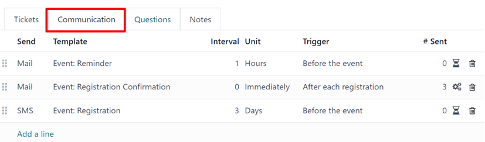
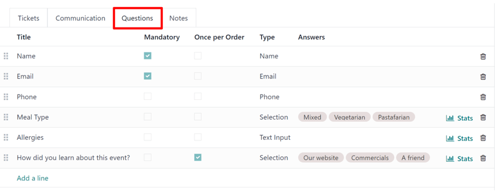
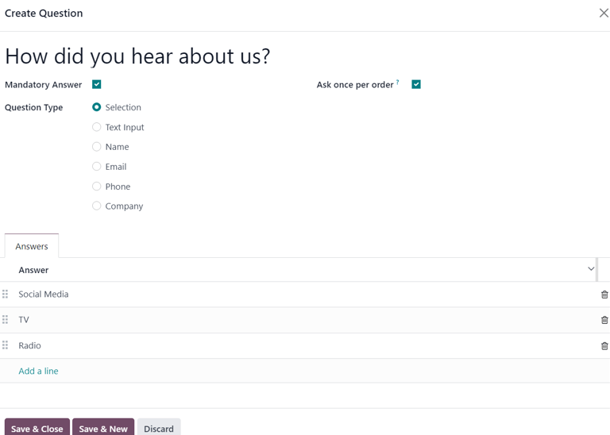
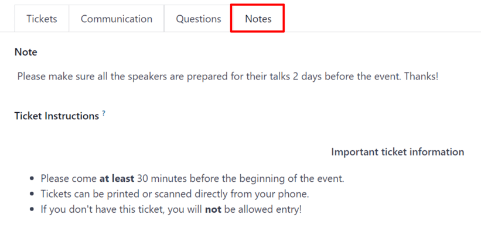

# Create events

With the *Events* application, event organizers can create and configure in-person or online-only
events in Odoo. Each new event contains a number of customizable options that are geared around
specific event logistics, as needed per event, such as ticket sales and registration desk, booths,
tracks, sponsors, rooms, and more.

Events can be manually created from scratch or built off of pre-made templates. Once launched, the
*Events* application then integrates with the *Website* app for the front-end promotion and
registration of the event for attendees, the *Sales* app for the purchasing ability of paid tickets,
as well the *CRM* application through customizable lead generation rules.

## New event

To create a new event, begin by navigating to the Events app to land on the default
Events dashboard, in the <i class="oi oi-view-kanban"></i> Kanban view. From there, or
alternatively from the <i class="oi oi-view-list"></i> List or <i class="fa fa-tasks"></i> Gantt
views, click the New button in the upper-left corner of the dashboard to open up a new
event form.

#### NOTE
If certain fields do not readily appear on the event form, that means an additional application
needs to be installed, or the database is not operating in a multi-company environment.

For example, the Twitter Wall field **only** appears if the *Social Marketing* app is
installed, and the Company field **only** appears if the database is working in a
multi-company environment.

These are just *additional* elements that can be used for an event. They are **not** required to
create, host, and manage an event with Odoo *Events*.

## Event form

At the top of the event form are a series of smart buttons related to various event metrics, which
will autopopulate with pertinent data once attendees begin to register, booths and sponsors sign on
for the event, the event takes place, and so on.

Primarily, these smart buttons are used as logistical portals to perform specific actions for the
event. The numeric displays are primarily for quick reference points.

While those visual metrics are useful, they can still be clicked, and used to navigate to
specific event-related pages to modify and/or perform any desired actions.

Beneath the smart buttons is the event form, which contains various fields and clickable tabs that
serve to configure the initial, necessary details of the event.

The following are fields found on an event form:

- Event Name: the title of the event. This field is **required**.

  #### NOTE
  To the right of the entered Event Name, there is a language tooltip, represented by
  an abbreviated language indicator (e.g. `EN`). When clicked, a Translate: name
  pop-up window appears, displaying various pre-configured language translation options available
  in the database.
- Date: when the event is scheduled to take place (expressed in your local timezone).
  This field is auto-populated, but modifiable, and is **required**.
- Display Timezone: the timezone in which the event dates/times will be displayed on the
  website. This field is auto-populated, but modifiable, and is **required**.
- Language: designate a specific language for all event communications to be translated
  into, if necessary. This field is blank, by default, so if event-related communications are being
  sent to recipients who speak a different language, be sure to configure this field properly.
- Twitter Wall: creates a separate page on the event website to feature specific social
  posts on X (formerly Twitter) that contain pre-determined desired elements.
- Template: choose a pre-configured event template from the resulting drop-down menu.

  Or, create a new one directly from this field, by typing in the name of the new template, and
  selecting either:
  - Create (which creates the template, and can be edited later) or
  - Create and edit... (which creates the template, and reveals a separate template page
    to configure the template in greater detail).
- Tags: add any corresponding tags to briefly describe the event (e.g. `Online`,
  `Conference`, etc.). Multiple tags can be added per event.
- Organizer: designate the organizer of the event (a company, contact, or employee).
- Responsible: designate a user in the database to be responsible for this event.
- Company: designate which company in the database to which this event is related. This
  field **only** appears if working in a multi-company environment. This field is auto-populated,
  but modifiable, and is **required**.
- Website: choose to restrict the publishing of this event to a specific website created
  in Odoo. If this field is left blank, the event can be published on *all* websites in the
  database. To learn more, refer to the [Multiple websites](../../websites/website/configuration/multi_website.md) documentation.
- Venue: enter event venue details. This field pulls pertinent information from the
  *Contacts* application. Alternatively, Venue information can be manually added in this
  field, as well. At the very least, there **must** be a venue name, address, city, zip code/region,
  and country entered.
- Exhibition Map: if desired, click the Upload your file button to upload an
  image of the event venue map.
- Limit Registrations: if this checkbox is ticked, a limit to the amount of
  registrations is added to the event, and that desired limit amount **must** be entered in the
  blank field before Attendees.
- Badge Dimension: select a desired paper format dimension for event badges. The options
  are: A4 foldable, A6, or 4 per sheet.
- Badge Background: if desired, click the Upload your file button to upload
  a custom background image for event badges.

When the above fields in the event form have been adequately filled in, move on to the four tabs at
the bottom of the event form for further customization.

Those tabs are: [Tickets](#events-event-tickets), [Communication](#events-event-communication), [Questions](#events-event-questions), and [Notes](#events-event-notes).

### Tickets tab

Create custom tickets (and ticket tiers) for events in the Tickets tab of an event form.

To create a ticket, click Add a line in the Tickets tab. Then, enter a name
for the ticket (e.g. `Basic Ticket` or `VIP`) in the Name field.

In the Product field, either select the pre-configured Event Registration
product, or create a new one by typing in the name of the new event registration product, and then
select either Create or Create and edit... from the resulting drop-down
menu.

#### IMPORTANT
Upon installing Odoo *Events*, a new product type, *Event Ticket*, becomes available on product
forms (Sales ‣ Products ‣ Products). In order for an event registration
product to be selectable in the *Tickets* tab, the event registration Product Type
**must** be set to Event Ticket.

Next, set the registration cost of the ticket in the Price field.

#### NOTE
The *Sales Price* defined on the event registration product's product form sets the default cost
of a ticket. Modifying the Price of a ticket in the Tickets tab, sets a
new registration cost of the ticket for that event.

Next, determine a Sales Start and Sales End date in their respective fields.
To do that, click into the blank field to reveal a calendar popover. From there, select the desired
date and time, then click <i class="fa fa-check"></i> Apply.

Then, if desired, designate a Maximum amount of that specific ticket that can be sold.

The Taken column populates with the number of tickets that are sold.

Optionally, in the Color column, add a custom color to differentiate ticket badges. The
selected color displays on ticket badges when printed.

To delete any tickets from the Tickets tab, click the <i class="fa fa-trash-o"></i>
(trash can) icon on the corresponding line for the ticket that should be deleted.

### Communication tab

In the Communication tab of an event form, create various marketing communications that
can be scheduled to be sent at specific intervals leading up to, and following, the event.

#### NOTE
Theo mặc định, Odoo cung cấp ba mẫu thông tin liên lạc riêng biệt cấu hình sẵn trên mỗi biểu mẫu sự kiện mới. Một trong số đó là email được gửi sau mỗi lượt đăng ký để xác nhận việc mua vé với người tham dự. Hai mẫu còn lại là email nhắc sự kiện, được lên lịch gửi tại các khoảng thời gian khác nhau trước khi sự kiện diễn ra để nhắc nhở người nhận về sự kiện sắp tới.

To add a communication in the Communication tab, click Add a line. Then,
select the desired type of communication in the Send field. The options are:
Mail, SMS, Social Post, or WhatsApp.

There is no limit to the number of communications that can be added in the Communication
tab of an event form.

To delete a communication from the Communication tab, click the <i class="fa fa-trash-o"></i>
(trash can) icon on the corresponding communication line. Doing so removes the
communication from the event entirely.

#### IMPORTANT
The Social Post option **only** appears if the *Social Marketing* application is
installed. The WhatsApp option **only** appears if the *WhatsApp Integration* module
is installed.

[WhatsApp](../../productivity/whatsapp.md) templates **cannot** be edited during active
configuration. A separate approval from *Meta* is required.

#### Mail

Select an existing email template from the Template drop-down menu.

Next, define the Interval, Unit, and Trigger from their
respective drop-down fields, letting Odoo know when the communication should be sent.

The Unit options are: Immediately, Hours, Days,
Weeks, and Months.

Then, select an option from the Trigger drop-down menu. The options are:
After each registration, Before the event, and After the event.

The Sent column populates with the number of sent communications. And, beside the
number are different icons that appear, depending on the status of that particular communication.

The status of *Running* is represented by a <i class="fa fa-cogs"></i> (three gears) icon. The
status of *Sent* is represented by a <i class="fa fa-check"></i> (checkmark) icon. And, the status
of *Scheduled* is represented by an <i class="fa fa-hourglass-half"></i> (hourglass) icon.

#### NOTE
Existing email templates can be modified directly from the Template drop-down menu,
if necessary, by clicking the <i class="oi oi-arrow-right"></i> (right arrow) icon next to the
template name. Doing so reveals a separate page where users can edit the Content,
Email Configuration, and Settings of that particular email template.

To view and manage all email templates, activate [Chế độ lập trình viên (chế độ gỡ lỗi)](../../general/developer_mode.md#developer-mode) and navigate to
Settings ‣ Technical ‣ Email: Email Templates. Modify with caution as email
templates effect all communications where the template is used.

### Questions tab

In the Questions tab of an event form, users can create brief questionnaires for
registrants to interact with, and respond to, after they register for the event.

These questions can be focused on gathering basic information about the attendee, learning about
their preferences, expectations, and other things of that nature. This information can also be used
to create more detailed reporting metrics, in addition to being utilized to create specific lead
generation rules.

#### NOTE
By default, Odoo provides three questions in the Questions tab for every event form.
The default questions require the registrant(s) to provide their Name and
Email, and make it optional to include their Phone number, as well.

The information gathered from the Questions tab can be found on the
Attendees dashboard, accessible via the <i class="fa fa-users"></i> Attendees smart
button. Odoo populates individual records that contain basic information about the registrant(s),
as well as their preferences.

To add a question in the Questions tab, click Add a line. Doing so reveals a
Create Question pop-up window. From here, users can create and configure their question.

First, enter the question in the field at the top of the form. Then, decide if the question should
require a Mandatory Answer and/or if Odoo should Ask once per order, by
ticking their respective boxes, if desired.

Nếu hộp kiểm Hỏi một lần cho mỗi lần đặt chỗ được tích, câu hỏi sẽ chỉ được hỏi một lần và giá trị của nó sẽ được áp dụng cho mọi người tham dự trong đơn hàng (nếu nhiều vé được mua cùng lúc). Nếu hộp kiểm này *không* được tích cho cài đặt này, Odoo sẽ hiển thị câu hỏi cho từng người tham dự liên quan đến đăng ký đó.

Next, select a Question Type option:

- Selection: provide answer options to the question for registrants to choose from.
  Selectable answer options can be managed in the Answers column at the bottom of the
  pop-up window.
- Text Input: lets the users enter a custom response to the question in a text field.
- Name: provides registrants with a field for them to enter their name.
- Email: provides registrants with a field for them to enter their email address.
- Phone: provides registrants with a field for them to enter their phone number.
- Company: provides registrants with a field for them to enter a company they are
  associated with.

Once all the desired configurations have been entered, either click Save & Close to save
the question, and return to the Questions tab on the event form, or click
Save & New to save the question and immediately create a new question on a new
Create Question pop-up window.

As questions are added to the Questions tab, the informative columns showcase the
configurations of each question.

The informative columns are the following:

- Tiêu đề
- Bắt buộc
- Once per Order
- Loại
- Answers (if applicable)

For Selection and Text Input types, a <i class="fa fa-bar-chart"></i> Stats
button appears on the right side of the question line. When clicked, Odoo reveals a separate page,
showcasing the response metrics to that specific question.

To delete any question from the Questions tab, click the <i class="fa fa-trash-o"></i>
(trash can) icon on the corresponding question line.

There is no limit to the number of questions that can be added in the Questions tab of
an event form.

### Tab Ghi chú

In the Notes tab of an event form, users can leave detailed internal notes and/or
event-related instructions/information for attendees.

In the Note field of the Notes tab, users can leave internal notes for other
event employees, like "to-do" lists, contact information, instructions, and so on.

In the Ticket Instructions field of the Notes tab, users can leave specific
instructions for people attending the event that appear on the attendees ticket.

## Publish events

Once all configurations and modifications are complete on the event form, it is time to publish the
event on the website. Doing so makes the event visible to website visitors, and makes it possible
for people to register for the event.

To publish an event after all the customizations are complete, click the <i class="fa fa-globe"></i>
Go to Website smart button at the top of the event form. Doing so reveals the event's
web page, which can be customized like any other web page on the site, via the Edit
button.

To learn more about website design functionality and options, consult the [Building block](../../websites/website/web_design/building_blocks.md) documentation.

Once the event website is ready to be shared, click the red Unpublished toggle switch
in the header menu, changing it to a green Published switch. At this point, the event
web page is published, and viewable/accessible by all website visitors.

## Send event invites

To send event invites to potential attendees, navigate to the desired event form, via
Events app ‣ Events, and click into the desired event. Following this, click the
Invite button in the upper-left corner of the event form.

Doing so reveals a blank email form to fill out, as desired. To learn more about how to create and
customize emails like this, refer to the [Create an email](../email_marketing.md#email-marketing-create-email)
documentation.

Proceed to create and customize an email message to send as an invite to potential attendees.
Remember to include a link to the registration page on the event website, allowing interested
recipients to quickly register.

#### SEE ALSO
[Talks, proposals, and agenda](track_manage_talks.md)
