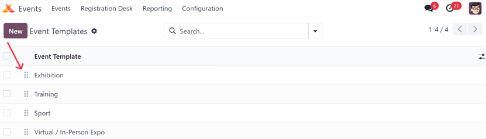
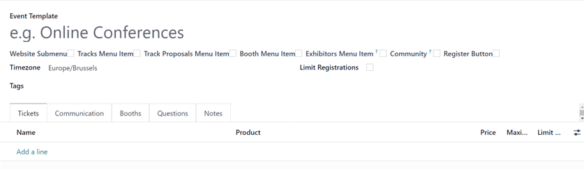
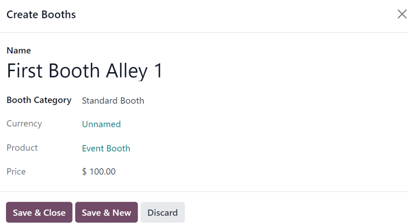

# Event templates

The Odoo *Events* application provides the ability to customize and configure event templates, which
can be used to expedite the event-creation process.

These templates can be created and personalized in the application, and then selected from an event
form, in order to quickly apply a series of settings and elements to the new event, all of which can
be further modified, if needed.

## Event templates page

In the Odoo *Events* application, event templates can quickly be created and modified.

To begin, navigate to Events app ‣ Configuration ‣ Event Templates. Doing so
reveals the Event Templates page. Here, find all the existing event templates in the
database.

By default, Odoo provides three pre-configured event templates: Exhibition,
Training, and Sport, which all have their own unique customizations applied
to them.

To change how these event templates appear on the *Template* drop-down field on an event form,
drag-and-drop them into any desired order, using the <i class="oi oi-draggable"></i> (draggable)
icon, located to the left of each event template line on the Event Templates page.

#### SEE ALSO
To learn more about event forms, refer to the [Create events](create_events.md) documentation.

## Create event template

There are two ways to create and configure an event template in Odoo *Events*.

1. **On the dashboard**, by navigating to Events app ‣ Configuration ‣ Event
   Templates and clicking the New button in the upper-left corner. Doing so reveals a
   blank event template form that can be customized in a number of different ways.
2. **On an event form itself**. Start by typing the name of a new event template in the *Template*
   field, and click Create and edit... from the resulting drop-down menu. Doing so
   reveals a *Create Template* pop-up window, featuring all the same configurable fields and
   elements found on a standard event template form.

#### NOTE
Clicking Create "[template name]" from the resulting drop-down menu, via the
*Template* field on an event form creates the event template in the database, but does **not**
present the user with the *Create Template* pop-up window.

The event template would have to be modified, by selecting it on the *Event Templates* page
(Events app ‣ Configuration ‣ Event Templates).

### Event template form

All the fields on a standard Event Template form are *also* on the *Create Template*
pop-up window, accessible via the *Template* field on an event form.

Start by providing the event template with a name in the Event Template field, located
at the top of the form.

Beneath that field, there is a series of selectable checkboxes, all of which are related to how the
event menu will be displayed on the event web page.

- Website Submenu: enables a submenu on the event's website. When this checkbox is
  ticked, every other checkbox in this series is automatically ticked, as well. Then, choose to
  untick (deselect) any of the checkbox options, as desired.
- Tracks Menu Item: adds a submenu item to navigate to a page displaying all planned
  tracks for the event.
- Track Proposals Menu Item: adds a submenu item to navigate to a page, in which
  visitors can fill out a form to propose a track (talk, lecture, presentation, etc.) to happen
  during the event.
- Booth Menu Item: adds a submenu item that takes visitors to a separate page, where an
  event booth can be purchased. Event booths can be customized and configured in the
  Booths tab of the event template form, from the *Booth Categories* page
  (Events app ‣ Configuration ‣ Booth Categories).

  #### IMPORTANT
  First, users **must** create a booth product with the required *Event Booth* option set as the
  Product Type on the product form.
- Exhibitors Menu Item: adds a submenu item that takes visitors to a separate page,
  showcasing all the exhibitors related to that specific event. Icons representing those exhibitors
  are also found on the footer of every event-specific web page, as well.
- Community: adds a submenu item allowing attendees to access pre-configured virtual
  community rooms to meet with other attendees, and discuss various topics related to the event.
  When this checkbox is ticked, the Allow Room Creation feature becomes available.
- Allow Room Creation: allow visitors to create community rooms of their own.
- Register Button: adds a button at the end of the event submenu that takes visitors to
  the event-specific registration page when clicked.

Once the desired checkboxes have been ticked, select an appropriate Timezone for the
event from the available drop-down menu.

Then, for organizational purposes, there is the option to add Tags to this event
template.

There is also the option to Limit Registrations to this specific event template by
ticking that checkbox. If ticked, proceed to enter the number of Attendees this template
should be limited to.

Beneath those general information fields at the top of the event template form, there are five tabs:

- [Vé](create_events.md#events-event-tickets)
- [Communication](create_events.md#events-event-communication)
- [Gian hàng](#event-templates-event-template-booths)
- [Câu hỏi](create_events.md#events-event-questions)
- [Ghi chú](create_events.md#events-event-notes)

#### Tab gian hàng

The Booths tab on an event template form is the only tab that differentiates itself from
a standard event form, where the other tabs (Tickets, Communication,
Questions, and Notes) are present and configured using the same process. For
more information about those tabs, refer to the [Create events](create_events.md) documentation.

#### IMPORTANT
To create a booth or booth category, an event booth product **must** be created in the database
first, with the *Product Type* set to *Event Booth*. **Only** products with that specific
configuration can be selected in the required *Product* field of a booth or booth category form.

#### NOTE
Event booths can be created and customized in two ways in the Odoo *Events* application. Either
in the Booths tab of an event template form, or by navigating to
Events app ‣ Configuration ‣ Booth Categories, and click New.

To add a booth from the Booths tab of an event template form, click Add a
line. Doing so reveals a blank Create Booths pop-up window.

Start by providing a Name for this booth in the corresponding field at the top of the
pop-up window.

Then, select an appropriate Booth Category from the drop-down field below. Booth
categories can be created and modified from the *Booth Categories* page in the *Events* application,
which is accessible by navigating to Events app ‣ Configuration ‣ Booth
Categories.

Once the desired Booth Category is selected, the remaining fields on the
Create Booths pop-up window (Currency, Product, and
Price) autopopulate, based on information configured for that selected Booth
Category.

#### NOTE
These fields **cannot** be modified from the Create Booths pop-up window. They can
only be modified from the specific booth category form page.

When all desired configurations are complete, click Save & Close to save the booth, and
return to the event template form. Or, click Save & New to save the booth, and start
creating another booth on a fresh Create Booths pop-up window. Click Discard
to remove all changes, and return to the event template form.

Once the booth has been saved, it appears in the Booths tab on the event template form.

## Use event templates

Once an event template is complete, it is accessible on all event forms in the Odoo *Events*
application.

To use an event template, navigate to the Events app and click New to
open a new event form.

From the event form, click the Template field to reveal all the existing event templates
in the database. They appear in the same order as they are listed in on the *Event Templates* page
(Events app ‣ Configuration ‣ Event Templates).

Select the desired event template from the Template drop-down field on the event form.
Pre-configured settings automatically populate the event form, saving time during the event creation
process.

Any of these pre-configured settings related to the selected event template chosen in the
Template field on an event form can be modified, as desired.

#### SEE ALSO
[Create events](create_events.md)
