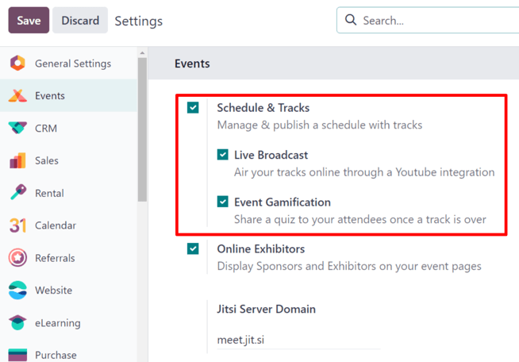
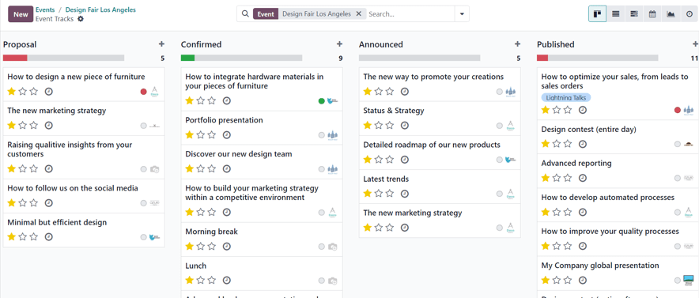
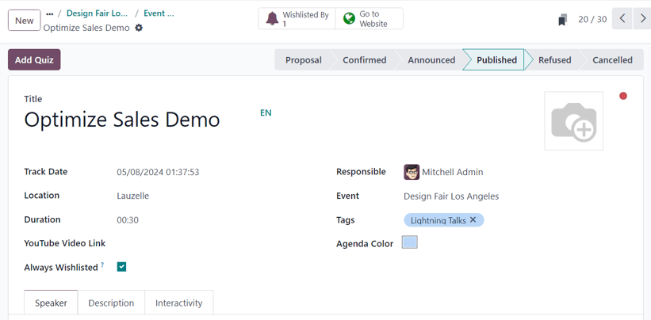
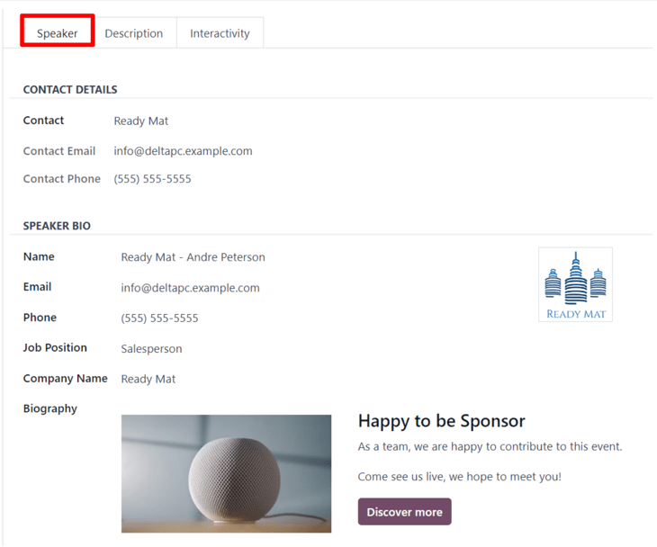
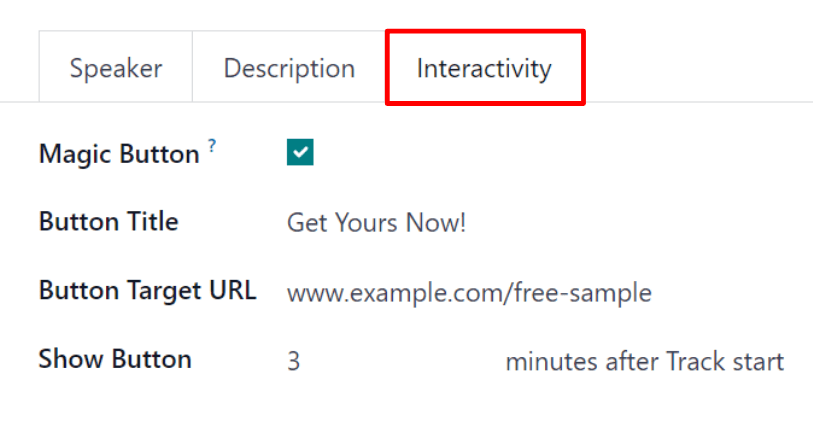
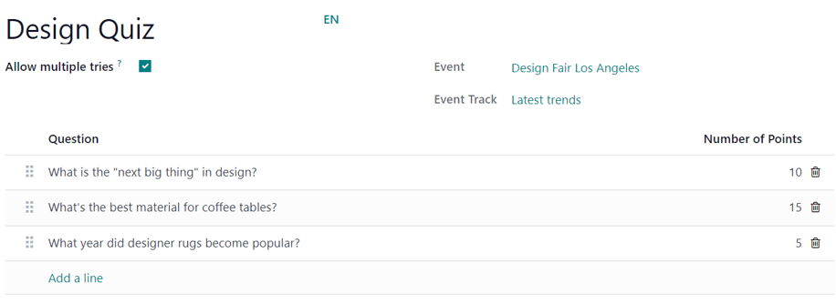
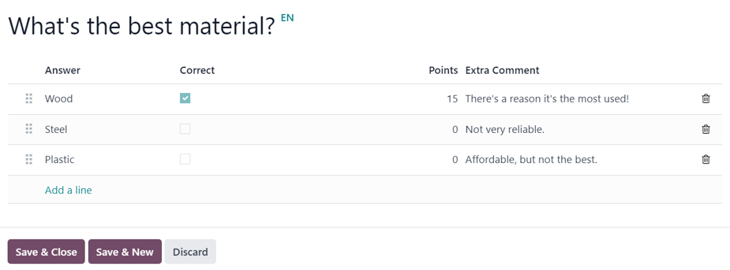
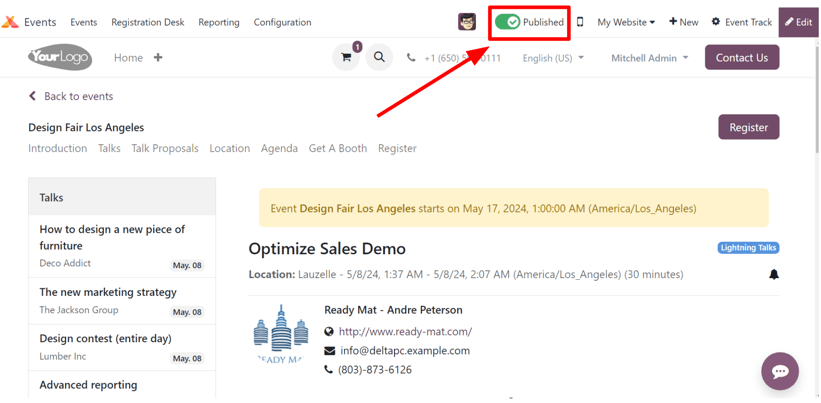

# Event tracks

Odoo *Events* provides the ability to create, schedule, and manage talks, lectures, demonstrations,
presentations, etc., which known as *Tracks* in Odoo.

The Odoo *Events* application also has an option to allow event attendees to propose talks (tracks)
for an event, which can then be approved (or disapproved).

## Cấu hình

First, there are some settings that need to be enabled, in order to get the most out of event
tracks.

To do that, navigate to Events app ‣ Configuration ‣ Settings, and tick the
checkbox beside the Schedule & Tracks setting. Doing so provides the ability to manage
and publish an event schedule with various tracks.

Also, when that setting checkbox is ticked, two additional setting options appear beneath it:
Live Broadcast and Event Gamification.

The Live Broadcast option provides the ability to air tracks online through a *YouTube*
integration.

The Event Gamification options provides the ability to share a quiz with track attendees
once the track is over, in order to test how much they learned.

#### NOTE
With the Event Gamification setting enabled, an Add Quiz button appears
on track forms, providing the ability to [quickly create a quiz](#events-track-add-quiz)
specific to the topic related to that particular track.

Once all desired settings have been enabled, be sure to click the Save button in the
upper-left corner of the Settings page.

## Event Tracks page

To access, modify, and/or create tracks for an event, first navigate to a preconfigured event, or
[create a new one](create_events.md) from the *Events* application.

To do that, navigate to Events app, and either select a pre-existing event from the
Events dashboard, or create a new one by clicking New.

Once on the desired event form, click into the Tracks smart button at the top of the
form.

Clicking the Tracks smart button reveals the Event Tracks page for that
particular event, which presents all the tracks (both scheduled and proposed) for the event, if
there are any.

The tracks are presented in a default <i class="oi oi-view-kanban"></i> (Kanban) view, but there is
also the option to view these tracks in a <i class="oi oi-view-list"></i> (List),
<i class="oi oi-view-cohort"></i> (Gantt) chart, <i class="fa fa-calendar-check-o"></i>
(Calendar), <i class="fa fa-area-chart"></i> (Graph), or <i class="fa fa-clock-o"></i>
(Activity) view. All of which are accessible in the upper-right corner of the
Tracks page.

In the default <i class="oi oi-view-kanban"></i> (Kanban) view, the tracks are categorized into
different stages. The default stages are: Proposal, Confirmed,
Announced, Published, Refused (collapsed stage), and
Cancelled (collapsed stage). All of which can be edited, if needed.

Clicking into a track from the Event Tracks page reveals the track form for that
particular track.

### Create event track

From the Event Tracks page, click New in the upper-left corner to reveal a
blank event track form to create an event track.

Start by giving this track a Title. This field is **required** by Odoo.

Sau đó, nếu muốn, bạn có thể thêm ảnh minh họa cho nội dung bằng cách nhấp vào biểu tượng <i class="fa fa-pencil"></i> (bút chì) xuất hiện khi di chuột qua biểu tượng <i class="fa fa-camera"></i> (máy ảnh) ở góc trên bên phải của biểu mẫu. Khi nhấp vào, hãy tải lên hình ảnh mong muốn cho nội dung. Hình ảnh này sẽ xuất hiện trên front-end của trang web sự kiện, tại trang web dành riêng cho nội dung này.

Next, enter a Track Date and time for the track, and designate a Location
where the talk is planning to be held.

Then, add a Duration to the track (in minutes).

If the *Live Broadcast* setting has been enabled in the *Events* app settings, the option to add a
corresponding link in the YouTube Video Link field is available.

If the Always Wishlisted checkbox is ticked, the talk is automatically set as a favorite
for each registered event attendee.

Assign someone to be in charge of managing this track in the Responsible field. By
default, the person who initially created the track is assigned.

Then, ensure the track is applied to the correct event in the Event field. By default,
this field is auto-populated with the event related to the *Event Tracks* page the track was
originally created from.

Next, choose to add existing tags, or create new ones, to further organize the track. These tags,
and their corresponding tag categories are utilized on the event specific website - mainly on the
*Talks* web page on the event website, via the drop-down filter menus.

Beneath that general information section, there are three tabs: [Speaker](#events-track-speaker-tab), [Description](#events-track-description-tab), and
[Interactivity](#events-track-interactivity-tab).

#### Tab diễn giả

The Speaker tab on an event track form is filled with various fields related to the
specific speaker who is planning to conduct/host the track.

##### Contact Details section

In the Contact Details section, proceed to use the Contact drop-down field
to select an existing contact from the database as the main point of contact for the talk.

If this contact is not yet in the database, type in the name of the contact, and click
Create to create and edit the contact form later, or click Create and
edit... to be taken to that new contact's contact form, where the rest of their pertinent
information can be entered.

The Contact Email and Contact Phone fields are greyed-out and populated with
the information found on that chosen contact's contact form. These fields are not modifiable once
the Contact field is selected.

##### Speaker Bio section

In the Speaker Bio section, proceed to enter information related to the specific speaker
scheduled to conduct/host the track. This section may auto-populate based on the Contact
selected in the Contact Details section. If not, enter information in the necessary
fields.

#### NOTE
This information appears on the front-end of the event website, on the specific track webpage,
providing more information about the speaker to the track attendees.

Start by entering a Name, Email, and Phone number for the
speaker.

Next, if desired, add an image to appear alongside the speaker biogrpahy on the event website, via
the <i class="fa fa-pencil"></i> (pencil) icon that appears when the cursor hovers over the
<i class="fa fa-camera"></i> (camera) icon. When clicked, proceed to upload the desired image for
the speaker.

Then, enter a Job Position for the designated speaker, followed by the
Company Name associated with the speaker.

In the Biography field, proceed to enter in a custom biography with any speaker-related
information.

#### Tab mô tả

The Description tab of an event track form is a blank text field, in which a description
of the track can be entered. The information entered here appears on the specific track page on the
event website.

#### Interactivity tab

The Interactivity tab on an event track form features a single option at first:
Magic Button.

When the checkbox beside Magic Button is ticked, Odoo displays a *call to action* button
to attendees on the track sidebar, while the track is taking place.

With that checkbox ticked, three more options appear, all of which are related to the
Magic Button:

- Button Title: enter a title to appear on the button for attendees.
- Button Target URL: enter a URL that leads attendees, who click the button, to a
  specific page.
- Show Button: enter a number in the field, and the button will appear that number of
  minutes after Track start.

#### NOTE
The magic button **only** appears if there is more than one published track.

#### Add Quiz button

The Add Quiz button **only** appears on event track forms if the *Event Gamification*
setting is enabled in the Odoo *Events* settings.

To add a quiz to the event track, click the Add Quiz button. Doing so reveals a separate
page where an event track quiz can be created and configured.

Start by entering a title for the quiz in the blank field at the top of the page. Then, if
participants should be allowed to try the quiz multiple times, tick the checkbox beside
Allow multiple tries.

The Event and Event Track fields are non-modifiable, and show the
corresponding event and track this quiz is associated with.

To add questions to the quiz, click Add a line beneath the Question column.
Doing so reveals a Create Questions pop-up window.

#### NOTE
**All** track quiz questions are multiple choice.

From the pop-up window, enter the question in the blank field at the top. Then, click Add
a line to add answer options. Upon clicking Add a line, a new line appears, in which an
answer option can be entered.

Once an answer option has been entered, proceed to designate whether it is the Correct
response, by ticking the checkbox in the Correct column.

Then, there is the option to add a point value in the Points column.

And, if there are any additional comments that should accompany an answer option, type them into the
Extra Comment field.

#### NOTE
The Correct, Points, and Extra Comment fields are all
optional.

Repeat this process for all the answer options.

To remove an answer option, click the <i class="fa fa-trash-o"></i> (trash can) icon on the
far-right.

Once all desired answer options (and their configurations) are complete, click Save &
Close to save the question, close the pop-up window, and return to the track quiz form. Or, click
Save & New to save this question, and instantly start creating another question on a new
Create Questions pop-up form.

To remove any question from the quiz, click the <i class="fa fa-trash-o"></i> (trash can) icon on
the far-right of the question line.

## Publish event track

Once all the desired configurations are complete on an event track form, click the desired stage it
should be in from the status bar in the upper-right corner (e.g. Confirmed,
Announced, etc.).

#### NOTE
The stage of a track can also be changed from the Event Tracks page, where the
desired track card can be dragged-and-dropped into the appropriate Kanban stage.

If an event track has *not* been published yet, and it is moved to the Published stage,
Odoo automatically publishes the track on the event website.

Một phần nội dung của sự kiện *cũng* có thể được công bố bằng cách mở biểu mẫu nội dung sự kiện mong muốn, rồi nhấp vào nút thông minh Đi đến trang web. Sau đó, để người tham dự có thể xem và truy cập trang của phần nội dung này, hãy chuyển nút <i class="fa fa-toggle-off"></i> Đã huỷ đăng ở đầu trang sang trạng thái <i class="fa fa-toggle-on"></i> Đã đăng; thao tác này sẽ đổi màu từ đỏ sang xanh lá, và giúp người tham dự có thể truy cập được nội dung.

#### SEE ALSO
- [Create events](create_events.md)
- [Talks, proposals, and agenda](track_manage_talks.md)
