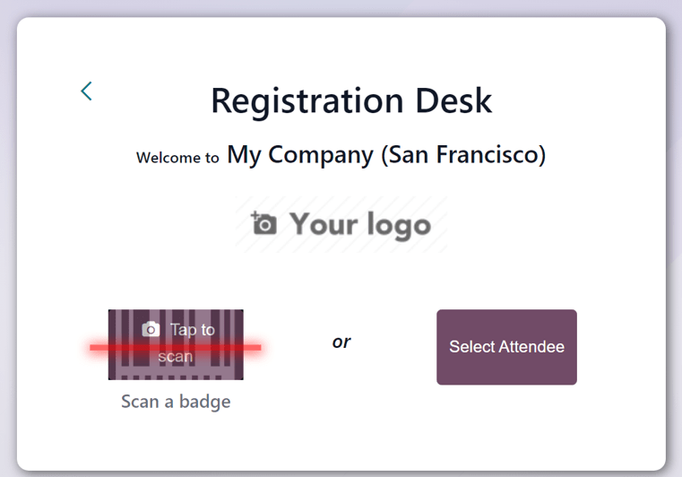
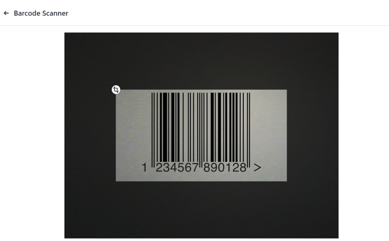
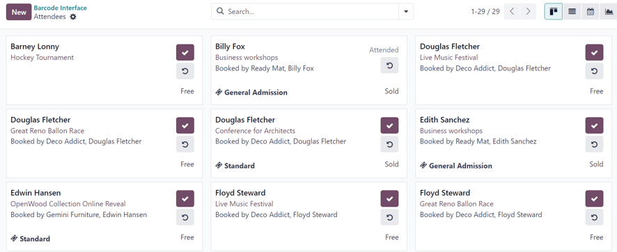

# Bàn đăng ký

Use the *Registration Desk* feature in Odoo **Events** to grant access to registered event attendees
as they arrive, and store attendee-related data in the reporting metrics.

## Registration Desk page

On a mobile device (on the Odoo app or in a browser), open the Events app, and
click the Registration Desk to view the Registration Desk page.

At the bottom of the Registration Desk box, there are options to either Scan
a badge or Select Attendee.

## Quét huy hiệu

Scan the codes present on event attendee badges, by navigating to Events app ‣
Registration Desk, and selecting the Scan a badge option.

#### IMPORTANT
Odoo **must** be granted access to the camera being used for the Scan a badge option
to work.

Once Odoo has access to the camera, a Barcode Scanner pop-up window appears, showing the
camera's point-of-view. There is also a specified view finder box present, whose size can be
manually modified, accordingly, using the <i class="fa fa-crop"></i> (crop) icon.

When the badge code is in the middle of the view finder box, the code is scanned, the
Barcode Scanner pop-up window disappears, and the attendee is granted access to the
event. Once the code is scanned, their attendance is logged in the Odoo **Events** app.

If the barcode being scanned is invalid, an error pop-up message appears in the upper-right corner.

## Select attendee

Manually grant access to event attendees, by navigating to Events app ‣
Registration Desk, and selecting the Select Attendee option.

Odoo reveals an Attendees page, with all the attendees for every event in the database,
in a default <i class="oi oi-view-kanban"></i> Kanban view.

On the Attendees page, each attendee card displays that person's name, which event they
are registered to attend, their associated company (if applicable), what ticket tier they purchased
(if applicable), along with two buttons: a <i class="fa fa-check"></i> (checkmark) and
<i class="fa fa-undo"></i> (counter-clockwise arrow).

To grant access to a person, marking them as attended, click the <i class="fa fa-check"></i>
(checkmark) button on that attendee's card.

Click the <i class="fa fa-undo"></i> (counter-clockwise arrow) button on an attendee's card to undo
the previous action.

#### SEE ALSO
[Tìm kiếm, lọc, và nhóm bản ghi](../../essentials/search.md)
