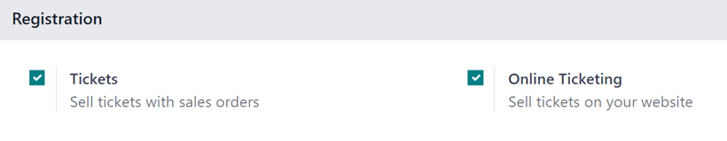
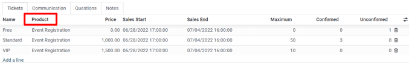
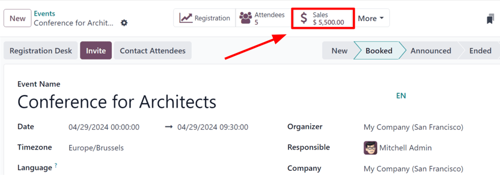
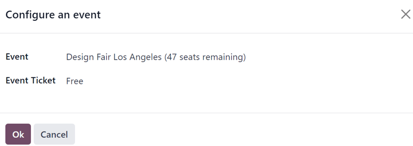
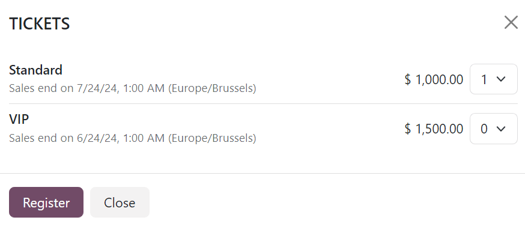
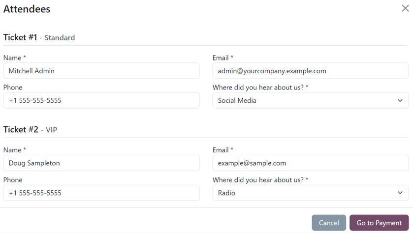

# Sell event tickets

Odoo _Events_ provides users with the ability to create custom event tickets (and ticket tiers),\
with various price points.

It _also_ allows them to sell event tickets in two different ways: via standard sales orders, and\
online through an integrated website.

Odoo also simplifies the ticket-purchasing process by providing plenty of payment method options.

## Cấu hình

In order to sell event tickets in Odoo, some settings must first be enabled.

First, navigate to Events app ‣ Configuration ‣ Settings. In the\
Registration section, there are two different settings: Tickets and\
Online Ticketing.

The Tickets setting allows users to sell event tickets with standard sales orders.

The Online Ticketing setting allows users to sell event tickets online through their\
integrated Odoo website.

To activate a setting, tick the checkbox beside the desired feature's label, and click\
Save to finish enabling it.

#### NOTE

If these options are _not_ enabled, a default Register button becomes available for\
visitors to interact with and procure free registrations to the event.

With those settings enabled, Odoo automatically creates a new _Product Type_ called, _Event Ticket_,\
which is accessible on every product form. Odoo also creates three event registration products (with\
the _Product Type_ set to _Event Ticket_) that can be used or modified for event tickets.

#### IMPORTANT

When creating a new event registration product, the _Product Type_ **must** be set to _Event_\
_Ticket_ on the product form, in order for it to be selected in the _Product_ column under th&#x65;_&#x54;ickets_ tab on an event form.

#### NOTE

Any event with paid tickets sold, features a Sales smart button at\
the top of the event form, where the respective sales orders attributed to those ticket sales\
become available.

Clicking the Sales smart button reveals a separate page, showcasing\
all the sales orders (standard and/or online) related to tickets that have been sold for that\
specific event.

## Sell event tickets with the Sales app

To sell event tickets with sales orders, start by navigating to the Sales app.\
Then, click New to open a new quotation form.

After filling out the top portion of the form with the appropriate customer information, click\
Add a product in the Order Lines tab. Then, in the Product\
column, select (or create) an event registration product configured with its Product\
Type set to Event Ticket on its product form.

Once an event registration product is selected, a Configure an event pop-up window\
appears.

From the Configure an event pop-up window, select to which event this ticket purchase is\
related to in the Event field drop-down menu. Then, in the Event Ticket\
drop-down menu, select which ticket tier the customer wishes to purchase, if there are multiple\
tiers configured for that event.

When all the desired configurations are complete, click Ok. Doing so returns the user to\
the sales order, with the event registration ticket product now present in the Order\
Lines tab. The user can proceed to confirm and close the sale, per the usual process.

## Sell event tickets through the Website app

When a visitor arrives on the register page of the event website, they can click the\
Register button to purchase a ticket to the event.

#### NOTE

If the visitor is _not_ already on the register page of the event website, clicking\
Register on the event website's submenu redirects them to the proper\
register page. From there, they can click the Register button to begin the ticket\
purchasing process.

If different ticket tiers are configured for the event, the visitor is presented with a\
Tickets pop-up window.

From here, visitors select which ticket tier they would like to purchase, along with a quantity,\
using the numerical drop-down menu available to the right of their desired ticket. Once the desired\
selections have been entered, the visitor then clicks the Register button.

Then, an Attendees pop-up window appears, containing all the questions that have been\
configured in the _Questions_ tab of the event form for this particular event.

If multiple tickets are being purchased at once, there are numbered sections for each individual\
ticket registrant, each containing the same questions. However, if any question has been configured\
with the _Ask once per order_ setting, that question is only asked once -- and **not** for every\
attendee making the reservation in the order.

With all necessary information entered, the visitor can then click the Go to Payment\
button. Doing so first takes the visitor to a Billing confirmation page, followed by a\
Payment confirmation page, where they can utilize any configured payment method set up\
in the database to complete the order.

Then, once the purchase is complete on the front-end of the website, the subsequent sales order is\
instantly accessible in the back-end of the database.

#### SEE ALSO

[Create events](create_events.md)
