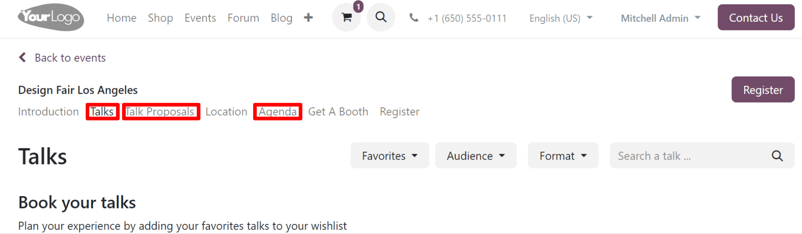
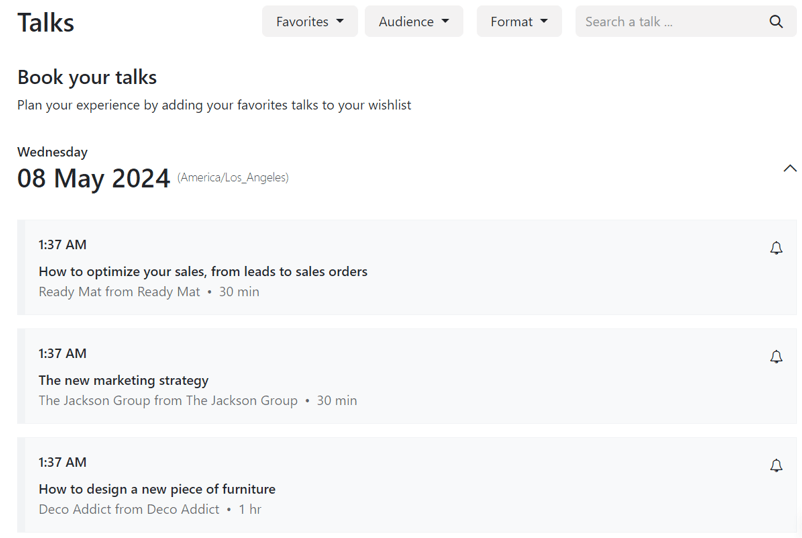
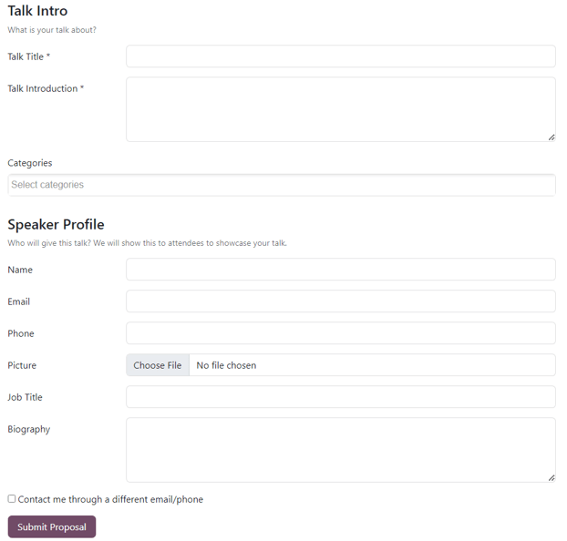
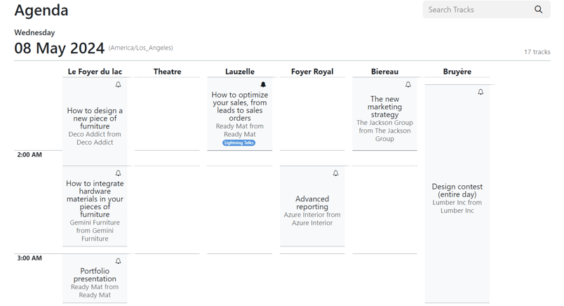

# Talks, proposals, and agenda

With Odoo *Events*, users can utilize a fully-integrated event website, where attendees can quickly
access various tracks (talks, presentations, etc.), view entire agendas, and propose talks for the
event.

## Event website

To access an event website, navigate to the specific event form in the Odoo *Events* app, and click
the Go to Website smart button. Or, while on the Odoo-built website for the company,
click the Events header option, and select the desired event to view that event's
website.

On the event website, there is an event-specific subheader menu with different options to choose
from.

With the *Schedule & Tracks* setting enabled in the Odoo *Events* app, the following links are
automatically added to the subheader menu, located on the event website: Talks,
Talk Proposals, and Agenda.

To enable the Schedule & Tracks setting, navigate to Events app ‣
Configuration ‣ Settings, tick the checkbox beside Schedule & Tracks, and click
Save.

### Talks page

The Talks link takes the attendee to a page filled with all the planned tracks for the
event.

At the top of Talks page, there are drop-down filter menus beside a Search
a talk... search bar.

The first drop-down filter menu (with the starting title: Favorites) is the only
drop-down filter menu that appears by default. When clicked, the resulting menu presents two
options: Favorites and All Talks.

Selecting Favorites shows *only* the tracks that have been favorited by the attendee.

#### NOTE
If no tracks have been favorited, and the Favorites filter is selected, Odoo presents
all the event tracks.

Selecting All Talks shows *all* the tracks, regardless if they have been favorited or
not.

The other drop-down filter menus that appear on this page are related to any configured tags (and
tag categories) created for event tracks in the backend.

Beneath the drop-down filter menus at the top of the Talks page, there is a list of
planned tracks for the specific event, organized by day.

If an attendee wishes to favorite a track, they can click the <i class="fa fa-bell-o"></i> (empty
bell) icon, located to the right of the track title. Attendees will know a track has been favorited
when they notice the icon has been changed to <i class="fa fa-bell"></i> (filled bell) icon.

Favoriting a track this way places it on the list of Favorites, which is accessible from
the default drop-down filter menu, located at the top of the Talks page.

### Talk Proposals page

The Talk Proposals link takes attendees to a page on the event website, wherein they can
formerly submit a proposal for a talk () for the event, via a custom online form.

In addition to the form, an introduction to the page, along with any other pertinent information
related to the types of talks the event will feature can be added, if needed.

The talk proposal form can be modified in a number of different ways, via the web builder tools,
accessible by clicking Edit while on the specific page.

Then, proceed to edit any of the default fields, or add new forms with the Form building
block (located in the Blocks section of the web builder tools sidebar).

Once all the necessary information is entered into the form, the attendees just need to click the
Submit Proposal button.

Then, that talk, and all the information entered on the form, can be accessed on the
Event Tracks page for that specific event in the Proposal stage, which is
accessible via the Tracks smart button on the event form.

At that point, an internal user can review the proposed talk, and choose to accept or deny the
proposal.

If accepted, the internal user can then move the track to the next appropriate stage in the Kanban
pipeline on the Event Tracks page for the event. Then, they can open that track form,
and click the Go to Website smart button to reveal that track's page on the event
website.

From there, they can toggle the Unpublished switch in the header to
Published, which allows all event attendees to view and access the talk.

### Agenda page

The Agenda link takes attendees to a page on the event website, showcasing an event
calendar, depicting when (and where) events are taking place for that specific event.

Clicking any track on the calendar takes the attendee to that specific track's detail page on the
event website.

If an attendee wishes to favorite a track, they can click the <i class="fa fa-bell-o"></i> (empty
bell) icon, located to the right of the track title. Attendees will know a track has been favorited
when they notice the icon has been changed to <i class="fa fa-bell"></i> (filled bell) icon.
