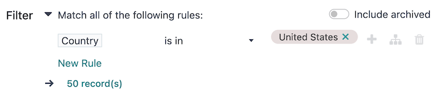

# Audience targeting

The Target and Filter fields on the campaign form, also referred to as the
*domain*, contain the parameters used to define the target audience for the campaign's reach (i.e.,
the unique contact records in the database, and imported list, etc.).

- Target: specifies the type of records available for use in the campaign, such as
  Lead/Opportunity, Event Registration, Contact, The assigned
  records model determines the fields that are available throughout the campaign, including the
  fields available in the Filter section, and in dynamic placeholders.
- Save as Favorite Filter: saves the current Filter for future use with the
  current Target model, and can be managed from the Marketing Automation
  app ‣ Configuration ‣ Favorite Filters menu.
- Unicity based on: specifies the Target model field where duplicates should
  be avoided. Traditionally, the Email field is used, but any available field can be
  used.
- Filter: contains an interactive form with configurable logic to further refine the
  targeting parameters under the chosen Target model. See more details in the
  [Defining filters](#marketing-automation-defining-filters) section.
- Include archived: allows or disallows the inclusion of archived records in the target
  audience.

#### NOTE
Each activity in a campaign's workflow can target a subset of the target audience; see the
[Campaign workflow activities](workflow_activities.md) documentation for more information.

## Defining filters

The default campaign Filter configuration is set to Match all records,
indicating that the campaign is targeting **all** records of the Target model.

To refine the Filter rules of a campaign, click the ➕ Add condition button
to reveal a new row with configurable rule parameters. See the [Search, filter, and group
records](../../essentials/search.md#search-custom-filters) documentation for more information on how to create filter rules.

At the bottom of the filter rules is a # record(s) button, which indicates the total
number of records targeted by this domain. Select the # record(s) button to open a
Selected records pop-up window, in which the targeted records can be viewed.

#### SEE ALSO
- [Domain developer documentation](../../../developer/reference/backend/orm/#reference-orm-domains)
- [Campaign workflow activities](workflow_activities.md)
- [Testing/running campaigns](testing_running.md)
- [Campaign metrics](understanding_metrics.md)
