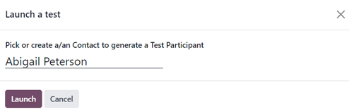
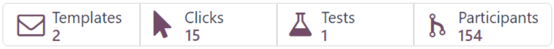

# Testing/running campaigns

The Odoo *Marketing Automation* app allows users to test marketing campaigns (and mailings) before
officially running them to check for errors and correct any mistakes before it reaches its target
audience.

## Test campaigns

To test a marketing campaign, open the Marketing Automation app, and select the
desired campaign to test, which reveals the campaign's detail form.

On the campaign detail form, make sure the campaign already has activities configured in the
workflow (or build a campaign by following the directions on [Campaign workflow activities](workflow_activities.md)
documentation).

#### NOTE
Testing marketing automation campaigns is meant to be performed in the production version of the
database. Duplicate (or trial) databases have limited email sending capabilities.

To start a test, click the Launch a Test button at the top of the campaign form, to the
right of the Start button.

When clicked, a Launch a test pop-up window appears.

In the Launch a test pop-up window, click the Pick or create a/an Contact to
generate a Test Participant field to reveal a drop-down menu of contacts. From this drop-down menu,
select an existing contact (or create a new one) to run the test on.

#### NOTE
Only one contact can be selected from the Launch a test pop-up window.

To create a new contact directly from the Launch a test pop-up window, start typing the
name of the new contact in the blank field, and click Create and edit....

Doing so reveals a blank Create Record pop-up form, in which the necessary contact
information (Email, Mobile, etc.) *must* be entered, in order for the test
to work. When the necessary information is entered, click Save & Close.

When all the necessary fields have been entered, click Save & Close to return to the
Launch a test pop-up window.

Once a contact is selected, click Launch to reveal the campaign test page.

On the campaign test page, the name of the Record being tested is visible, along with
the precise time this test workflow was started in the Workflow Started On field.
Beneath that, in the Workflow section is the first activity (or activities) in the
workflow that's being tested.

To start a test, click the Run button, represented by a ▶️ (play button)
icon beside the first activity in the workflow. When clicked, the page reloads, and Odoo shows the
various results (and analytics) connected to that specific activity as they occur, in real-time.

#### NOTE
If a child activity is scheduled beneath a parent activity, that child activity will be revealed
slightly indented in the workflow, once that parent activity has been run, via the ▶️
(play button) icon.

Once all the workflow activities are completed, the test ends, and the status bar (in the
upper-right corner) moves to the Completed stage.

To stop a test before all the workflow activities are completed, click the Stop button
in the upper-left corner of the campaign test page.

## Run campaigns

To run a campaign, navigate to Marketing Automation app, and select the desired
campaign to run.

On the campaign detail form, with all the desired activities ready in the Workflow
section, click Start in the upper-left corner to officially run the campaign to the
configured target audience specified on the campaign detail form.

Clicking Start launches the campaign, and the status bar of the campaign switches to
Running, which is located in the upper-right corner of the campaign detail form.

#### NOTE
If some participants are already running on a campaign, and was stopped for any reason, clicking
the Start button again prompts a pop-up warning. This warning advises the user to
click an Update button to apply any modifications made to the campaign.

Be aware that participants that had already gone through an entire campaign in its original state
**can** be reintroduced into the newly-modified campaign, and new traces could be created for
them.

Then, as the mailings and actions are triggered in the Workflow, the various stats and
data related to each activity appear in each activity block. There is also a series of stat-related
smart buttons that appear at the top of the campaign detail form, as well.

These analytical smart buttons will *also* populate with real-time data as the campaign progresses:
Templates, Clicks, Tests, Participants.

## Stop campaigns

To stop a campaign that's currently running, navigate to the Marketing Automation
app, and select the desired campaign to stop. On the campaign detail form, click the
Stop button in the upper-left corner.

When clicked, the campaign is officially stopped, and the status changes to Stopped in
the upper-right corner of the campaign detail form.

#### SEE ALSO
- [Campaign configuration](../marketing_automation.md)
- [Audience targeting](target_audience.md)
- [Campaign workflow activities](workflow_activities.md)
