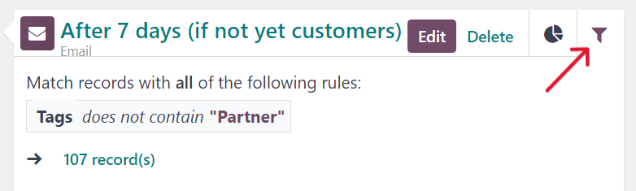
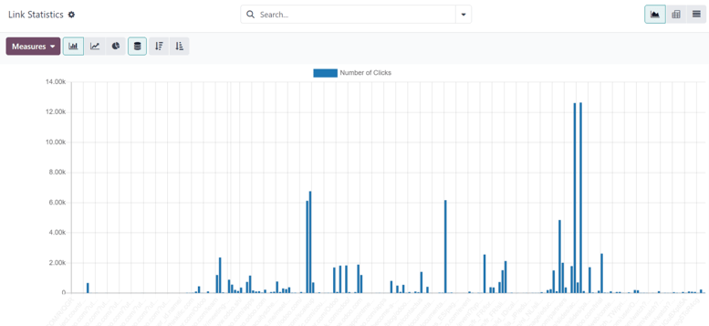

# Campaign metrics

*Campaign metrics* are detailed statistics and analytics within a marketing campaign, measuring its
success and effectiveness. Triggered marketing activities populate relevant activity blocks with
real-time metrics, in the campaign detail form.

## Activity analytics

In the Workflow section of a campaign detail form in the *Marketing Automation* app,
where the various campaign activities are located, a collection of useful data can be found on every
individual activity block, like number of communications Sent, percentage of messages
that have been Clicked, and more.

To the left of the activity block, the configured [trigger time](workflow_activities.md) is
displayed as a duration (either Hours, Days, Weeks, or
Months) if it corresponds to period after the workflow begins.

#### NOTE
If the trigger time is dependent on another activity or triggering action (e.g. Mail:
Replied, etc.) the time is displayed, along with the necessary action for that activity to be
activated (e.g. `Replied after 2 Hours`).

In the activity block, an icon represents each activity type. An ✉️ (envelope) icon
means the activity is an email. Three tiny, interlocking ⚙️ (gear) icons means the
activity is an internal action. And, a small, basic 📱 (mobile) icon means the activity
is an SMS.

Beside the activity icon, at the top of the activity block, is the title of the activity. To the
right of the activity title, there are Edit and Delete buttons.

Click Edit to open the Open: Activities pop-up form for that specific
activity, in which that activity can be modified. Click the Delete button to completely
delete that specific activity from the workflow.

#### SEE ALSO
[Campaign workflow activities](workflow_activities.md)

### Activity graph tab

In every activity block, the Graph (pie chart icon) tab is open by default, displaying
related metrics as a simple line graph. The success metrics are represented in `green` and the
rejected metrics are represented in `red`.

Numerical representations of both Success and Rejected activities are shown
to the right of the line graph.

Beneath the graph in the activity block, for *Email* or *SMS* activity types, a line of accessible
data figures provide a bird's eye view of the campaign activity, including: Sent
(numerical), Clicked (percentage), Replied (percentage), and
Bounced (percentage).

### Activity filter tab

Next to the Graph tab on the activity block, there's the option to open a
Filter tab (represented by a filter/funnel icon).

Clicking the Filter tab on an activity block, reveals what the specific filters are for
that particular campaign activity, and how many records in the database match that specific
criteria.

## Trình theo dõi liên kết

Odoo tracks all URLs used in marketing campaigns. To access and analyze those URLs, navigate to
Marketing Automation app ‣ Reporting ‣ Link Tracker. Doing so reveals a
Link Statistics page, wherein all campaign-related URLs can be analyzed.

The default view on the Link Statistics page is the Bar Chart view, but
there are different view options available in the upper-left corner. There is the option to view the
statistics as a Line Chart or Pie Chart.

Beside that, there is also the option to view the statistics as Stacked, and the data
can be put into Descending or Ascending order.

To the far-left of the view options, there is the Measures drop-down menu. When clicked,
the options to view the Number of Clicks or total Count are available. And,
to the right of the Measures drop-down menu, there's the ability to add any data to a
spreadsheet by clicking the Insert in Spreadsheet button.

Also, in the upper-right corner of the Link Statistics page, to the far-right of the
search bar, there are additional view options to choose from: the default Graph view,
the Pivot table view, and the List view.

## Dấu vết

Odoo tracks all activities used in every marketing campaign. The data related to these activities
can be accessed and analyzed in the Traces page, which can be found by navigating to
Marketing Automation app ‣ Reporting ‣ Traces.

The default view on the Traces page is the Bar Chart view, but there are
different view options available in the upper-left corner. There is the option to view the
statistics as a Line Chart or Pie Chart.

At the top of the graph, there's a color key, informing the user which activities have been
Processed, Scheduled, and Rejected. There's also an outline
indicator to inform users of the Sum of certain activities, as well.

Beside the various view option in the upper-left corner of the Traces page, there is
also the option to view the statistics as Stacked, and the data can be put into
Descending or Ascending order.

To the far-left of the view options, there is the Measures drop-down menu. When clicked,
the options to view the Document ID or total Count are available. And, to
the right of the Measures drop-down menu, there's the ability to add any data to a
spreadsheet by clicking the Insert in Spreadsheet button.

Also, in the upper-right corner of the Link Statistics page, to the far-right of the
search bar, there are additional view options to choose from: the default Graph view,
the Pivot table view, and the List view.

## Người tham gia

Odoo tracks all participants related to every marketing campaign. The data related to these
participants can be accessed and analyzed in the Participants page, which can be found
by navigating to Marketing Automation app ‣ Reporting ‣ Participants.

The default view on the Participants page is the Pie Chart view, but there
are different view options available in the upper-left corner. There is the option to view the
statistics as a Line Chart or Bar Chart.

At the top of the graph, there's a color key that describes the type of participants found in the
graph.

To the far-left of the view options, there is the Measures drop-down menu. When clicked,
the options to view the Record ID or total Count are available. And, to the
right of the Measures drop-down menu, there's the ability to add any data to a
spreadsheet by clicking the Insert in Spreadsheet button.

Also, in the upper-right corner of the Link Statistics page, to the far-right of the
search bar, there are additional view options to choose from: the default Graph view,
the Pivot table view, and the List view.
