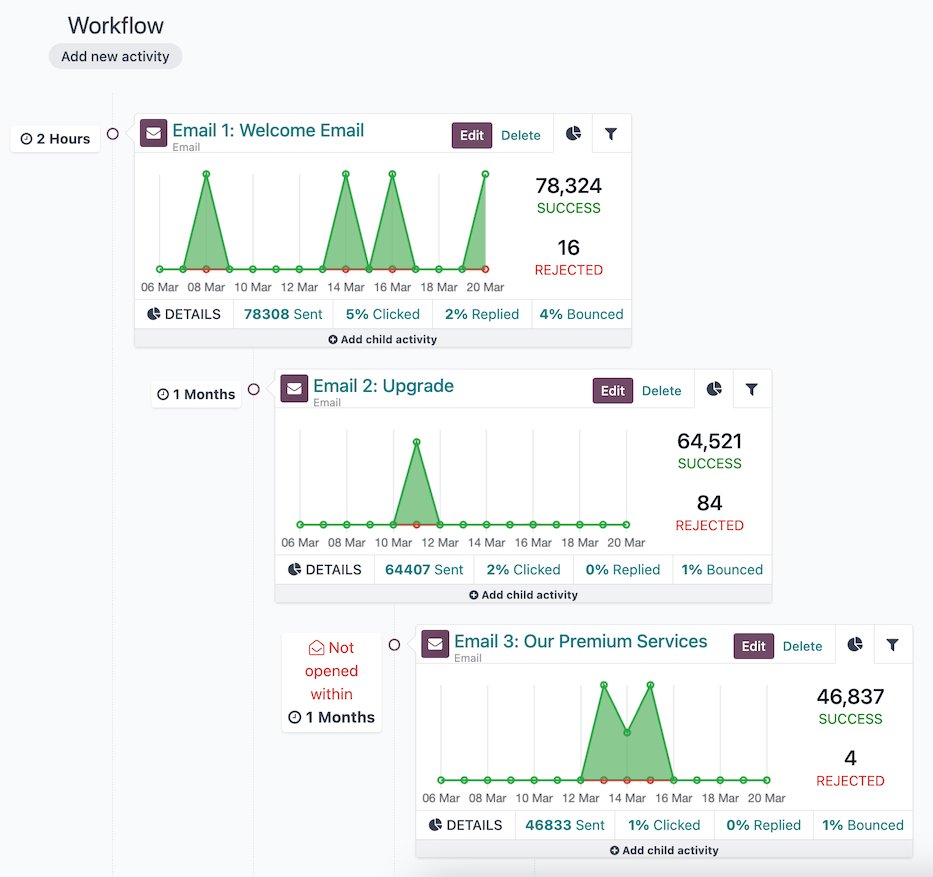
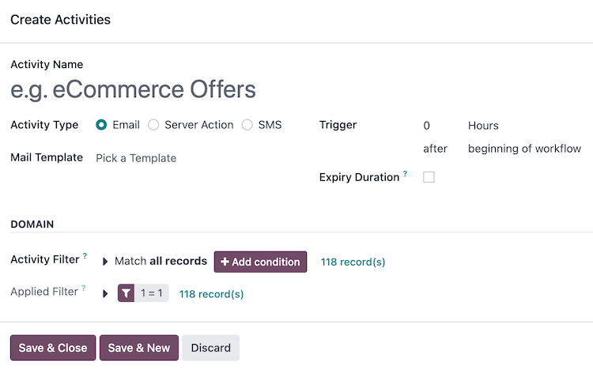
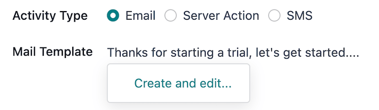
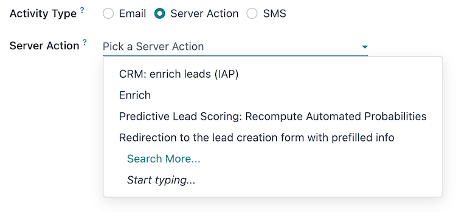
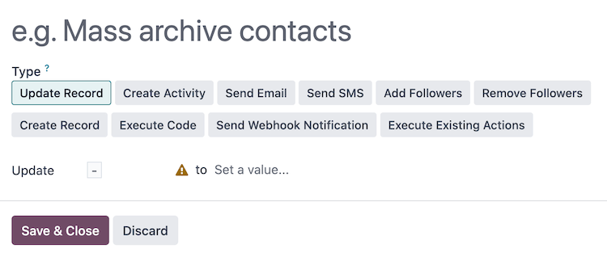
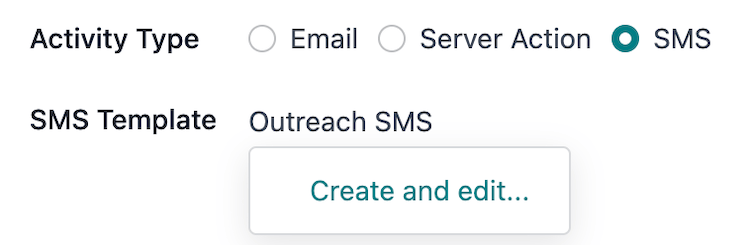
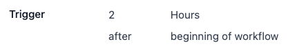
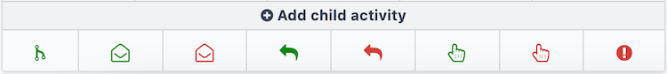
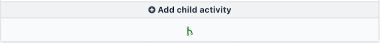
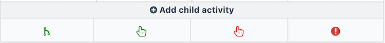

# Campaign workflow activities

A *workflow* is the overall *activity* structure of a marketing automation campaign. There can only
be a single workflow in each campaign. However, a workflow can be made up of any number of
[activities](#marketing-automation-activities) to meet the needs of the campaign.

## Hoạt động

Activities are the methods of communication or server actions, organized in a workflow, that are
executed within a campaign; they are the building blocks of the campaign's workflow.

A new activity can be added to the workflow on a campaign form by selecting an existing campaign or
[creating a new campaign](./#marketing-automation-campaigns) from the Marketing
Automation app ‣ Campaigns dashboard, then clicking the Add new activity button in
the Workflow section. Doing so opens the Create Activities pop-up window.

First, define the name of the activity in the Activity Name field, and select the
[type of activity](#marketing-automation-activity-types) to be executed from the
Activity Type field.

Then, configure the activity's [Trigger](#marketing-automation-trigger), and optionally, the
[Expiry Duration](#marketing-automation-expiry-duration) and the [DOMAIN](#marketing-automation-activity-domain) of the activity.

Once the activity is fully configured, click Save & Close to add it to the campaign's
workflow, or click Save & New to add the activity to the workflow and open a new
Create Activities pop-up window to add another activity. Clicking Discard
closes the pop-up window without saving the activity.

### Loại hoạt động

There are three different types of activities available in the *Marketing Automation* app:

- [Email](#marketing-automation-email-activity-type): an email that is sent to the target
  audience.
- [Server action](#marketing-automation-sa-activity-type): an internal action within the
  database that is executed.
- [SMS](#marketing-automation-sms-activity-type): a text message that is sent to the target
  audience.

#### Email

If Email is selected as the Activity Type, the option to Pick a
Template in the Mail Template field is available.

To create a new template directly from the Mail Template field, start typing the title
of the new template, then select Create and edit... to reveal a Create
Marketing Template pop-up window. Proceed to create and configure the new email template.

Once the email template is configured, click Save & Close to save the activity, and
return to the Create Activities pop-up window, in order to continue to configure the
[trigger](#marketing-automation-trigger).

#### NOTE
The title used for the Mail Template **must** be unique from any other mail template
titles in the campaign, and it also serves as the subject of the email.

#### SEE ALSO
[Creating and configuring email templates](../email_marketing/)

#### Tác vụ máy chủ

If Server Action is selected as the Activity Type, the option to
Pick a Server Action in the Server Action field is available. This field is
a drop-down menu containing all the pre-configured server actions for the campaign's
Target model. Optionally, [create a new server action](#marketing-automation-create-sa).

After selecting a pre-configured server action, no other activity type configuration is needed.
Click Save & Close to save the activity, and return to the Create Activities
pop-up window, in order to configure the [trigger](#marketing-automation-trigger).

##### Create a new server action

The option to create a new server action is also available. To do so, type in the Server
Action field a title for the new action, then click Create and edit.... Doing so
reveals a blank Create Server Action pop-up window, wherein a custom server action can
be created and configured.

On the Create Server Action pop-up window, select the Type of server action.
The configuration fields change, depending on the selected Type:

- Update Record: update the values of a record.
- Create Activity: create an activity with the *Discuss* app.
- Send Email: post a message, a note, or send an email with the *Discuss* app.
- Send SMS: send an SMS, and log them on documents, with the *SMS* app.
- Add Followers or Remove Followers: add or remove followers on a record
  with the *Discuss* app.
- Create Record: create a new record with new values.
- Execute Code: execute a block of Python code.
- Send Webhook Notification: send a POST request to an external system.
- Execute Existing Actions: define an action that triggers several other server
  actions.

Once the server action is configured, click Save & Close to save the activity, and
return to the Create Activities pop-up window, in order to configure the [trigger](#marketing-automation-trigger).

#### SMS

If SMS is selected as the Activity Type, the option to Pick a
Template in the SMS Template field is available.

To create a new template directly from the SMS Template field, start typing the title of
the new template, and select Create and edit... to reveal a Create Marketing
Template pop-up window. Proceed to create and configure the new SMS template.

Once the SMS template is configured, click Save & Close to save the activity, and return
to the Create Activities pop-up window, in order to configure the [trigger](#marketing-automation-trigger).

#### SEE ALSO
[Creating and configuring SMS templates](../sms_marketing/)

### Thời điểm

Once an [activity type](#marketing-automation-activity-types) is configured, the next step in
the Create Activities pop-up window is to define when the activity should be executed.
This is done in the Trigger field group.

To set an execution delay for the activity from when the [trigger type](#marketing-automation-trigger-type) occurs, type a whole number in the *interval number* input
(e.g. `2` is valid, `0` is also valid, and `1.5` is not).

Next, select the unit of time for the interval number in the *interval type* drop-down menu, the
options are: Hours, Days, Weeks, and Months.

#### Trigger type

To define the event occurrence that sets the activity into motion, select a *trigger type* from the
drop-down menu:

- beginning of workflow: the activity is executed when the campaign is started.

All other trigger types reveal a drop-down menu Activity field containing all of the
other activities in the campaign. Selecting one of these types converts this activity into a
[child activity](#marketing-automation-child-activities) to be executed directly after the
selected Activity:

- another activity: to be executed after another activity in the campaign.
- Mail: opened: the activity's email was opened by the participant.
- Mail: not opened: the activity's email was **not** opened by the participant.
- Mail: replied: the activity's email was replied to by the participant.
- Mail: not replied: the activity's email was **not** replied to by the participant.
- Mail: clicked: a link in the activity's email was clicked by the participant.
- Mail: not clicked: a link in the activity's email was **not** clicked by the
  participant.
- Mail: bounced: the activity's email has bounced.
- SMS: clicked: a link in the activity's SMS was clicked by the participant.
- SMS: not clicked: a link in the activity's SMS was **not** clicked by the participant.
- SMS: bounced: the activity's SMS has bounced.

### Expiry duration

Optionally, an Expiry Duration can be defined in the Create Activities
pop-up window to cancel the execution of this activity after a specific amount of time. Selecting
this checkbox reveals the Cancel after field with *interval* and *interval type* inputs.

Type a whole number in the interval number input (e.g. `2` is valid, `0` is also valid, and `1.5`
is not). Then, select the unit of time for the interval number in the interval type drop-down menu,
the options are: Hours, Days, Weeks, and Months.

### Activity domain

The DOMAIN section of the Create Activities pop-up window contains fields to
further filter the target audience of the activity.

The Activity Filter field focuses this activity, **and** its [child activities](#marketing-automation-child-activities), even further on a specific group of the campaign's filter.
The process is the same as [defining filters](target_audience.md#marketing-automation-defining-filters) for the
campaign, and the fields that are available to filter are also specific to the Target
of the campaign.

The # record(s) beside the Activity Filter field indicates how many records
are currently being targeted by this Activity Filter.

The Applied Filter displays the combined filters from the Activity Filter
and the inherited campaign [Filter](target_audience.md). This field is read-only.

The # record(s) beside the Applied Filter field indicates how many records,
in total, are currently being targeted by the activity.

## Child activities

Activities that are connected to, and triggered by, another activity are known as, *child
activities*.

The activity that triggers a child activity is known as its *parent activity*.

A child activity can be added to a campaign's workflow by hovering over the ➕ Add child
activity button, located beneath the desired parent activity.

The child activity's [trigger types](#marketing-automation-trigger-type) are specific to the
parent [activity type](#marketing-automation-activity-types) (*Email*, *SMS*, or *Server
Action*), and are as follows:

Email

Each trigger the child activity on the following conditions of the parent activity:

- Add Another Activity: to be executed after the parent activity.
- Opened: the email was opened by the participant.
- Not Opened: the email was **not** opened by the participant.
- Replied: the email was replied to by the participant.
- Not Replied: the email was **not** replied to by the participant.
- Clicked: a link in the email was clicked by the participant.
- Not Clicked: a link in the email was **not** clicked by the participant.
- Bounced: the email has bounced.

Tác vụ phía máy chủ

Triggers the child activity on the following condition of the parent activity:

- Add Another Activity: to be executed after the parent activity.

SMS

Each trigger the child activity on the following conditions of the parent activity:

- Add Another Activity: to be executed after the parent activity.
- Clicked: a link in the SMS was clicked by the participant.
- Not Clicked: a link in the SMS was **not** clicked by the participant.
- Bounced: the SMS has bounced.

Once a trigger type is selected, the Create Activities pop-up window opens to configure
the child activity. The process is the same as [creating a new activity](#marketing-automation-activities), with the exception that the Trigger field is
pre-filled with the selected trigger type, and the Activity field has the parent
activity selected.

#### SEE ALSO
- [Testing/running campaigns](testing_running.md)
- [Campaign metrics](understanding_metrics.md)
- [Audience targeting](target_audience.md)
