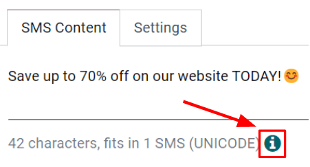

# Create SMS messages

To start, click Create on the main SMS Marketing dashboard, and Odoo reveals
a blank SMS template form, which can be configured in a number of different ways.

First, give the mailing a Subject, which describes what the mailing is about.

Next, in the Recipients field, choose to whom this 
will be sent. By default, Odoo has Mailing List selected. If this is the desired
Recipients field option, specify which mailing list Odoo should send this  to in the Select Mailing List field.

#### NOTE
To create (or edit) a mailing list, go to Mailing Lists ‣ Mailing List. There,
Odoo displays all previously created mailing lists, along with various types of data related to
that specific list (e.g. number of contacts, mailings, recipients, etc.).

To learn more about mailing lists and contacts, check out [Mailing lists and blacklists](applications/marketing/sms_marketing/mailing_lists_blacklists.md).

To reveal all the possible options in the Recipients field, click the field to see all
the choices Odoo makes available.

When another field (other than Mailing List) is selected, the option to specify that
chosen field even further becomes available — either with a default recipient filter equation that
appears automatically (which can be customized to fit any business need), or, if no default
recipient filter equation is present, an Add Filter button will appear.

Clicking the Add Filter button, reveals fully customizable domain rule fields, which can
be configured similar to an equation. You can create multiple recipient rules, if necessary.

Then, Odoo will only send the  to recipients who fit into
whatever criteria is configured in those fields. Multiple rules can be added.

## Writing SMS messages

Nhập nội dung  vào trường văn bản trong tab Nội dung SMS. Bạn cũng có thể thêm liên kết và biểu tượng cảm xúc. Bên dưới trường văn bản, Odoo hiển thị số ký tự đã sử dụng trong tin nhắn cùng với số lần gửi  cần thiết để truyền tải toàn bộ nội dung.

#### NOTE
Credits must be purchased from Odoo in order to take advantage of the *SMS Marketing* app;
 messages will not be sent without credits.

#### SEE ALSO
[Odoo SMS - FAQ](https://iap-services.odoo.com/iap/sms/pricing)

## Track links used in SMS messages

When links are used in  messages, Odoo automatically generates
link trackers to gather analytical data and metrics related to those specific links, which can be
found by going to Configuration ‣ Link Tracker.

### Adjust SMS settings

Under the Settings tab of the SMS template, there is an option to Include
opt-out link. If activated, the recipient is able to unsubscribe from the mailing list, thus
avoiding all future mailings.

An employee can be designated as the Responsible in the Tracking section of
the Settings tab, as well.

### Send SMS messages

Once a mailing is created, choose when Odoo should deliver the message from the following options:

- Send: sends the message immediately. Consider using this option if the recipient list
  is highly refined, or in cases that involve fast approaching deadlines, such as a "flash sale."
- Schedule: choose a day (and time) for Odoo to send the mailing. This is typically the
  best option for mailings related to a specific event. Such a method can also be used to promote a
  limited-time offer, or to help plan a company's content strategy in advance.
- Test: allows for an  to be sent to one or multiple
  numbers for test purposes. Remember to use a comma between phone numbers if multiple numbers are
  used as recipients.
