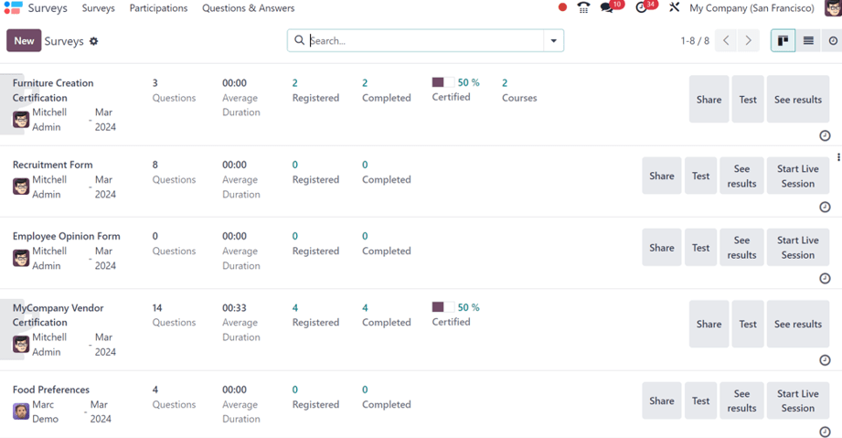
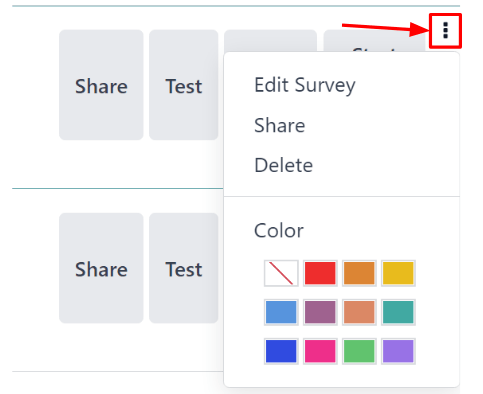
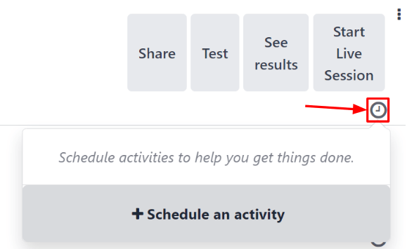
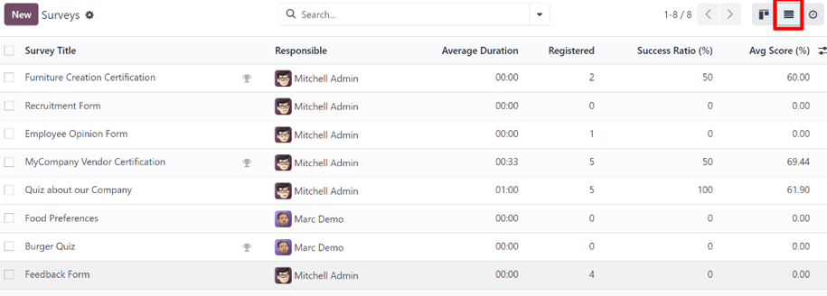
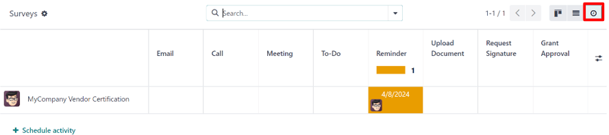

# Khảo sát

Companies gather valuable insights from customers and employees through surveys, aiding informed
decision-making.

With Odoo *Surveys*, users create various surveys, questionnaires, certifications, assessments, and
so much more. These can be used to collect feedback, evaluate the success of a recent event, and
measure the satisfaction of customers and/or employees. This process yields valuable insights into
shifting market trends.

#### SEE ALSO
[Odoo Tutorials: Surveys](https://www.odoo.com/slides/surveys-62)

## Trang tổng quan

Upon opening the *Surveys* application, Odoo presents the main dashboard of the *Surveys*
application, otherwise known as the Surveys page.

In the upper-left corner, there is a New button. When clicked, Odoo presents a blank
survey form that can be used to create a survey.

On the dashboard, all the surveys that have been created in the database are displayed in a default
Kanban view.

From left-to-right, after the survey name, the user who is responsible for it, and the month it was
created, each line on the *Surveys* dashboard shows the following:

- Number of Questions in that particular survey
- Average Duration of the survey (how long it typically takes a participant to complete)
- Number of Registered participants for the survey
- Number of times that particular survey has been Completed
- Percentage and data bar showcasing how many people have Passed or become
  Certified

  #### NOTE
  The Passed percentage and bar **only** appears when a *Required Score* has been
  configured for that particular survey.

  The Certified percentage and bar **only** appears if that particular survey has the
  *Is a Certification* option enabled on the survey form.

  If neither Passed nor Certified appear on the line, that indicates the
  survey is without a *Required Score* and was not enabled with the *Is a Certification* option.
- Number of Courses related to that survey, which **only** appears if more than one
  course has been created and attached to a single survey

#### NOTE
A half-trophy background image behind the survey name indicates that the survey is a
*Certification*.

To the far-right of those data points on the survey lines, located on the *Surveys* application
dashboard, are a collection of buttons.

Those buttons are as follows:

- Share: click to reveal a Share a Survey pop-up form that can be used to
  invite potential participants to the survey - complete with a Survey Link that can be
  copied and sent to potential participants, and a Send by Email toggle switch.

  When the Send by Email toggle is active (green switch), additional fields appear, in
  which Recipients, Additional Emails, and a Subject can be
  added to the email.

  Below that, a dynamic email template, complete with a Start Certification button
  appears, which can be modified, as well, if needed.

  Attachments can be added to the email, as well as an Answer deadline can
  be set, if needed.

  Once modifications are complete, click Send to send that email invite to all the email
  addresses/contacts listed in the Recipients field.
  

  #### NOTE
  The Send by Email toggle switch is **not** present when the survey line has zero
  questions.

  The Survey Link only appears when the survey's *Access Mode* is set to *Anyone with
  the link*.

  The Additional Emails field only appears when the survey's *Require Login* field is
  **not** active.
- Test: click to take a test version of the survey in a new tab, from the point-of-view
  of a survey participant, in order to check for any errors or inconsistencies.
- See results: click to reveal a new tab showcasing detailed metrics and graphical
  representations of all survey participants, questions, and responses for deeper analysis.
- Start Live Session: click to initiate a *Live session* survey, and reveal a session
  manager window in a new tab. This button is **not** present for surveys that have enabled the *Is
  a Certification* option on the survey form.
- End Live Session: click to end a *Live session* survey that has been officially
  started. This button option **only** appears on survey lines that have previously initiated a live
  session.

Above the buttons that are located to the far-right of the survey lines, a ⋮ (three
dots) icon appears when the cursor hovers over that particular line. When the ⋮ (three
dots) icon is clicked, a drop-down menu with some configuration-related options appear:

The options are:

- Edit Survey: when clicked, Odoo reveals the survey form for that particular survey,
  which can then be modified in a number of different ways.
- Share: when clicked, Odoo reveals the Share a Survey pop-up form that can
  be used to invite potential participants to the survey.
- Delete: when clicked, Odoo presents a pop-up window, wherein the user **must** confirm
  they want to delete the survey entirely, which they can do by clicking the Delete
  button at the bottom of the pop-up window.
- Color: users can opt to choose a color to add to the survey line on the dashboard for
  added organizational purposes, if needed.

Beneath the buttons that are located to the far-right of the survey lines, there is an *Activities*
button, represented by a 🕘 (clock) icon. When clicked, a mini pop-up window appears,
from which activities related to that particular survey can be scheduled and customized.

### Xem danh sách

The *Surveys* dashboard is shown in the Kanban view, by default, but there is also a list view
option available in the upper-right corner, represented by a ≣ (bars) icon.

When the ≣ (bars) icon is clicked, the survey related data is displayed in a list view.

The columns shown on the *Surveys* app dashboard, while in list view, are as follows:

- Survey Title
- Người phụ trách
- Average Duration
- Registered
- Success Ratio (%)
- Avg Score (%)

### Activities view

To have the *Surveys* application dashboard display nothing but the activities associated to the
surveys in the database, click the 🕘 (clock) icon to the far-right of the other view
options, located in the upper-right corner.

Doing so reveals a table with rows and columns. The rows show the different surveys in the database,
and the columns depict the various activity types.

#### NOTE
A new survey cannot be created in this view, as it is solely for the purpose of creating and
viewing scheduled activities.

## Create surveys

Learn about all the different options and configurations that can be utilized when creating a survey
in Odoo.

#### SEE ALSO
[Create surveys](create.md)

## Scoring surveys

Discover how to measure a survey participant's performance, or overall satisfaction, with Odoo's
detailed (and fully customizable) survey scoring options.

#### SEE ALSO
[Scoring surveys](scoring.md)

## Create questions

With Odoo *Surveys*, there are many question types and options to choose from, providing the ability
to create any kind of unique survey, questionnarire, and/or certification.

#### SEE ALSO
[Create questions](questions.md)

## Live Session surveys

The *Live Session* survey option available in Odoo can enhance in-person demonstrations and
presentations, where participants' real-time responses can be used to dictate where the conversation
goes next.

#### SEE ALSO
[Live Session surveys](live_session.md)

## Survey analysis

Once the surveys start to come in, it is time to analyze the responses from your participants.
Fortuantely, the in-depth reporting pages and options available in Odoo *Surveys* provide countless
ways to examine everything related to surveys, and their submitted responses.

#### SEE ALSO
[Survey analysis](analysis.md)

* [Create surveys](create.md)
* [Scoring surveys](scoring.md)
* [Create questions](questions.md)
* [Live Session surveys](live_session.md)
* [Survey analysis](analysis.md)
