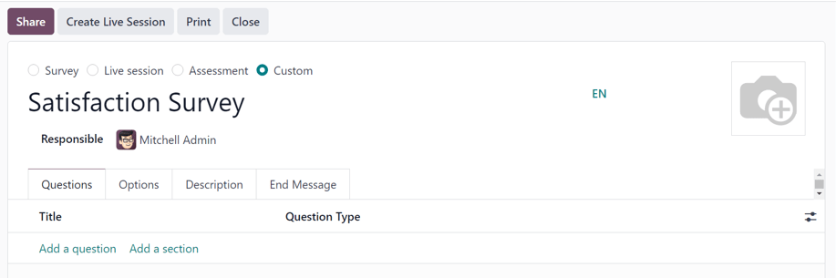
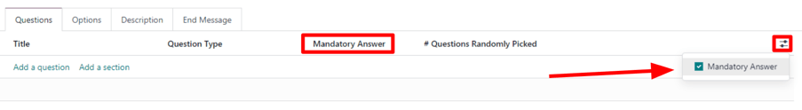
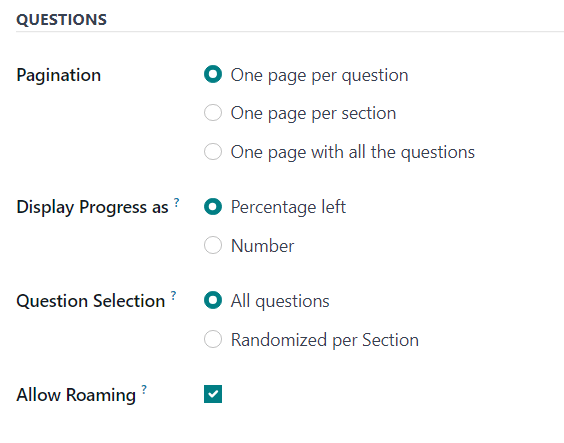
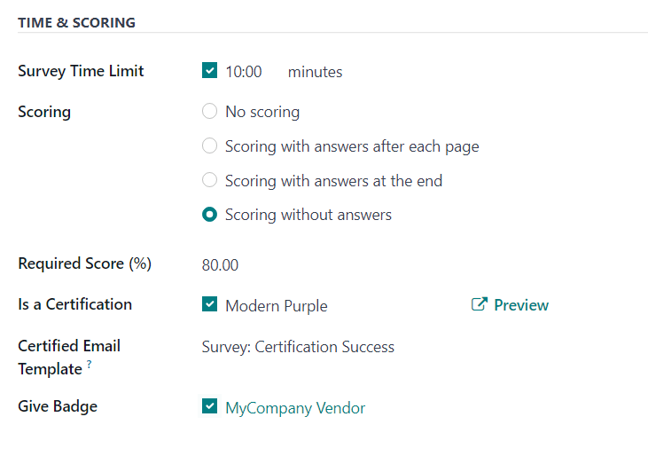
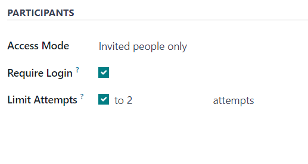
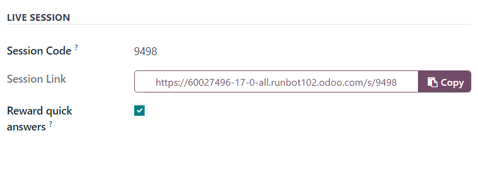
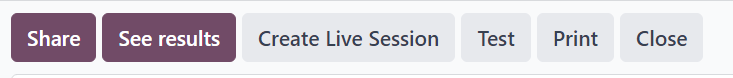
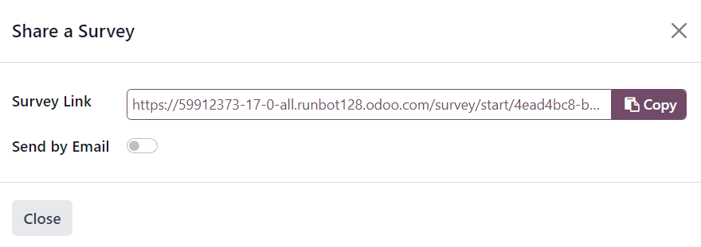
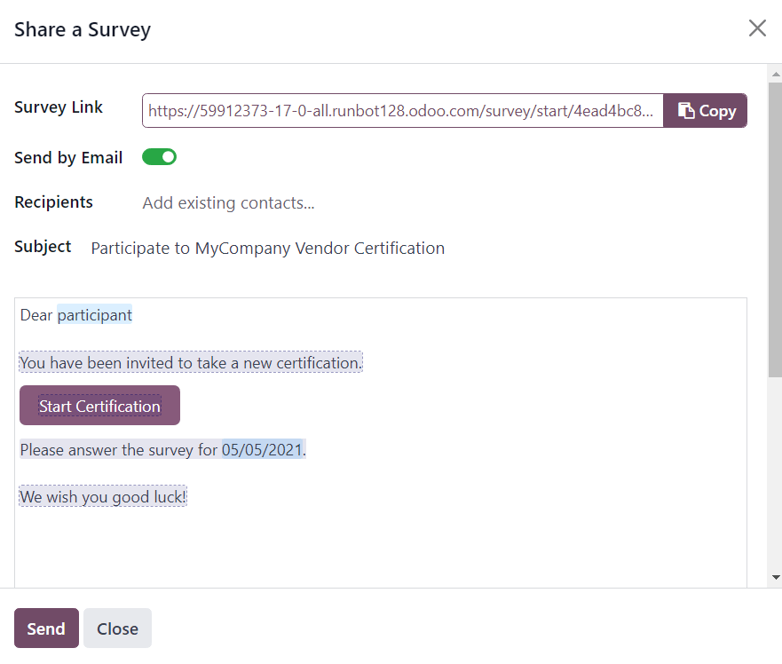

# Create surveys

To create a survey in the Odoo *Surveys* application, navigate to Surveys app ‣
New to reveal a blank survey form.

#### NOTE
The New button is **not** present on the *Surveys* dashboard if in the *Activities*
view.

## Survey form

At the top of the survey form are four radio buttons, each representing a survey style. The radio
button options are:

- Khảo sát
- Live Session
- Đánh giá
- Custom (selected by default)

These options are here to streamline the survey-making process, by providing users with automated
settings and options that are ideally specific to those types of surveys. Each of those survey type
options comes equipped with its own specific selection of options.

The Custom option, selected by default, offers all the options from every potential
survey type (located in the Options tab).

Beneath those radio survey type options is a blank field in which a name for the survey **must** be
entered.

Below the survey name field, is the Responsible field. Choose a user from the drop-down
menu to be in charge of the survey. By default, the user who initially created the survey is
selected as the default Responsible.

To the right of those fields, and above the tabs, is the option to add a background image,
represented by a 📷 (camera) icon. When clicked, the option to upload an image becomes
available. This image would be used as the background image for the entire survey. This is **not** a
required option.

Below those fields and options are four tabs: Questions, Options,
Description, and End Message.

### Questions tab

View, access, add, and/or delete questions and sections to the survey in the Questions
tab.

By default, two columns are present in the Questions tab: Title (i.e. the
question) and Question Type.

If the Randomized per Section option is enabled in the Options tab of the
survey form, a column titled, # Questions Randomly Picked appears in the
Questions tab.

Indicate whether questions require a mandatory answer by clicking the (optional columns)
icon to the far-right of the column titles. Then, select Mandatory Answer from the
drop-down menu to reveal the Mandatory Answer column in the Questions tab.

#### Add a question

To add a question to a survey, click Add a question in the Questions tab,
and proceed to fill out the Create Sections and Questions pop-up window that appears.

To learn how to create and customize questions, refer to the [create questions](questions.md)
documentation.

#### IMPORTANT
There **must** be a survey title entered in order for the Create Sections and
Questions pop-up window to appear. If no title is entered for the survey, an error pop-up
message appears in the upper-right corner, instructing the user to enter a survey title.

#### Thêm phần

A *section* divides the survey into organized parts, in order to visually group similar questions
together. To make a section, click Add a section at the bottom of the
Questions tab, proceed to type in a desired name for the section, then either press
`Enter` or click away.

The section line appears in dark gray in the Questions tab.

Then, drag-and-drop desired questions beneath a section, or drag-and-drop a section title on top of
(i.e. *before*) the desired question(s) in the survey. Doing so populates the section with questions
that align with its theme.

If the Randomized per Section option is enabled in the Options tab of the
survey form, the number `1` appears, by default, on the section line, beneath the #
Questions Randomly Picked column.

This indicates that `1` question from that section will be picked at random for each participant
taking the survey, bypassing every other, non-chosen question from that section. To change that
number, select that figure, and type in the desired number in its place. Then, either press
`Enter`, or click away.

### Options tab

In the Options tab of the survey form, there are many options to choose from, separated
in four different sections: Questions, Time & Scoring,
Participants, and Live Session.

The options available in this tab vary on the survey type chosen, via the radio buttons at the top
of the survey form: Survey, Live Session, Assessment, or
Custom.

The Custom survey type showcases all the possible options in the Options
tab. So, if any of the following options do **not** appear in the Options tab, it is
likely because the selected survey type does not offer it.

#### Questions section

The first field in the Questions section revolves around the Pagination,
or overall layout, of the survey.

Choose between One page per question, One page per section, or
One page with all the questions in the Pagination field.

#### NOTE
If One page with all the questions is selected, all the remaining options in the
Questions field, apart from Question Selection is removed, as they are no
longer needed.

Next, select one of the following options in the Display Progress as field:

- Percentage left: displays the percentage of the survey remaining to participants.
- Number: display the number of questions answered along with the total number of
  questions to answer.

In the Question Selection field choose to have the survey show All questions
or Randomized per Section. If Randomized per Section a new column appears in
the Questions tab, titled: # Questions Randomly Picked.

In the # Questions Randomly Picked column, designate how many questions, in that
particular section, should be chosen at random to the participant.

Lastly, there is the Allow Roaming option. When enabled, participants are able to
navigate back to previous pages in the survey.

#### Time & Scoring section

The first option in the Time & Scoring section is the Survey Time Limit
option. If enabled, proceed to enter in an amount of time (in minutes) to be set as the
time limit for the survey.

Next, in the Scoring section, determine whether there should be: No scoring,
Scoring with answers after each page, Scoring with answers at the end, or
Scoring without answers.

If the No scoring option is selected, no other options are available in this section.
However, if any *other* Scoring option is selected, two additional fields appear:
Required Score (%) and Is a Certification.

In the Required Score (%) field, enter the minimum percentage participants **must** earn
in order to pass the survey. Scores below this threshold are considered fails. This figure is also
used to determine if a participant is 'certified' or not, if the Is a Certification
option is enabled.

If the Is a Certification option is enabled, that makes the survey a *Certification*,
which is represented on the main *Surveys* app dashboard via a half-tropy image behind the survey
title, while in the default Kanban view. Or, via a full-trophy icon, while in list view.

When the Is a Certification option is enabled, three additional fields appear -- one
beside the option, and two below.

In the field that appears beside the option, users can select (and Preview) a
certification template.

Beneath that, in the Certified Email Template field, users can select a preconfigured
email template, or create one on-the-fly, to be sent to certified participants of the survey upon
completion.

Lastly, if the Give Badge field is enabled, a preconfigured badge is then displayed on
the contact page for that certified survey participant.

#### Participants section

The first available option in the Participants section is the Access Mode
field. This is where users can determine who has access to the survey. Users can select either:
Anyone with the link or Invited people only.

Next, there is the option to Require Login. Enabling this feature means users **must**
login before being able to take the survey, even if they have a valid token.

Lastly, in there is the Limit Attempts field. If enabled, an additional field appears
beside it, in which users can determine how many times users can attempt this survey.

#### Live Session section

#### NOTE
The Live Session section in the Options tab of the survey form **only**
pertains to *Live Session* surveys.

The first option in the Live Session section is the Session Code field. In
this field, enter a custom code, consisting of letters, numbers, and/or symbols, to be used by
participants in order to access the live session survey.

Next, is the Session Link field, which **cannot** be customized, but it *can* be sent
out to potential participants.

#### NOTE
If a Session Code has been entered, the URL in the Session Link field
ends with that specific Session Code.

If that complete Session Link (ending in the custom Session Code) is used
by participants to access the live session survey, that link would *already* be entered for them.
At that point, they'd simply have to wait until the host of the live session begins the survey,
and then they'd be able to enter.

If the Session Link (ending in the custom Session Code) is sent
**without** including the Session Code ending, participants trying to access the live
session, via that link, will need to enter the custom Session Code to gain access.

Nếu trường Mã phiên để trống, một URL dài hơn và phức tạp hơn sẽ tự động điền vào trường Liên kết phiên. Khi người tham gia truy cập phiên trực tiếp qua liên kết này (khi chưa cấu hình Mã phiên), họ chỉ cần chờ chủ phiên bắt đầu khảo sát là có thể tham gia ngay.

Lastly, in the Live Session section, there is the option to Reward quick
answers. If that option is enabled, participants who submit their answer quickly receive more
points.

#### SEE ALSO
[Live Session surveys](live_session.md)

### Tab mô tả

In this non-required tab, users can enter a custom description about the survey, along with any
explanations or guidance that a survey participant may need in order to properly participate (and
complete) the survey.

### End Message tab

In this non-required tab, users can enter a custom message that participants see upon completing the
survey.

## Survey form buttons

Once the survey has been configured properly, and questions have been added, the user can utilize
any of the available buttons in the upper-left corner of the survey form.

Those buttons are the following:

- Share: click to reveal a Share a Survey pop-up form that can be used to
  invite potential participants to the survey — complete with a Survey Link that can be
  copied and sent to potential participants, and a Send by Email toggle switch.
  

  When the Send by Email toggle is in the 'on' position, indicated by a green switch,
  additional fields appear, in which Recipients and a Subject can be added
  to the email. Below that, a dynamic email template, complete with a Start
  Certification button appears, which can also be modified.
  

  Once modifications are complete, click Send to send that email invite to all the email
  addresses/contacts listed in the Recipients field.
- See results: this button **only** appears if there has been at least one participant
  who has completed the survey. Clicking See results reveals a separate tab containing
  a visual analysis of the survey questions and responses. For more information, check out the
  [scoring surveys](scoring.md) documentation.
- Create Live Session: clicking this button opens the *Session Manager* in a separate
  tab. It also allows participants to access the live session, but the actual survey does **not**
  begin until the user hosting the live session survey clicks the Start button on the
  *Session Manager* window.

  Additionally, when Create Live Session has been clicked, and the *Session Manager* tab
  has been opened, the Create Live Session button on the survey form is replaced with
  two new buttons: Open Session Manager and Close Live Session.

  Clicking Open Session Manager opens another separate tab to the *Session Manager*, and
  clicking Close Live Session closes, and subsequently ends, the live session.
- Kiểm thử: Việc nhấp vào nút này sẽ mở ra một tab mới với phiên bản khảo sát thử, cho phép người dùng kiểm tra lỗi hoặc sự không nhất quán từ góc nhìn của một người tham gia. Người dùng có thể nhận biết họ đang ở phiên bản kiểm thử của khảo sát nếu có một biểu ngữ màu xanh ở đầu màn hình với nội dung: `Đây là một khảo sát thử --> Chỉnh sửa khảo sát`.

  If the link in the blue banner is clicked, Odoo returns the user to the survey form.
- Print: clicking this button opens a new tab to a printable version of the survey that
  the user can proceed to print for their records.
- Close: clicking this button closes the survey (i.e. archives it), which is represented
  by a red Archived banner across the top-right corner of the survey form.

  When this button is clicked, and the survey is closed, a single button appears in the upper-right
  corner of the survey form, titled: Reopen. When Reopen is clicked the
  survey is reopened (i.e. unarchived), and the Archived banner is removed from the
  survey form.

#### SEE ALSO
- [Create questions](questions.md)
- [Scoring surveys](scoring.md)
