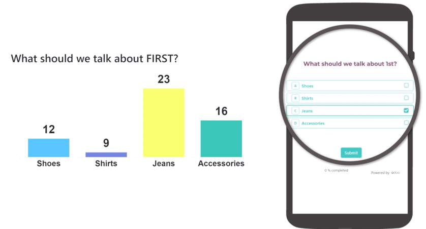
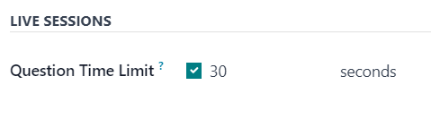

# Live Session surveys

With the Odoo *Surveys* application, users can enhance in-person demonstrations and presentations
with the *Live Session* feature.

*Live Session* surveys function the same way as a normal survey, but with a host or moderator, who
presents the questions to participants, reveals their responses in real-time, and controls the tempo
of the survey.

In *Live Session* surveys, participants access the survey experience via a custom URL, and sign in
with an optional access code. When the survey has begun, the host presents one question at a time.

Then, the audience of participants submit their answer, either via their computer or mobile device,
and once the responses have been gathered, the host reveals all the participant's responses, in real
time, with each answer's results displayed as a bar graph.

## Create Live Session survey

To create a *Live Session* survey, begin by opening the *Surveys* application. From the
Surveys dashboard, click the New button to reveal a blank survey form.

Any of the survey type options (Survey, Live Session,
Assessment, or Custom), presented as radio buttons at the top of the survey,
can be used to create a *Live Session*.

However, selecting the Live Session survey type radio button streamlines the process
because Odoo auto-selects the optimal settings and options for a *Live Session* survey when that
option is selected.

#### IMPORTANT
If the Is a Certification option is enabled in the Options tab, the
survey **cannot** be used as a *Live Session* survey.

With the desired survey radio button option selected, proceed to [create a survey](applications/marketing/surveys/create.md) with [questions and sections](applications/marketing/surveys/questions.md).

While creating questions for the *Live Session* survey, open the Options tab on the
Create Sections and Questions pop-up form, in order to reveal the Live
Sessions section, which only has one available feature: Question Time Limit.

When the Question Time Limit option is enabled, a new field appears beside it, wherein
the user **must** enter the desired amount of time (in seconds) the participant gets to answer the
question.

### Options tab

After the questions have been created for the *Live Session* survey, open the Options
tab of the survey form to further configure the survey.

The Options tab is organized into four sections: Questions, Time
& Scoring, Participants, and Live Session.

#### Questions section

Regardless of the option selected for the Pagination field, the *Live Session* survey
*only* shows One page per question, and will default to that option when the
Create Live Session button is clicked, and a *Live Session* survey officially begins.

#### NOTE
The One page per question option in the Pagination field is selected by
default, and no other options appear in the Questions section, when the
Live Session survey type radio button is selected.

The Display Progress as and Question Selection options are still viable and
active options for *Live Session* surveys, if desired, but they are **not** required.

However, the Allow Roaming feature is **not** available during *Live Session* surveys
whatsoever, as the host/moderator controls the survey, and participants have no control over what
question they see, or when they see it.

#### Time & Scoring section

The Survey Time Limit option is **not** applicable for *Live Session* surveys. This
option does not even appear in the Time & Scoring section of the Options tab
if the Live Session survey type radio button option is selected.

#### NOTE
While the Survey Time Limit option is not applicable for *Live Session* surveys, each
question *can* be affixed with its own *Question Time Limit*, via the *Options* tab of the
question pop-up form. Those question-specific time limits *do* work with *Live Session* surveys.

If desired, any Scoring option, and subsequent Required Score (%) option are
available to use with *Live Session* surveys.

However, if the Is a Certification option is enabled, the survey **cannot** be used as a
*Live Session* survey. The Is a Certification option does **not** appear in the
Time & Scoring section of the Options tab if the Live Session
survey type radio button option is selected.

#### Participants section

The Access Mode field is set to the Anyone with the link option when the
survey is used as a *Live Session*. The Anyone with the link option **cannot** be
modified if the Live Session survey type radio button option is selected.

The Require Login option is available for *Live Session* surveys. However, if the
Live Session survey type radio button option is selected, the usual Limit
Attempts field that appears when Require Login is enabled does **not** appear, as live
session participants only get to attempt the survey once, as the host leads them through it.

#### Live Session section

The Session Code field allows users to create unique codes for participants to use, in
order to gain access to the *Live Session* survey. This code can consist of any combination of
letters, numbers, and/or symbols.

The Session Code field is **not** required, however, it is encouraged because it adds a
level of exclusivity to the survey and, without a Session Code, the URL that appears in
the following Session Link field becomes far more complex.

#### IMPORTANT
If a Session Code is **not** entered, participants can access the survey, via the
Session Link without needing a host, and the fundamental elements of the *Live
Session* are lost, as the survey is then just a normal questionnaire, without any real-time
results.

With a Session Code, the URL in the non-modifiable Session Link field is
simplified, and ends with the Session Code, preceded by `/s/`.

If any Scoring option has been enabled, the opportunity to Reward quick
answers is also available with *Live Session* surveys.

## Start Live Session surveys

Once all the questions and configurations are complete, users can click the Create Live
Session button at the top of the survey form. Doing so opens a new browser tab to the *Session
Manager*.

Khi nút Tạo phiên trực tiếp được nhấp và *Phiên trực tiếp* đã bắt đầu, một nút Mở Trình quản lý phiên mới sẽ xuất hiện trên biểu mẫu khảo sát và mở một tab trình duyệt mới đến *Trình quản lý phiên*. Nếu *Phiên trực tiếp* đã bắt đầu, nút này sẽ dẫn người dùng đến câu hỏi hoặc phần hiện đang diễn ra trong *Phiên trực tiếp*.

Additionally, a Close Live Session button appears on the survey form. When that button
is clicked, the *Live Session* survey closes.

The *Session Manager* is controlled by the host/moderator of the *Live Session* survey, and is
typically shown on a projection or screen, so the participants can collectively view the questions
and real-time responses, as the host/moderator guides them through the *Live Session*.

#### NOTE
The participant can see and answer the questions from their computer or mobile device, but the
results and real-time responses can **only** be seen on the *Session Manager*.

Initially, the *Session Manager* shows the title of the *Live Session* survey, the link needed to
access it, and a Waiting for attendees... counter, which populates as participants enter
the *Live Session* survey.

Once the desired amount of participants have entered the *Live Session* survey, the host/moderator
can click the Start button on the right side of the *Session Manager* window to begin
the *Live Session*.

#### NOTE
If the survey begins with a section title on the survey form, that section title appears in the
*Session Manager*, and the participant's view of the survey informs them to `Pay attention to the
host screen until the next question`. This message appears whenever a section title appears
during a *Live Session*.

When the first question appears on the survey, the *Session Manager* shows the question above an
empty bar graph, showing the potential answer options on the x-axis. The participants see the
question and selectable answer options on their computer or mobile device.

As participants submit their answers, a progress bar, in the upper-left corner of the *Session
Manager*, fills in. This is how *Live Session* hosts/moderators know when every participant has
submitted their responses.

Then, when the desired amount of participants have submitted their responses, the host/moderator
clicks the Show Results button on the right side of the *Session Manager* to reveal the
collective real-time responses on the bar graph.

Khi người dẫn chương trình/điều phối viên cảm thấy người tham gia đã có đủ thời gian xem kết quả trực tiếp thông qua biểu đồ cột đã được điền, họ có thể nhấp nút Hiển thị (các) câu trả lời đúng ở bên phải cửa sổ *Trình quản lý phiên*. Thao tác này sẽ làm nổi bật câu trả lời đúng (nếu được chỉ định) bằng màu xanh lá. Tất cả câu trả lời sai sẽ được đánh dấu màu đỏ.

When the host/moderator feels the participants have had enough time to take in the correct and
incorrect responses, via the bar graph on the *Session Manager*, they can click the
Next button to move on to the next portion of the survey.

Repeat this process until the survey is complete.

#### SEE ALSO
- [Create surveys](applications/marketing/surveys/create.md)
- [Create questions](applications/marketing/surveys/questions.md)
- [Scoring surveys](applications/marketing/surveys/scoring.md)
