# Create questions

In Odoo *Surveys*, crafting and tailoring survey questions is crucial for [creating and
customizing surveys](create.md).

Fortunately, Odoo provides numerous ways to configure tailored questions for any kind of survey.

To access a list of *all* the questions that have been created in the database, navigate to
Surveys app ‣ Questions & Answers ‣ Questions. There, users can view and modify
any question from any survey.

However, there is only one place in the Odoo *Surveys* application where survey questions can be
created. To do that, navigate to a survey form, by going to Surveys app ‣ New, or
by selecting any pre-existing survey from the Surveys page (Surveys app
‣ Surveys).

## Questions tab

On a survey form, users can view, access, add, and/or delete questions (and sections) in the
Questions tab.

By default, two columns are present in the Questions tab: Title (i.e. the
question) and Question Type.

If the Randomized per Section option is enabled in the Options tab of the
survey form, a column titled, # Questions Randomly Picked appears in the
Questions tab.

To reveal the Mandatory Answer column on the Questions tab, which indicates
if questions require a mandatory answer or not, click the (optional columns) icon
located to the far-right of the column titles.

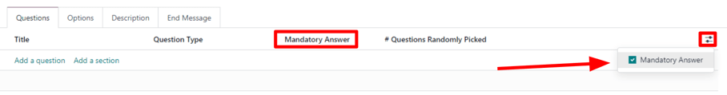

### Create sections

A *section* divides the survey into organized parts, in order to visually group similar questions
together. To make a section, click Add a section at the bottom of the
Questions tab, proceed to type in a desired name for the section, then either press
`Enter` or click away.

The section line appears in dark gray in the Questions tab.

Then, drag-and-drop desired questions beneath a section, or drag-and-drop a section title on top of
(i.e. *before*) the desired question(s) in the survey, in order to populate the section with
specific questions that fit the theme of the section.

If the Randomized per Section option is enabled in the Options tab of the
survey form, the number `1` appears, by default, on the section line, beneath the #
Questions Randomly Picked column.

This indicates that `1` question from that section will be picked at random for each participant
taking the survey, bypassing every other, non-chosen question from that section. To change that
number, select that figure, and type in the desired number in its place. Then, either press
`Enter`, or click away.

## Create questions

To create questions for the survey, click Add a question in the Questions
tab.

Clicking Add a question opens the Create Sections and Questions pop-up
window, in which a survey question can be created.

#### IMPORTANT
There **must** be a survey title entered in order for the Create Sections and
Questions pop-up window to appear. If no title is entered for the survey, an error pop-up
message appears in the upper-right corner, instructing the user to enter a survey title.

When all desired configurations are complete click either Save & Close to save the
question and return to the survey form, or Save & New to save the question and create a
new one right away in a fresh Create Sections and Questions pop-up window.

Click Discard to discard the question entirely.

### Create Sections and Questions pop-up window

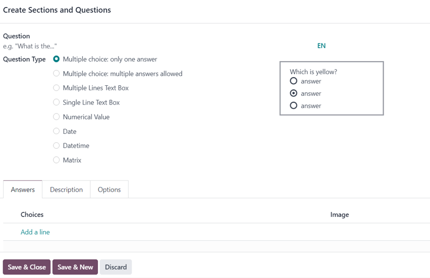

In the Create Sections and Questions pop-up window, start by typing the question into
the Question field, located at the top of the pop-up window.

Then, choose the desired Question Type. A preview of each Question Type is
to the right of the Question Type field, when a Question Type is selected.

Choose from the following Question Types:

- Multiple choice: only one answer: a multiple choice question, where only one answer is
  permitted.
- Multiple choice: multiple answers allowed: a multiple choice question, where more than
  answer is permitted.
- Multiple Lines Text Box: an open-ended question, where participants can type in a
  multiple line response.
- Single Line Text Box: an open-ended question, where participants can type in a single
  line response.
- Numerical Value: a number-based question, where participants must enter a number as a
  response.
- Date: a date-based question, where participants must enter a date (year-month-day) as
  a response.
- Datetime: a date-based question, where participants must enter a date *and* time
  (year-month-day, hour-minute-second) as a response.
- Matrix: a multiple-choice, multiple question, in a table/chart layout, where
  participants are presented with different questions on each row, and different answer options on
  each column.

#### NOTE
Different features appear in the Answers and Options tabs, depending on
the chosen Question Type.

However, the Description tab **always** remains the same, regardless of the question
type chosen.

Once a Question Type has been selected, there are three possible tabs where information
can be customized for the question. These include the Answers tab (if applicable for the
chosen Question Type), the Description tab, and the Options tab.

Each tab offers a variety of different features, depending on what Question Type was
chosen.

#### Answers tab

The Answers tab **only** appears if the selected Question Type provides
answer options to the participant.

However, if a custom response is required to answer the selected Question Type, like a
Multiple Lines Text Box, for example. Or, if the answer to the Question Type
is a number, date, or datetime, the Answers tab disappears completely.

If the Single Line Text Box is selected as the Question Type, the
Answers tab remains, although it only provides two checkbox options: Input
must be an email and Save as user nickname.

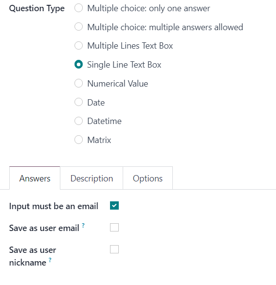

If the Input must be an email option is enabled, a new field, Save as user
email appears. If that box is ticked, Odoo saves the participant's answer to that specific question
as their email address.

If the Save as user nickname option is enabled, Odoo saves the participant's answer as
its nickname.

For all other applicable Question Type options that provide answer options to the
participant, the Answers tab appears the same.

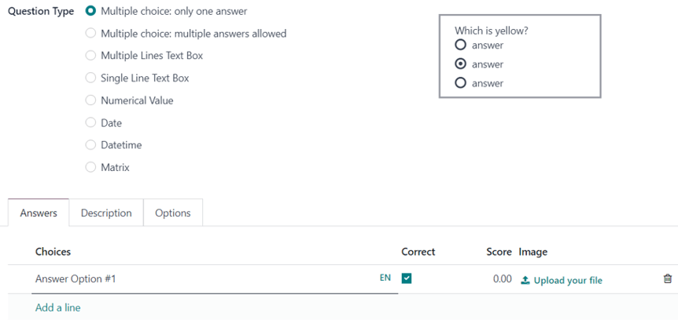

From here, users can add answer options by clicking Add a line, and typing in the
various answer options for that question. Then, either press `Enter` to lock in that answer
option and immediately add another one. Or, click away to simply lock in that answer option.

The entered answer options appear in the Choices column of the Answers tab.

If any *Scoring* option is enabled in the Options tab of the survey form, the
Correct and Score columns appear to the right of the Choices
column.

To mark an answer option as correct, tick the box beneath the Correct column for the
respective question. If Multiple choice: multiple answers allowed is set as the
Question Type, multiple answers in the Choices column can be marked as
Correct.

In the Score column, designate how many points (if any) should be rewarded to the
participant for entering that specific answer. It is possible to enter a negative amount as the
Score to take points away for an incorrect response.

The option to upload a corresponding image to accompany the answer options is available on the
question line, beneath the Image column, by clicking Upload your file, and
uploading the desired image.

To delete any answer option, click the 🗑️ (trash can) icon to the far-right of the
question line.

An exception to that is if the Matrix option is selected as the Question
Type. If that's chosen, the Answers tab remains, but below the typical
Choices section, there is a Rows section. That's because the
Matrix option provides an answer table for participants to fill out.

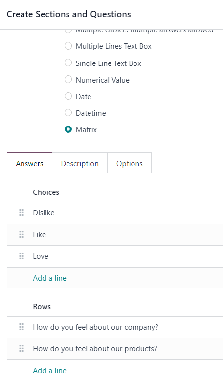

#### Tab mô tả

In the Description tab of the Create Sections and Questions pop-up window is
used to provide any kind of guidelines, instructions, or any other type of supplemental material
deemed necessary to help participants answer/understand the question.

Entering a description is **not** required.

#### Options tab

In the Options tab of the Create Sections and Questions pop-up window, there
are four available sections: Answers, Constraints, Conditional
Display, and Live Sessions.

##### Answers section

#### NOTE
Fields in the Answers section in the Options tab of the Create
Sections and Questions pop-up window vary, depending on the selected Question Type
and overall Options configured on the survey form.

###### Multiple Choice question types

If the selected Question Type is either Multiple choice: only one answer or
Multiple choice: multiple answers allowed, there is a Show Comments Field
present in the Answers section.

When enabled, two additional fields appear: Comment Message and Comment is an
answer.

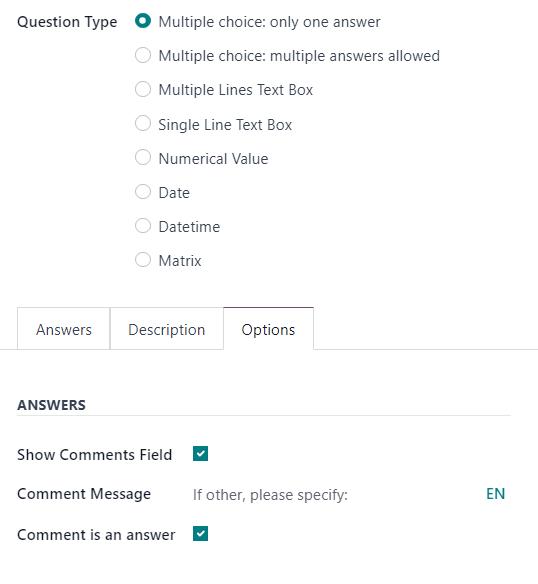

In the Comment Message field, type in a guiding message to help participants know what
is expected of them (e.g. `If other, please specify`).

If the Comment is an answer option is enabled, Odoo takes the participant's commented
response as an answer, and not just commentary on the question. This is best utilized in surveys
where there is no scoring option enabled.

###### Multiple Lines Text Box question type

If the selected Question Type is Multiple Lines Text Box, a
Placeholder field appears in the Answers section of the Options
tab.

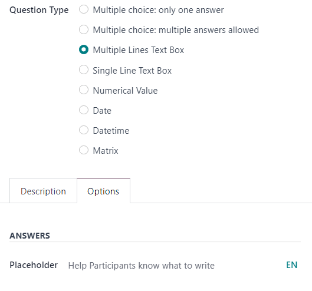

In the Placeholder field, enter a guiding direction to help participants know what they
should write in the Multiple Lines Text Box presented to them.

###### Single Line Text Box, Numerical Value, Date, Datetime question types

If the selected Question Type is Single Line Text Box, Numerical
Value, Date, or Datetime, two options appear in the Answers
section of the Options tab: Validate Entry and Placeholder.

If the Validate Entry option is enabled, two additional fields appear beneath:
Min/Max Limits and Validation Error.

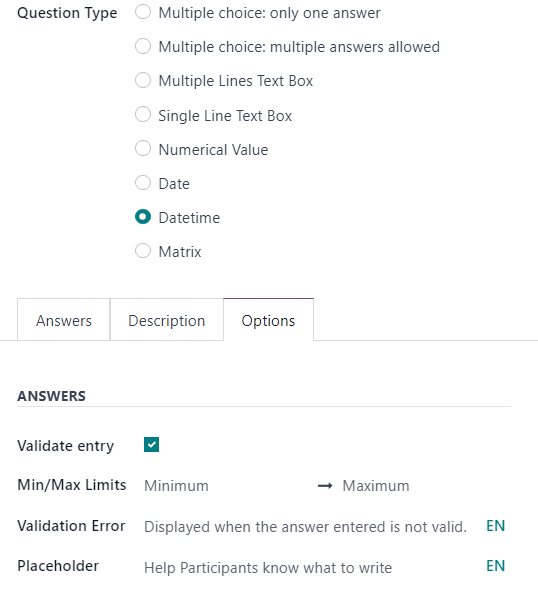

In the Min/Max Limits field, designate the minimum and maximum allowed quantities for
that specific question.

In the Validation Error field, enter a custom message that Odoo displays when an answer
is not valid.

In the Placeholder field, enter a guiding direction to help participants know what they
should write in the Multiple Lines Text Box presented to them.

##### Constraints section

The Constraints section in the Options tab is the same, regardless of the
selected Question Type.

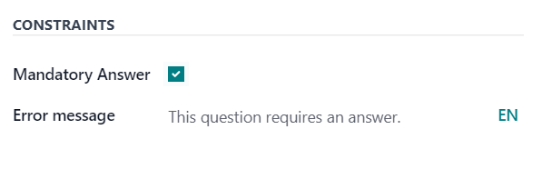

In the Constraints section, there is one option available: Mandatory Answer.

When Mandatory Answer is enabled, that means that specific question requires an answer
from the participant before they can move on. Also, when Mandatory Answer is enabled,
that reveals an additional field: Error Message.

In the Error Message field, enter a custom error message prompting the participant to
provide an answer for this question.

##### Conditional Display section

Conditional Display means the question is **only** displayed if a specified conditional
answer(s) (i.e. Triggering Answers) has been selected in a previous question(s).

#### NOTE
The Conditional Display section of the Options tab is **not** available
when questions are randomly picked.

There is only one field in the Conditional Display section: Triggering
Answers.

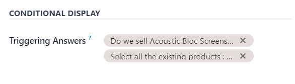

In the Triggering Answers field, select specific responses from previous questions that
would trigger this question. More than one answer can be selected. Leave the field empty if the
question should always be displayed.

##### Live Sessions section

The option in the Live Sessions section of the Options tab are **only**
supported by *Live Session* surveys.

There is only one option available in the Live Sessions section: Question
Time Limit.

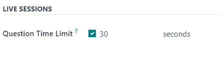

When the Question Time Limit option is enabled, designate how much time (in
seconds) participants have to answer the question during a *Live Session* survey.

#### NOTE
Survey text colors are directly linked to the colors used for the [website theme](../../websites/website/web_design/themes.md).
