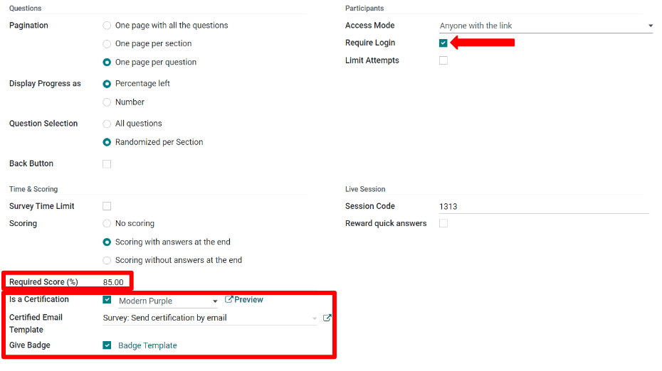
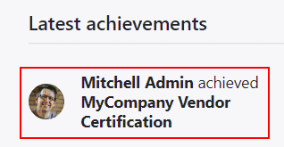

# Scoring surveys

To measure a survey participant's performance, knowledge, or overall satisfaction, Odoo ascribes
points to survey answers. At the end of the survey, these points are summed up, resulting in the
participant's final score.

To add points to questions, open the Surveys application, choose the desired survey
form, and then click on the Options tab. Under the :guilabel;\`Scoring\` section, choose
between Scoring with answers at the end or Scoring without answers at the
end.

- Scoring with answers at the end shows the survey participant their answers after
  completing the survey, and displays which questions they got right or wrong. On questions where
  there was an incorrect answer, the correct answer will be highlighted.
- Scoring without answers at the end does not show the survey participant their answer
  choices after completing the survey, only their final score.

To indicate correct answers, click on the Questions tab and choose a question. In the
question form, check the Is a correct answer box for the choice that is the correct
answer and attach a score value.

Back on the Options tab of the survey, set the Success %. The percentage
entered determines what percentage of correct answers is needed to pass the survey.

Further on the Options tab of the survey, survey administrators can also choose to make
the survey a certification. A certification indicates that the survey asks questions to test the
participants' knowledge level on a subject.

When enabling the Is a certification option, choose a Certification email
template. The certification will automatically be emailed using this email template to users who
pass the survey with a final score that is greater than or equal to the set Success %.

Trong phần Ứng viên, có thể yêu cầu người tham gia đăng nhập để thực hiện khảo sát. Nếu bật cài đặt Yêu cầu đăng nhập, hai tùy chọn mới sẽ xuất hiện: hộp kiểm Giới hạn lần làm để giới hạn số lần tham gia khảo sát, và tùy chọn Trao huy hiệu nằm dưới mục Chứng nhận trong phần Chấm điểm.

Badges are displayed on the eLearning portion of a given user's portal, and are a way to set
milestones and reward participants for passing surveys or gaining points. Besides the awardee,
website visitors who access the Courses page will also be able to see the granted
badges.

#### SEE ALSO
[Create questions](applications/marketing/surveys/questions.md)
