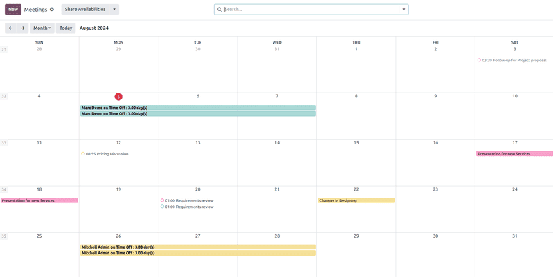
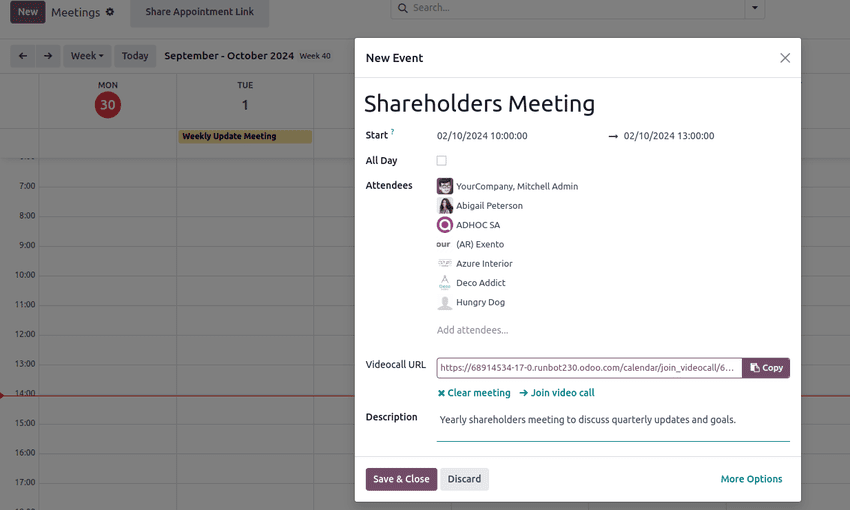
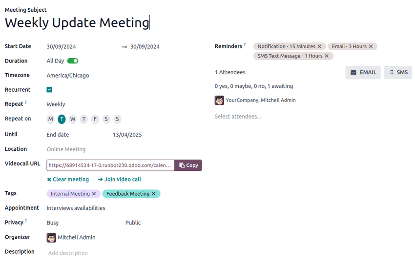
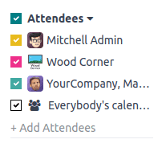
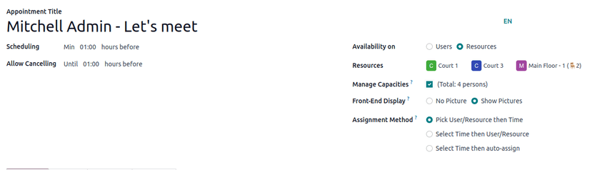

# Lịch

Odoo **Calendar** is a scheduling app that allows users to integrate a company's business flow into
a single management platform. By integrating with the other apps in Odoo's ecosystem, **Calendar**
allows users to schedule and organize meetings, schedule events, plan employee appraisals,
coordinate projects, and more – all from the same platform.

Upon opening the Calendar app, users have an overview of their current meetings.
The selected view option appears as a Day, Week, Month, or
Year drop-down menu. Under the view options drop-down menu, users can also enable or
disable Show weekends.

## Sync third-party calendars

Users can sync Odoo with existing [Outlook](outlook.md) and/or
[Google](google.md) calendars, by heading to
Calendar app ‣ Configuration ‣ Settings. From here, enter
Client ID and Client Secret. There is also an option to pause
synchronization by ticking the checkbox, or automating synchronization by keeping it blank.

Once the desired configurations are complete, be sure to click Save before moving on.

Events created in synced calendars automatically appear across the integrated platforms.

#### SEE ALSO
- [Synchronize Outlook calendar with Odoo](outlook.md)
- [Synchronize Google calendar with Odoo](google.md)

## Create activities from chatter

Instantly create new meetings anywhere in Odoo through an individual record's chatter, like
in a **CRM** opportunity card or task in the **Projects** app.

From the chatter, click on the Activities button. In the Schedule Activity
pop-up window, select the desired Activity Type, which populates a set of buttons,
depending on the activity.

Các hoạt động liên quan đến lịch trình khác như Họp hoặc Gọi demo, sẽ liên kết với ứng dụng **Lịch**. Chọn một trong các hoạt động này để liên kết với ứng dụng **Lịch**, sau đó nhấn Mở lịch để quay lại ứng dụng. Ngoài ra, bạn cũng có thể chọn Lên lịch & đánh dấu hoàn tất để kết thúc hoạt động, hoặc chọn Hoàn tất & lên lịch tiếp theo để giữ cửa sổ Lên lịch hoạt động mở nhằm tạo hoạt động mới.

#### SEE ALSO
[Schedule activities in Odoo](../../essentials/activities.md)

## Plan an event

To put an event on the calendar, open the Calendar app, and click into the target
date. On the New Event pop-up window that appears, start by adding the event title.

The target date auto-populates in the Start field. This can be changed by clicking
into the date section, and selecting a date from the calendar. For multi-day events, select the end
date in the second field, then click Apply.

Tick the All Day checkbox if there is no specific start or end time.

For events with specific start and stop times, ensure the All Day checkbox is unticked
to enable time selection. With the All Day checkbox unticked, time selections appear in
the Start field.

The signed-in user auto-populates as the first attendee. Additional Attendees can be
added or created from here, as well.

For virtual meetings, copy and paste the URL into the space provided in the
Videocall URL field. Or, click <i class="fa fa-plus"></i> Odoo meeting to create a
link.

Next, either create the event by clicking Save & Close, or select More
Options to further configure the event.

The Description field allows users to add additional information and details about the
meeting.

Click More Options to navigate to the meeting form, which provides additional
configurations for the event:

- Duration: Define the length of the meeting in hours, or toggle the
  All Day switch.
- Recurrent: Tick the checkbox to create a recurring meeting. Once selected, this
  opens new fields:
  - Timezone: Select the timezone for which this meeting time is specified.
  - Lặp lại: Chọn giai đoạn định kỳ của cuộc họp này. Tùy thuộc vào loại chu kỳ lặp được chọn, một trường bổ sung sẽ xuất hiện để người dùng có thể xác định thời điểm cuộc họp nên lặp lại. Ví dụ: nếu chọn Hàng tháng làm tùy chọn Lặp lại, một trường mới sẽ xuất hiện để người dùng quyết định Ngày trong tháng mà cuộc họp sẽ lặp lại.
  - Until: Select the limited Number of repetitions this meeting should
    recur, the End date of when the recurrences should stop, or if the meetings should
    recur Forever.
- Tags: Add tags to the event, like `Customer Meeting` or `Internal Meeting`. These can
  be searched and filtered in the **Calendar** app when organizing multiple events.
- Appointment: Link existing or new appointments. These can be configured through the
  [Share Availabilities](#calendar-share-availabilities) button from the main **Calendar**
  dashboard.
- Privacy: Toggle between visibility options to control who can view the event.
- Organizer: This is defaulted to the current Odoo user. Select a new one from
  existing users, or create and edit a new user.
- Description: Add additional information or details about the meeting.
- Reminders: Select notification options to send to attendees. Choose a default
  notification, or configure new reminders.

## Coordinate with teams' availability

When scheduling an event for multiple users, on the **Calendar** app dashboard, tick the checkbox
next to Attendees to view team members' availability. Tick (or untick) the checkbox next
to listed users to show (or hide) individual calendars.

## Chia sẻ Lịch trống

On the **Calendar** app main dashboard, click the Share Availabilities button at the top
of the page. Next, click and drag to select the available times and dates on the calendar to add
them as options in the invitation.

#### NOTE
Within the Share Availabilities feature, selecting times is only possible on the
*Day* calendar views.

Once availability has been selected, click the <i class="fa fa-external-link"></i> Open button to
navigate to the associated appointment.

Several configuration options are available on the appointment form:

In the Scheduling field, set a minimum hour window to ensure appointments are confirmed
a specified amount of time in advance. For example, set `01:00` to require attendees to confirm at
least one hour before their appointment time.

In the Allow Cancelling field, set a maximum hour window before the appointment that
attendees are able to cancel.

The Availability on field enables attendees to book Users or
Resources, such as meeting rooms or tables. After selecting Users or
Resources, type in the desired user or resource in the space below.

The Front-End Display field is used to choose No Picture or
Show Pictures related to the selected user or resource on the appointment page.

If Resources has been selected in the Availability on field, users have an
option to Manage Capacities.

Tick the checkbox to limit the maximum amount of people that can use the resource at the same time.

The Assignment Method field enables the order in which attendees book their time and
user/resource:

- Pick User/Resource then Time
- Select Time then User/Resource

If Resources has been selected in the Availability On field, a third option
is available, Select Time then auto-assign.

Optionally, configure the following tabs:

- [Schedule tab](#calendar-appointment-schedule)
- [Options tab](#calendar-appointment-options)
- [Questions tab](#calendar-appointment-questions)
- [Messages tab](#calendar-appointment-messages)

Click the Preview button to see how the appointment link looks for attendees.

Once the configurations are finished, click the Share button to generate a link to send
directly, or click Publish to publish the appointment selection on the connected Odoo
website.

### Schedule tab

In the Schedule tab of the appointment form, time slots can be managed. The target date
and time populate as the first time slots.

To add a new time slot, hit Add a line. Click into the new blank space under the
From field, then select and enter the new target start date and time, respectively.
Repeat under the new blank space under To to select and enter the new target end date
and time.

### Options tab

The Options tab provides additional configurations:

- Website: Specify which website this meeting invitation will be published on.
- Timezone: This defaults to the company's timezone selected in the **Settings** app.
  To change the timezone, select the desired option from the drop-down menu.
- Location: Select or create new locations from the drop-down menu. If this field is
  left empty, the meeting is considered to be taking place online.
- Videoconference Link: Select from Odoo Discuss or Google Meet
  to include a video conference link in the meeting invitation, or leave it blank to prevent
  generating a meeting URL.
- Manual Confirmation: Only shown if Resources has been selected in the
  Availability On field. Tick the checkbox and enter a maximum percentage of the
  selected resource(s)' total capacity to create a manual confirmation requirement to finalize the
  meeting.
- Up-front Payment: Tick the checkbox to require users to pay before confirming their
  booking. Once this is ticked, a link appears to <i class="oi oi-arrow-right"></i> Configure
  Payment Providers, which enables online payments.
- Limit to Work Hours: If Users has been selected in the
  Availability On field, tick the checkbox to limit meeting time slots to the selected
  [users' working hours](../../hr/employees/new_employee.md).
- Create Opportunities: When this is selected, each scheduled appointment creates
  a new **CRM** opportunity.
- Reminders: Add or delete notification reminders in this field. Select the blank space
  for additional options.
- Confirmation Email: Tick the checkbox to automatically send a confirmation email to
  attendees once the meeting is confirmed. Select from the email templates or click
  Search More..., then New to create a custom template.
- Cancelation Email: Tick the checkbox to automatically send a cancelation email to
  attendees if the meeting is canceled. Select from the email templates or click
  Search More..., then New to create a custom template.
- CC to: Add contacts to be notified of meeting updates in this field, regardless if
  they attend the meeting.
- Allow Guests: Tick the checkbox to allow attendees to invite guests.

### Questions tab

In the Questions tab, add questions for the attendee to answer when confirming their
meeting. Click Add a line to configure a Question. Then select a
Question Type, optionally add a Placeholder answer, and choose whether it is
a Required Answer.

To learn how to create more comprehensive questionnaires, head to the **Survey** app
documentation on [creating and configuring data-capturing questions](../../marketing/surveys/questions.md).

### Messages tab

In the Introduction Message field of the Messages tab, add additional
meeting information that appears on the invitation.

Information added to the Extra Message on Confirmation field appears once the meeting is
confirmed.

* [Outlook Calendar synchronization](outlook.md)
* [Google Calendar synchronization](google.md)
