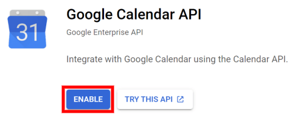
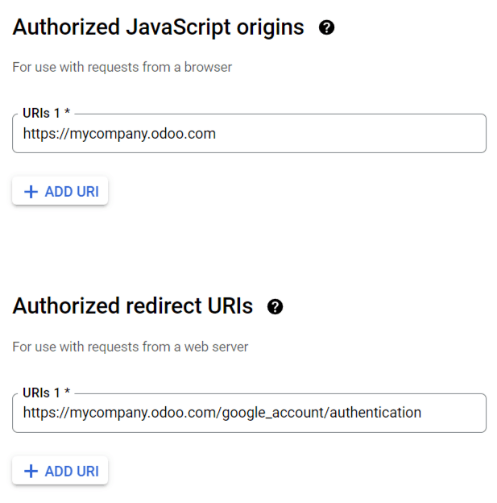
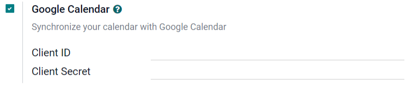
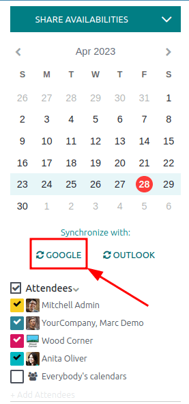
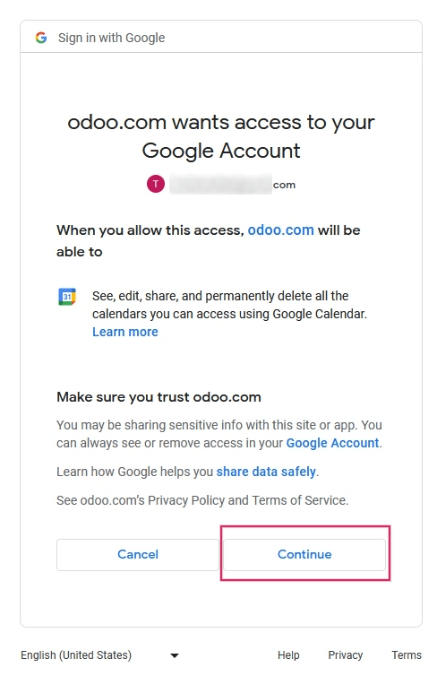
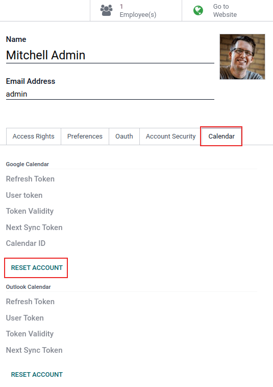
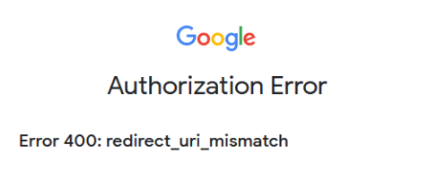

# Google Calendar synchronization

Synchronize Google Calendar with Odoo to see and manage meetings from both platforms (updates go in\
both directions). This integration helps organize schedules, so a meeting is never missed.

#### SEE ALSO

* [Google Sign-In Authentication](../../general/users/google.md)
* [Connect Gmail to Odoo using Google OAuth](../../general/email_communication/google_oauth.md)

## Setup in Google

### Select (or create) a project

Create a new Google API project and enable the Google Calendar API. First, go to the [Google API\
Console](https://console.developers.google.com) and log into the Google account.

#### NOTE

If this is the first time visiting this page, Google will prompt the user to enter a country and\
agree to the Terms of Service. Select a country from the drop-down list and agree to the\
.

Next, click Select a project and select (or create) an API project to configure OAuth\
in, and store credentials. Click New Project.

### Enable Google calendar API

Now, click on Enabled APIs and Services in the left menu. Select Enabled APIs\
and Services again if the Search bar doesn't appear.

After that, search for `Google Calendar API` using the search bar and select Google\
Calendar API from the search results. Click Enable.

### OAuth consent screen

Now that the API project has been created, OAuth should be configured. To do that, click on\
OAuth consent in the left menu and then select the User Type.

#### WARNING

_Personal_ Gmail Accounts are only allowed to be **External** User Type, which means Google may\
require an approval, or for _Scopes_ to be added on. However, using a _Google WorkSpace_ account\
allows for **Internal** User Type to be used.

Note, as well, that while the API connection is in the _External_ testing mode, then no approval\
is necessary from Google. User limits in this testing mode is set to 100 users.

In the second step, OAuth Consent Screen, type `Odoo` in the App name field,\
select the email address for the User support email field, and type the email address\
for the Developer contact information section. Then, click Save and\
Continue.

Skip the third step, Scopes, by clicking Save and Continue.

Next, if continuing in testing mode (External), add the email addresses being configured under the\
Test users step, by clicking on Add Users, and then the Save and\
Continue button. A summary of the app registration appears.

Finally, scroll to the bottom, and click on Back to Dashboard.

Now, the OAuth consent has been configured, and it's time to create credentials.

### Create credentials

The _Client ID_ and the _Client Secret_ are both needed to connect Google Calendar to Odoo. This is\
the last step in the Google console. Begin by clicking Credentials in the left menu.\
Then, click Create Credentials, and select OAuth client ID, Google will open\
a guide to create credentials.

Under Create OAuth Client ID, select Website application for the\
Application Type field, and type `My Odoo Database` for the Name.

* Under the Authorized JavaScript Origins section, click + Add URI and type\
  the company's Odoo full address.
* Under the Authorized redirect URIs section, click + Add URI and type the\
  company's Odoo address followed by`/google_account/authentication`. Finally, click Create.

A Client ID and Client Secret will appear, copy these to a notepad.

## Thiết lập trong Odoo

Once the _Client ID_ and the _Client Secret_ are located, open the Odoo database and go to\
Settings ‣ General Settings ‣ Integrations ‣ Google Calendar. Check the box\
next to Google Calendar.

Next, copy and paste the _Client ID_ and the _Client Secret_ from the Google Calendar API\
credentials page into their respective fields below the Google Calendar checkbox. Then,\
click Save.

## Sync calendar in Odoo

Finally, open the Calendar app in Odoo and click on the Google sync\
button to sync Google Calendar with Odoo.

#### NOTE

When syncing Google Calendar with Odoo for the first time, the page will redirect to the Google\
Account. From there, select the Email Account that should have access, then select\
Continue (should the app be unverifed), and finally select Continue (to\
give permission for the transfer of data)\`.

Now, Odoo Calendar is successfully synced with Google Calendar!

#### WARNING

Odoo highly recommends testing the Google calendar synchronization on a test database and a test\
email address (that is not used for any other purpose) before attempting to sync the desired\
Google Calendar with the user's production database.

Once a user synchronizes their Google calendar with the Odoo calendar:

* Creating an event in Odoo causes Google to send an invitation to all event attendees.
* Deleting an event in Odoo causes Google to send a cancellation to all event attendees.
* Adding a contact to an event causes Google to send an invitation to all event attendees.
* Removing a contact from an event causes Google to send a cancellation to all event attendees.

Events can be created in _Google Calendar_ without sending a notification by selecting\
Don't Send when prompted to send invitation emails.

## Troubleshoot sync

There may be times when the _Google Calendar_ account does not sync correctly with Odoo. Sync issues\
can be seen in the database logs.

In these cases, the account needs troubleshooting. A reset can be performed using the\
Reset Account button, which can be accessed by navigating to Settings\
app ‣ Manage Users. Then, select the user to modify the calendar, and click the\
Calendar tab.

Next, click Reset Account under the correct calendar.

### Reset options

The following reset options are available for troubleshooting Google calendar sync with Odoo:

User's Existing Events:

> * Leave them untouched: no changes to the events.
> * Delete from the current Google Calendar account: delete the events from _Google_\
>   _Calendar_.
> * Delete from Odoo: delete the events from the Odoo calendar.
> * Delete from both: delete the events from both _Google Calendar_ and Odoo calendar.

Next Synchronization:

> * Synchronize only new events: sync new events on _Google Calendar_ and/or Odoo\
>   calendar.
> * Synchronize all existing events: sync all events on _Google Calendar_ and/or Odoo\
>   calendar.

Click Confirm after making the selection to modify the user's events and the calendar\
synchronization.

## Google OAuth FAQ

At times there can be misconfigurations that take place, and troubleshooting is needed to resolve\
the issue. Below are the most common errors that may occur when configuring the _Google Calendar_\
for use with Odoo.

### Production vs. testing publishing status

Choosing Production as the Publishing Status (instead of\
Testing) displays the following warning message:

`OAuth is limited to 100 sensitive scope logins until the OAuth consent screen is verified. This may require a verification process that can take several days.`

To correct this warning, navigate to the [Google API Platform](https://console.cloud.google.com/apis/credentials/consent). If the Publishing Status\
is In Production, click Back to Testing to correct the issue.

### No test users added

If no test users are added to the OAuth consent screen, then an Error 403:\
access\_denied populates.

To correct this error, return to the OAuth consent screen, under APIs &\
Services, and add test users to the app. Add the email to be configured in Odoo.

### Application Type

When creating the credentials (OAuth _Client ID_ and _Client Secret_), if Desktop App is\
selected for the Application Type, an Authorization Error appears\
(Error 400:redirect\_uri\_mismatch).

To correct this error, delete the existing credentials, and create new credentials, by selecting\
Web Application for the Application Type.

Then, under Authorized redirect URIs, click ADD URI, and type:`https://yourdbname.odoo.com/google_account/authentication` in the field, being sure to replac&#x65;_&#x79;ourdbname_ in the URL with the **real** Odoo database name.
