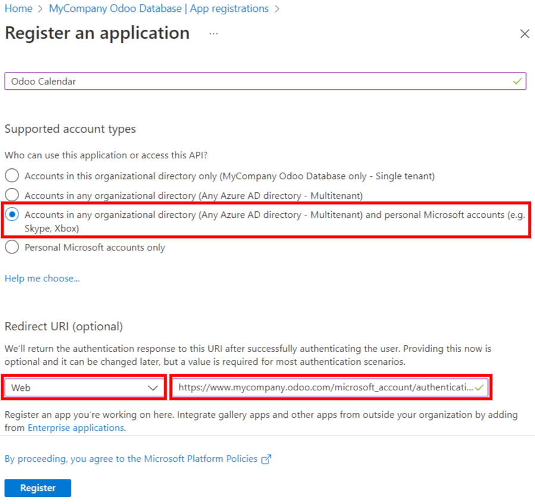

# Outlook Calendar synchronization

Synchronizing a user's *Outlook Calendar* with Odoo is useful for keeping track of tasks and
appointments across all related applications.

#### SEE ALSO
- [Microsoft Azure sign-in authentication](../../general/users/azure.md)
- [Connect Microsoft Outlook 365 to Odoo using Azure OAuth](../../general/email_communication/azure_oauth.md)

## Microsoft Azure setup

To sync the *Outlook Calendar* with Odoo's *Calendar*, a Microsoft *Azure* account is required.
Creating an account is free for users who have never tried, or paid for, *Azure*. For more
information, view the account options on the [Azure website](https://azure.microsoft.com/en-us/free/?WT.mc_id=A261C142F).

Refer to [Microsoft's documentation](https://docs.microsoft.com/en-us/azure/active-directory/develop/quickstart-create-new-tenant) on how to set up a Microsoft *Entra ID* (formally called
Microsoft *Azure Active Directory (Azure AD)*). This is an API console to manage and register
Microsoft applications.

Existing Microsoft *Entra ID* users should log in at the [Microsoft Azure developer portal](https://portal.azure.com/#home). Next, select View under the section labeled
Manage Microsoft Entra ID.

### Register application

After logging in with the Microsoft *Entra ID*, [register an application](https://docs.microsoft.com/en-us/azure/active-directory/develop/quickstart-register-app).

To create an application, click + Add in the top menu. From the resulting drop-down
menu, select App Registration.

Enter a unique Name for the connected application.

Choosing the appropriate Supported account type is essential, or else the connected
application will not work. Users who wish to connect their *Outlook Calendar* to Odoo should select
the Accounts in any organizational directory (Any Microsoft Entra ID directory -
Multitenant) and personal Microsoft accounts (e.g. Skype, Xbox) option for Supported
account types.

When configuring the Redirect URI, choose the Web option from the first
drop-down menu. Then, enter the Odoo database URI (URL) followed by
`/microsoft_account/authentication`.

For more information on the restrictions and limitations of URIs, check Microsoft's [Redirect URI
(reply URL) restrictions and limitations](https://docs.microsoft.com/en-us/azure/active-directory/develop/reply-url) page.

Finally, on the application registration page, click Register button to complete the
application registration. The Application (client) ID is produced. Copy this value, as
it is needed later, in the [Cấu hình trong Odoo](#outlook-calendar-odoo-setup).

### Create client secret

The second credential needed to complete the synchronization of the Microsoft *Outlook Calendar* is
the *Client Secret*. The user **must** add a client secret, as this allows Odoo to authenticate
itself, requiring no interaction from the user's side. *Certificates* are optional.

To add a client secret, click Certificates & secrets in the left menu. Then click
+ New client secret to create the client secret.

Next, type a Description, and select when the client secret Expires.
Available options include: 90 days (3 months), 365 days (12 months),
545 days (18 months), 730 days (24 months) or Custom. The
Custom option allows the administrator to set a Start and End
date.

Finally, click Add to Add a client secret.

Copy the Value for use in the next section.

#### WARNING
Client secret values cannot be viewed, except immediately after creation. Be sure to save the
secret when created *before* leaving the page.

## Cấu hình trong Odoo

In the Odoo database, go to Calendar app ‣ Configuration ‣ Settings, and tick
the checkbox beside the Outlook Calendar setting. Remember to click Save to
implement the changes.

From the Microsoft *Azure* portal, under the Overview section of the application, copy
the Application (Client) ID, if it has not already been copied, and paste it into the
Client ID field in Odoo.

Copy the previously-acquired Value (Client Secret Value), and paste it into the
Client Secret field in Odoo.

Finally, on the Odoo Settings ‣ General Settings page, click Save.

## Sync with Outlook

#### WARNING
Odoo highly recommends testing the Outlook calendar synchronization on a test database and a
test email address (that is not used for any other purpose) before attempting to sync the
desired Outlook Calendar with the user's production database.

If the user has any past, present, or future events on their Odoo calendar before syncing their
Outlook calendar, Outlook will treat the events pulled from Odoo's calendar during the sync as
new events, causing an email notification to be sent from Outlook to all the event attendees.

To avoid unwanted emails being sent to all past, present, and future event attendees, the user
must add the events from the Odoo calendar to the Outlook calendar before the first ever sync,
delete the events from Odoo, and then start the sync.

Even after synchronizing the Odoo Calendar with the Outlook calendar, Outlook will still send a
notification to all event participants every time an event is edited (created, deleted,
unarchived, or event date/time changed), with no exceptions. This is a limitation that cannot be
fixed from Odoo's side.

In summary, once a user synchronizes their Outlook calendar with the Odoo calendar:

- Creating an event in Odoo causes Outlook to send an invitation to all event attendees.
- Deleting an event in Odoo causes Outlook to send a cancellation to all event attendees.
- Unarchiving an event in Odoo causes Outlook to send an invitation to all event attendees.
- Archiving an event in Odoo causes Outlook to send a cancellation to all event attendees.
- Adding a contact to an event causes Outlook to send an invitation to all event attendees.
- Removing a contact from an event causes Outlook to send a cancellation to all event attendees.

### Sync Odoo Calendar and Outlook

In the Odoo database, open to the *Calendar* module, and click the Outlook sync button
on the right-side of the page, beneath the monthly calendar.

The synchronization is a two-way process, meaning that events are reconciled in both accounts
(*Outlook* and Odoo). The page redirects to a Microsoft login page, and the user is asked to log in
to their account, if they are not already. Finally, grant the required permissions by clicking
Accept.

#### NOTE
All users that want to use the synchronization simply need to [sync their calendar with
Outlook](#outlook-sync). The configuration of Microsoft's *Azure* account is only done once, as
Microsoft *Entra ID* tenants' client IDs and client secrets are unique, and help the user manage
a specific instance of Microsoft cloud services for internal and external users.

#### SEE ALSO
- [Plugin Outlook](../../general/integrations/mail_plugins/outlook.md)
- [Google Calendar synchronization](google.md)

## Troubleshoot sync

There may be times when the *Microsoft Outlook Calendar* account does not sync correctly with Odoo.
Sync issues can be seen in the database logs.

In these cases, the account needs troubleshooting. A reset can be performed using the
Reset Account button, which can be accessed by navigating to Settings
app ‣ Manage Users. Then, select the user to modify the calendar, and click on the
Calendar tab.

Next, click Reset Account under the correct calendar.

### Reset options

The following reset options are available for troubleshooting *Microsoft Outlook Calendar* sync with
Odoo:

User's Existing Events:

> - Leave them untouched: no changes to the events.
> - Delete from the current Microsoft Calendar account: delete the events from *Microsoft
>   Outlook Calendar*.
> - Delete from Odoo: delete the events from the Odoo calendar.
> - Delete from both: delete the events from both *Microsoft Outlook Calendar* and Odoo
>   calendar.

Next Synchronization:

> - Synchronize only new events: sync new events on *Microsoft Outlook Calendar* and/or
>   Odoo calendar.
> - Synchronize all existing events: sync all events on *Microsoft Outlook Calendar*
>   and/or Odoo calendar.

Click Confirm after making the selection to modify the user's events and the calendar
synchronization.
