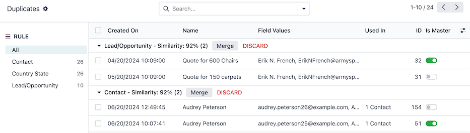
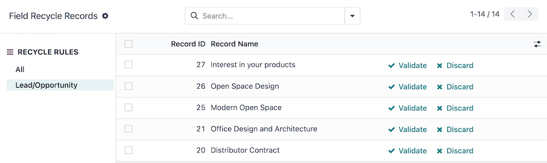
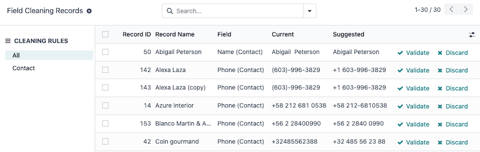

# Làm sạch Dữ liệu

The Odoo **Data Cleaning** app maintains data integrity and consistency with the following features:

* [Deduplicates](data_cleaning.md#data-cleaning-deduplication): merges or removes duplicate entries to ensure\
  data is unique.
* [Recycles](data_cleaning.md#data-cleaning-recycle): identifies outdated records to either archive or delete\
  them.
* [Formats](data_cleaning.md#data-cleaning-field-cleaning): standardizes text data by finding and replacing it\
  according to specified needs.

Customizable rules ensure text data stays up-to-date, streamlined, consistently formatted, and\
aligned with company-specific formatting requirements.

## Install modules

The **Data Cleaning** application consists of several modules. [Install](../general/apps_modules.md#general-install) the\
following to access all available features:

| 
Tên   <code>Technical name</code>  
               | Mô tả                                                                                                                                                                                                 |
| ----------------------------------------------------------------------- | ----------------------------------------------------------------------------------------------------------------------------------------------------------------------------------------------------- |
| 
Data Recycle   <code>data_recycle</code>  
        | Base module to enable the recycle feature, available on [Odoo Community edition](../../#install-editions).                                                                                            |
| 
Data Cleaning   <code>data_cleaning</code>  
      | 
Enables field cleaning feature to format text data across multiple records, available <strong>only</strong> on <a href="../../#install-editions">Odoo Enterprise edition</a>.
               |
| 
Data Cleaning (merge)   <code>data_merge</code>  
 | 
Enables the deduplication feature to find similar (or duplicate) records, and merge them, available <strong>only</strong> on <a href="../../#install-editions">Odoo Enterprise edition</a>.
 |

## Loại bỏ trùng lặp

The _Duplicates_ dashboard groups similar records to be [merged](data_cleaning.md#data-cleaning-merge-records)\
by matching conditions within the records set by the [deduplication rules](data_cleaning.md#data-cleaning-deduplication-rules).

Navigate to this dashboard by going to Data Cleaning app ‣ Deduplication.

The RULE sidebar lists each of the active deduplication rules, and displays the total\
number of duplicates detected beside each rule.

By default, the All rule is selected. Records are grouped by their rule, with a\
Similarity rating (out of 100%), with the following columns:

* Created On: the date and time the original record was created.
* Name: the name or title of the original record.
* Field Values: the original record's values for the fields used to detect duplicates.
* Used In: lists other models referencing the original record.
* ID: the original record's unique ID.
* Is Master: the duplicates are merged into the _master_ record. There can only be**one** master record in a grouping of similar records.

Select a specific rule in the RULE sidebar to filter the duplicate records.

### Merge duplicate records

To merge records, first choose a _master_ record within the grouping of similar records. The master\
record acts as the base, at which any additional information from similar records are merged into.

Optionally, no master record can be set, leaving Odoo to choose a record at random to merge into.

Next, click the Merge button at the top of the similar records grouping. Then, click\
Ok to confirm the merge.

Once a record is merged, a message is logged in the chatter of the master record, describing the\
merge. Certain records, like **Project** tasks, are logged in the chatter with a link to the old\
record as a convenient reference of the merge.

### Deduplication rules

The _Deduplication Rules_ set the conditions for how records are detected as duplicates.

These rules can be configured for each model in the database, and with varying levels of\
specificity. To get started, navigate to Data Cleaning app ‣ Configuration ‣\
Deduplication.

#### Modify a deduplication rule

Select a default rule to edit, or create a new rule by clicking on the New button.

First, choose a Model for this rule to target. Selecting a model updates the rule title\
to the chosen model.

Optionally, configure a Domain to specify the records eligible for this rule. The number\
of eligible records is shown in the # record(s) link.

Depending on the selected Model, the Duplicate Removal field appears.\
Choose whether to Archive or Delete merged records.

Next, select a Merge Mode:

* Manual: requires each duplicate grouping to be manually merged, also enables the\
  Notify Users field.
* Automatic: automatically merges duplicate groupings, without notifying users, based on\
  the records with a similarity percentage above the threshold set in the Similarity\
  Threshold field.

Enable the Active toggle to start capturing duplicates with this rule as soon as it is\
saved.

Lastly, create at least one deduplication rule in the Deduplication Rules field, by\
clicking Add a line, under the Unique ID Field column.

* Select a field in the model from the Unique ID Field drop-down menu. This field is\
  referenced for similar records.
* Select a matching condition in the Match If field to apply the deduplication rule,\
  depending on the text in the Unique ID Field:
  * Exact Match: the characters in the text match exactly.
  * Case/Accent Insensitive Match: the characters in the text match, regardless of\
    casing and language-specific accent differences.

#### IMPORTANT

At least one Deduplication Rules must be set for the rule to capture duplicates.

With the rule's configuration complete, either close the rule form, or [run the rule manually](data_cleaning.md#data-cleaning-run-deduplication-rule) to instantly capture duplicate records.

#### Manually run a deduplication rule

To manually run a specific deduplication rule at any time, navigate to Data Cleaning\
app ‣ Configuration ‣ Deduplication, and select the rule to run.

Then, on the rule form, select the Deduplicate button on the top-left. Upon doing so,\
the Duplicates smart button displays the number of duplicates captured.

Click on the Duplicates smart button to [manage these records](data_cleaning.md#data-cleaning-merge-records).

## Recycle records

Use the _recycle records_ feature to rid the database of old and outdated records.

The _Field Recycle Records_ dashboard displays records that can be archived or deleted, by matching\
conditions within the records set by the [recycle record's rules](data_cleaning.md#data-cleaning-recylce-rule).

Navigate to this dashboard by going to Data Cleaning app ‣ Recycle Records.

The RECYCLE RULES sidebar lists each of the active recycle record rules.

By default, the All option is selected. Records are displayed with the following\
columns:

* Record ID: the ID of the original record.
* Record Name: the name or title of the original record.

Select a specific rule in the RECYCLE RULES sidebar to filter the records.

To recycle records, click the Validate button on the row of the record.

Upon doing so, the record is recycled, depending on how the rule is configured, to be either\
archived or deleted from the database.

### Recycle record rules

The _Recycle Records Rules_ set the conditions for how records are recycled.

These rules can be configured for each model in the database, and with varying levels of\
specificity. To get started, navigate to Data Cleaning app ‣ Configuration ‣\
Recycle Records.

By default, no recycle record rules exist. Click the New button to create a new rule.

On the recycle record rule form, first choose a Model for this rule to target. Selecting\
a model updates the rule title to the chosen model.

Optionally, configure a Filter to specify the records eligible for this rule. The number\
of eligible records is shown in the # record(s) link.

Next, configure the field and time range for how the rule detects the records to recycle:

* Time Field: select a field from the model to base the time ().
* Delta: type the length of time, which must be a whole number (e.g. `7`).
* Delta Unit: select the unit of time (Days, Weeks,\
  Months, or Years).

Then, select a Recycle Mode:

* Manual: requires each detected record to be manually recycled, and enables the\
  Notify Users field.
* Automatic: automatically merges recycled groupings, without notifying users.

Lastly, select a Recycle Action to either Archive or Delete\
records. If Delete is selected, choose whether or not to Include Archived\
records in the rule.

With the rule's configuration complete, either close the rule form, or [run the rule manually](data_cleaning.md#data-cleaning-run-recycle-rule) to instantly capture records to recycle.

#### Manually run a recycle rule

To manually run a specific recycle rule at any time, navigate to Data Cleaning app\
‣ Configuration ‣ Recycle Records, and select the rule to run.

Then, on the rule form, click the Run Now button on the top-left. Upon doing so, theRecords smart button displays the number of records captured.

Click the Records smart button to [manage these records](data_cleaning.md#data-cleaning-recycle).

## Field cleaning

Use the field cleaning feature to maintain consistent formatting of names, phone numbers, IDs and\
other fields throughout a database.

The _Field Cleaning Records_ dashboard displays formatting changes to data in fields of a record,\
to follow a convention set by the field cleaning rules.

Navigate to this dashboard by going to Data Cleaning app ‣ Field Cleaning.

The CLEANING RULES sidebar lists each of the active cleaning rules.

By default, the All rule is selected. Records are listed with the following columns:

* Record ID: the ID of the original record.
* Record Name: the name or title of the original record.
* Field: the original record's field that contains the value to format.
* Current: the current value in the field of the original record.
* Suggested: the suggested formatted value in the field of the original record.

To clean and format records, click the Validate button on the row of\
the record.

Upon doing so, the record is formatted and/or cleaned.

### Field cleaning rules

The _Field Cleaning Rules_ set the conditions for fields to be cleaned and/or formatted.

These rules can be configured for each model in the database, and with varying levels of\
specificity. To get started, navigate to Data Cleaning app ‣ Configuration ‣\
Field Cleaning.

By default, a Contact rule exists to format and clean up the **Contacts** app records.\
Select the Contact record to make edits, or select the New button to create\
a new rule.

On the field cleaning rule form, first choose a Model for this rule to target. Selecting\
a model updates the rule title to the chosen model.

Next, configure at least one rule by clicking Add a line in the Rules\
section.

Upon doing so, a Create Rules popover window appears with the following fields to\
configure:

* Select a Field To Clean from the model to assign to an action.
*   Choose one of the following Action options:

    * Trim Spaces reveals the Trim field to select the All Spaces\
      or Superfluous Spaces option. Leading, trailing, and successive spaces are\
      considered superfluous.
    * Set Type Case reveals the Case field to select either First\
      Letters to Uppercase, All Uppercase, or All Lowercase.
    * Format Phone converts the phone number to an international country format.
    * Scrap HTML converts to plain text.

    Once a field and action are selected, click Save to close the Create Rules\
    popover window.

Then, select a Cleaning Mode:

* Manual: requires each detected field to be manually cleaned and enables the\
  Notify Users field.
* Automatic: automatically cleans fields without notifying users.

With the rule's configuration complete, either close the rule form, or [run the rule manually](data_cleaning.md#data-cleaning-run-field-cleaning-rule) to instantly capture fields to clean.

#### Manually run a field cleaning rule

To manually run a specific field cleaning rule at any time, navigate to Data\
Cleaning app ‣ Configuration ‣ Field Cleaning, and select the rule to run.

Then, on the rule form, select the Clean button on the top-left. Upon doing so, theRecords smart button displays the number of records captured.

Click on the Records smart button to [manage these records](data_cleaning.md#data-cleaning-field-cleaning).

## Merge action manager

The _Merge Action Manager_ enables or disables the _Merge_ action available in the _Actions_ menu\
for models in the database.

Enable [Chế độ lập trình viên (chế độ gỡ lỗi)](../general/developer_mode.md#developer-mode) and navigate to Data Cleaning app ‣ Configuration ‣\
Merge Action Manager.

Models are listed with the following columns:

* Model: technical name of the model.
* Model Description: display name of the model.
* Type: whether the model is of the _Base Object_ or _Custom Object_ type.
* Transient Model: the model handles temporary data that does not need to be stored\
  long-term in the database.
* Can Be Merged: enables the _Merge_ action for the model.

To view which models are enabled by default, use the [search bar](../essentials/search.md#search-filters) to filter\
models that Can Be Merged.

#### SEE ALSO

[Gộp liên hệ](../essentials/contacts/merge.md)
