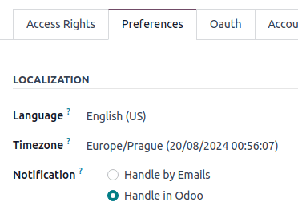
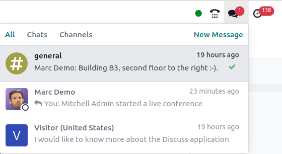

# Thảo luận

Odoo **Discuss** is an internal communication app that allows users to connect through messages,
notes, file sharing, and video calls. **Discuss** enables communication through a persistent chat
window that works across applications, or through the dedicated *Discuss* dashboard.

Upon opening the Discuss app, the Discuss dashboard appears.

## Inbox, starred, and history

Upon opening the Discuss app, the *Discuss* dashboard appears.

On the Discuss dashboard, unread messages are visible in the <i class="fa fa-inbox"></i>
Inbox. <i class="fa fa-star-o"></i> Starred is where starred messages are stored.
<i class="fa fa-history"></i> History shows chatter updates for records in the Odoo database the
user has been assigned to, or tagged on.

## Tin nhắn trực tiếp

*Direct messages* allow the user to communicate privately with one or multiple team members. To
start a new direct message, click the <i class="fa fa-plus"></i> icon, next to Direct Messages on
the Discuss dashboard, and enter the name of the desired person in the Start
a conversation search bar that appears.

### Direct message actions

Hover over a direct message in the chat window to see a menu of actions to take on the message.

- <i class="oi oi-smile-add"></i> (Add a Reaction): open a drop-down menu of emojis that can be
  used to react to the direct message.
- <i class="fa fa-reply"></i> (Reply): reply to the direct message in a thread.
- <i class="fa fa-star-o"></i> (Mark as Todo): add the message to the Starred tab.
- <i class="fa fa-ellipsis-h"></i> (Expand): reveals more message actions, including:
  - <i class="fa fa-thumb-tack"></i> Ghim
  - <i class="fa fa-eye-slash"></i> Mark as Unread
  - <i class="fa fa-pencil"></i> Chỉnh sửa
  - <i class="fa fa-trash"></i> Xoá

### Conversation actions

The icons in the top-right corner of a direct message conversation represent different actions the
user can take on that conversation.

Click <i class="fa fa-bell"></i> Notification Settings to set up notification preferences for the
conversation, or click <i class="fa fa-phone"></i> Start a Call to begin a meeting. See the
[Meetings](#discuss-meetings) section for more information about meetings.

At the top of the direct message window, click the name of the direct message to change the group
name, and choose to add a description in the adjacent Add a description field.

#### NOTE
The Add a description field is **only** available for group messages with more than
two participants.

### Trạng thái người dùng

It is helpful to see what colleagues are up to, and how quickly they can respond to messages, by
checking their status. The status is displayed as a circle in the bottom-right corner of a contact's
photo in the <i class="fa fa-users"></i> (Members List).

The color of the circle represents the user's status:

- Xanh lá = online
- Cam = vắng mặt
- Trắng = offline
- Airplane = out of the office

### Leave a direct message conversation

To leave a direct message conversations, click the <i class="fa fa-times"></i> (Leave this channel)
icon next to the conversation name in the Direct Messages section of the sidebar.

#### NOTE
Leaving a conversation does **not** delete the direct messages in the conversation. The direct
message conversation's history is visible when another direct message with the same person, or
group, is created.

## Cuộc họp

In **Discuss**, *Meetings* are video calls. To start a meeting from the Discuss
dashboard, click Start a meeting in the top-left corner, and select who to invite to the
meeting, via the Invite People drop-down window that appears. To start a meeting from a
direct message, click the <i class="fa fa-phone"></i> Start a Call icon in the top-right corner.

Once a meeting has been started, the following buttons can be used:

| Biểu tượng                             | Sử dụng            |
|----------------------------------------|--------------------|
| <i class="fa fa-microphone"></i>       | Mute               |
| <i class="fa fa-microphone-slash"></i> | Unmute             |
| <i class="fa fa-headphones"></i>       | Deafen             |
| <i class="fa fa-deaf"></i>             | Undeafen           |
| <i class="fa fa-video-camera"></i>     | Turn camera on/off |
| <i class="fa fa-hand-paper-o"></i>     | Dơ tay             |
| <i class="fa fa-desktop"></i>          | Chia sẻ màn hình   |
| <i class="fa fa-arrows-alt"></i>       | Enter Full Screen  |

## User-specific notification preferences

Access user-specific preferences for the **Discuss** app by navigating to Settings
app ‣ Manage Users, select a user, then click the Preferences tab.

Thông báo được đặt mặc định là Xử lý bằng email. Khi bật cài đặt này, một email thông báo sẽ được Odoo gửi mỗi khi có tin nhắn được gửi từ khung cửa sổ trò chuyện của một bản ghi, một ghi chú được gửi kèm đề cập `@` (từ khung cửa sổ trò chuyện của bản ghi), hoặc một thông báo được gửi cho bản ghi mà người dùng đang theo dõi.

By choosing Handle in Odoo, the above notifications are shown in the **Discuss** app's
*Inbox*.

## Chat from different applications

The **Discuss** application enables communication across all of Odoo's applications. To view chats
and channels, or start a new message, select the speech bubbles that are consistently present in the
upper-right corner of the database header.

#### SEE ALSO
- [Use channels for team communication](applications/productivity/discuss/team_communication.md)
- [Hoạt động](applications/essentials/activities.md)
- [Configure ICE servers with Twilio](applications/productivity/discuss/ice_servers.md)
- [Chatter](applications/productivity/discuss/chatter.md)

* [Use channels for team communication](applications/productivity/discuss/team_communication.md)
* [Configure ICE servers with Twilio](applications/productivity/discuss/ice_servers.md)
* [Chatter](applications/productivity/discuss/chatter.md)
