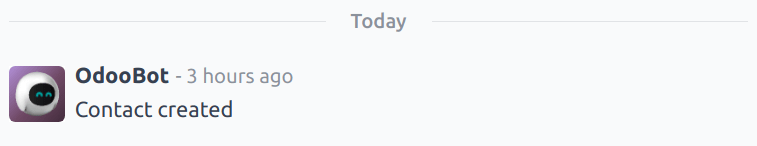

# Chatter

The *Chatter* feature is integrated throughout Odoo to streamline communication, maintain
traceability, and provide accountability among team members. Chatter windows, known as *composers*,
are located on almost every record within the database, and allow users to communicate with both
internal users and external contacts.

Chatter composers also enable users to log notes, upload files, and schedule activities.

## Chủ đề cửa sổ trò chuyện

A *chatter thread* can be found on most pages in the database, and serves as a record of the updates
and edits made to a record. A note is logged in the chatter thread when a change is made. The note
includes details of the change, and a time stamp.

If a record was created, or edited, via an imported file, or was otherwise updated through an
intervention by the system, the chatter thread creates a log note, and credits the change to
OdooBot.

## Thêm người theo dõi

A *follower* is a user or contact that is added to a record and is notified when the record is
updated, based on specific [follower subscription settings](#discuss-edit-subscription).
Followers can add themselves, or can be added by another user.

#### NOTE
If a user creates, or is assigned to a record, they are automatically added as a follower.

To follow a record, navigate to any record with a chatter thread. For example, to open a *Helpdesk*
ticket, navigate to Helpdesk app ‣ Tickets ‣ All Tickets, and select a ticket
from the list to open it.

At the top-right, above the chatter composer, click Follow. Doing this changes the
button to read Following. Click it again to Unfollow.

### Quản lý người theo dõi

To add another user, or contact, as a follower, click the <i class="fa fa-user-o"></i> (user) icon. This opens a drop-down list of the
current followers. Click Add Followers to open an Invite Follower pop-up
window.

Select one or more contacts from the Recipients drop-down list. To notify the contacts,
tick the Send Notification checkbox. Edit the message template as desired, then click
Add Followers.

To remove followers, click the <i class="fa fa-user-o"></i> (user) icon to open the current followers list. Find the name of the
follower to be removed, and click the <i class="fa fa-remove"></i> (remove) icon.

### Edit follower subscription

The updates a follower receives can vary based on their subscription settings. To see the type of
updates a follower is subscribed to, and to edit the list, click the <i class="fa fa-user-o"></i> (user) icon. Find the appropriate
follower in the list, then click the <i class="fa fa-pencil"></i> (pencil) icon. This opens the
Edit Subscription pop-up window for the follower.

The list of available subscription settings varies depending on the record type. For example, a
follower of a *Helpdesk* ticket may be informed when the ticket is rated. This option would not be
available for the followers of a *CRM* opportunity.

Tick the checkbox for any updates the follower should receive, and clear the checkbox for any
updates they should **not** receive. Click Apply when finished.

## Ghi chú

The chatter function includes the ability to log internal notes on individual records. These notes
are only accessible to internal users, and are available on any records that feature a chatter
thread.

To log an internal note, first navigate to a record. For example, to open a *CRM* opportunity,
navigate to CRM app ‣ Sales ‣ My Pipeline, and click on the Kanban card of an
opportunity to open it. Then, at the top-right, above the chatter composer, click Log
note.

Enter the note in the chatter composer. To tag an internal user, type `@`, and begin typing the name
of the person to tag. Then, select a name from the drop-down menu. Depending on their notification
settings, the user is notified by email, or through Odoo.

#### IMPORTANT
Liên hệ bên ngoài cũng có thể được gắn thẻ trong một ghi chú nội bộ. Khi đó, liên hệ này sẽ nhận được một email chứa nội dung của ghi chú mà họ được gắn thẻ, bao gồm cả các tệp đính kèm được thêm trực tiếp vào ghi chú đó. Nếu họ trả lời email, phản hồi của họ sẽ được ghi lại trong cửa sổ trò chuyện, và họ sẽ được thêm vào bản ghi đó với tư cách là người theo dõi.

Outside contacts are **not** able to log in to view the entire chatter thread, and are only
notified of specific updates, based on their [follower subscription settings](#discuss-edit-subscription), or when they are tagged directly.

## Gửi tin nhắn

Chatter composers can send messages to outside contacts, without having to leave the database, or
open a different application. This makes it easy to communicate with potential customers in the
*Sales* and *CRM* applications, or vendors in the *Purchase* app.

To send a message, first navigate to a record. For example, to send a message from a *CRM*
opportunity, navigate to CRM app ‣ Sales ‣ My Pipeline, and click on the Kanban
card of an opportunity to open it. Then, at the top-right, above the chatter composer, click
Send message.

If any [followers](#discuss-add-followers) have been added to the record, they are added as
recipients of the message.

#### WARNING
[Followers](#discuss-add-followers) of a record are added as recipients of a message
automatically. If a follower should **not** receive a message, they must be removed as a follower
before the message is sent, or a note is logged.

### Expand full composer

The chatter composer can be expanded to a larger pop-up window, allowing for additional
customizations.

To open the full composer, click the <i class="fa fa-expand"></i> (expand) icon in the bottom-right
corner of the composer window.

Doing this opens a Compose Email pop-up window. Confirm or edit the intended
Recipients of the message, or add additional recipients. The Subject field
auto-populates based on the title of the record, though it can be edited, if desired.

To use an [email template](../../general/companies/email_template.md) for the message, select it
from the drop-down menu in the Load template field.

#### NOTE
The number and type of templates available vary, based on the record the message is created from.

Click <i class="fa fa-paperclip"></i> (paperclip) icon to add any files to the message, then click
Send.

### Edit sent messages

Messages can be edited after they are sent, to fix typos, correct mistakes, or add missing
information.

#### NOTE
When messages are edited after they have been sent, an updated message is **not** sent to the
recipient.

To edit a sent message, click the <i class="fa fa-ellipsis-h"></i> (ellipsis) icon menu to the
right of the message. Then, select Edit. Make any necessary adjustments to the message.

To save the changes, press **Ctrl + Enter**. To discard the changes, press **Escape**.

#### IMPORTANT
Users with Admin-level access rights can edit any sent messages. Users without Admin rights can
**only** edit messages they created.

## Tìm kiếm tin nhắn

Chatter threads can become long after a while, because of all the information they contain. To make
it easier to find a specific entry, users can search the text of messages and notes for specific
keywords.

First, select a record with a chatter thread. For example, to search a *CRM* opportunity, navigate
to CRM app ‣ Sales ‣ My Pipeline, and click on the Kanban card of an
opportunity to open it. Then, at the top-right, above the chatter composer, click the
<i class="oi oi-search"></i> (search) icon to open the search bar.

Enter a keyword or phrase into the search bar, then hit **Enter**, or click the
<i class="oi oi-search"></i> (search) icon to the right of the search bar. Any messages or notes
containing the keyword or phrase entered are listed below the search bar, with the keyword
highlighted.

To be taken directly to a particular message in the chatter thread, hover over the upper-right
corner of the result to reveal a Jump button. Click this button to be directed to that
message's location in the thread.

## Lên lịch hoạt động

*Activities* are follow-up tasks tied to a record in an Odoo database. Activities can be scheduled
on any database page that contains a chatter thread, Kanban view, list view, or activities view of
an application.

To schedule an activity through a chatter thread, click the Activities button, located
at the top of the chatter on any record. On the Schedule Activity pop-up window that
appears, select an Activity Type from the drop-down menu.

Nhập tiêu đề cho hoạt động trong trường Tóm tắt, nằm trong cửa sổ bật lên Lên lịch hoạt động.

Select a name from the Assigned to drop-down menu to assign the activity to a different
user. Otherwise, the user creating the activity is automatically assigned.

Add any additional information in the optional Log a note... field.

#### NOTE
Trường Ngày đến hạn trên cửa sổ bật lên Lên lịch hoạt động được tự động điền dựa trên cài đặt cấu hình cho Loại hoạt động đã chọn. Tuy nhiên, ngày này có thể được thay đổi bằng cách chọn một ngày trên lịch trong trường Ngày đến hạn.

Cuối cùng, nhấp vào một trong các nút sau:

- Lên lịch: thêm hoạt động vào cửa sổ trò chuyện dưới Hoạt động theo kế hoạch.
- Đánh dấu là hoàn tất: thêm chi tiết của hoạt động vào cửa sổ trò chuyện trong phần Hôm nay. Hoạt động không được lên lịch mà sẽ tự động được đánh dấu là đã hoàn tất.
- Hoàn tất & Lên lịch tiếp theo: thêm nhiệm vụ vào phần Hôm nay được đánh dấu là hoàn tất và mở một cửa sổ hoạt động mới.
- Huỷ bỏ: huỷ bỏ mọi thay đổi được thực hiện trên cửa sổ bật lên.

Scheduled activities are added to the chatter for the record under Planned activities,
and are color-coded based on their due date.

- **Red** icons indicate an overdue activity.
- **Yellow** icons indicate an activity with a due date scheduled for the current date.
- **Green** icons indicate an activity with a due date scheduled in the future.

After completing an activity, click Mark Done under the activity entry in the chatter.
This opens a Mark Done pop-up window, where additional notes about the activity can be
entered. After adding any comments to the pop-up window, click: Done & Schedule Next,
Done, or Discard.

After the activity is marked complete, an entry with the activity type, title, and any other details
that were included in the pop-up window are listed in the chatter.

## Đính kèm tệp

Files can be added as attachments in the chatter, either to send with messages, or to include with a
record.

#### NOTE
After a file has been added to a chatter thread, it can be downloaded by any user with access to
the thread. Click the <i class="fa fa-paperclip"></i> (paperclip) icon to make the files header visible, if necessary. Then, click the
<i class="fa fa-download"></i> (download) icon the file to download it.

To attach a file, click the <i class="fa fa-paperclip"></i> (paperclip) icon located at the top of the chatter composer of any record
that contains a chatter thread.

This opens a file explorer pop-up window. Navigate to the desired file, select it, then click
Open to add it to the record. Alternatively, files can be dragged and dropped directly
onto a chatter thread.

After files have been added, they are listed in the chatter thread, under a Files
heading.

#### NOTE
After at least one file has been added to a chatter record, a new button labeled
Attach files appears below the Files heading. To attach any additional
files, this is the button that **must** be used, instead of the <i class="fa fa-paperclip"></i> (paperclip) icon at the top of the
chatter thread.

After the Files section heading appears in the thread, clicking the <i class="fa fa-paperclip"></i> (paperclip) icon no
longer opens a file explorer pop-up window. Instead, clicking the <i class="fa fa-paperclip"></i> (paperclip) icon toggles the
Files section from visible to invisible in the chatter thread.

## Tích hợp

Beyond the standard features, additional integrations can be enabled to work with the chatter
feature, specifically *WhatsApp* and *Google Translate*.

#### IMPORTANT
Before the *WhatsApp* and *Google Translate* integrations can be used with the chatter, they
**must** be configured. Step-by-step instructions on how to set-up each of these features can be
found in the documentation below:

- [WhatsApp](../whatsapp.md)
- [Google Dịch](../../general/integrations/google_translate.md)

### WhatsApp

*WhatsApp* is an instant messaging and voice-over-IP app that allows users to send and receive
messages, as well as share content.

#### WARNING
*WhatsApp* is an Odoo Enterprise-only application that does **not** work in the Odoo Community
edition. To sign up for an Odoo Enterprise edition, click here: [Odoo Free Trial](https://www.odoo.com/trial).

After *WhatsApp* has been configured and enabled within a database, a WhatsApp button is
added above the chatter composer on any applicable record. If one or more approved *WhatsApp*
templates are found for that model, clicking this button opens a Send WhatsApp Message
pop-up window.

#### IMPORTANT
*WhatsApp* templates **must** be approved before they can be used. See [WhatsApp templates](../whatsapp.md#productivity-whatsapp-templates) for more information.

### Google Dịch

*Google Translate* can be used to translate user-generated text in the Odoo chatter.

To enable *Google Translate* on a database, an *API key* must first [be created](../../general/integrations/google_translate.md) through the [Google API Console](https://console.developers.google.com/).

After creating the API key, navigate to the Settings app ‣ Discuss section and
paste the key in the Message Translation field. Click Save to save the
changes.

#### Translate a chatter message

To translate a user's text from another language, click the <i class="fa fa-ellipsis-h"></i>
(ellipsis) menu to the right of the chatter. Then, select Translate. The
content translates to the language set in the [user's preferences](../../general/users/language.md).

#### IMPORTANT
Using the *Google Translate* API **requires** a current billing account with [Google](https://myaccount.google.com/).

#### SEE ALSO
- [Thảo luận](../discuss.md)
- [Kênh thảo luận](team_communication.md)
- [Hoạt động](../../essentials/activities.md)
- [WhatsApp](../whatsapp.md)
