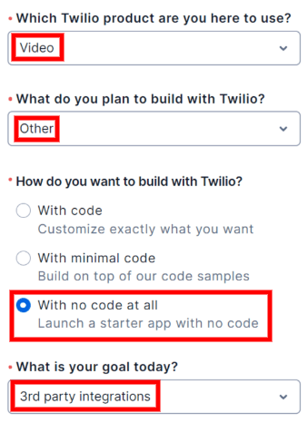
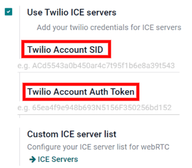

# Configure ICE servers with Twilio

Odoo Thảo luận sử dụng WebRTC API và kết nối peer-to-peer để thực hiện các cuộc gọi thoại và video. Nếu một trong những người tham gia cuộc gọi đang ở sau NAT đối xứng, bạn cần cấu hình một máy chủ ICE để thiết lập kết nối đến người đó. Để thiết lập máy chủ ICE, trước tiên hãy tạo một tài khoản Twilio dành cho cuộc gọi video, sau đó kết nối tài khoản Twilio đó với Odoo.

## Create a Twilio account

First, go to [Twilio](https://www.twilio.com) and click Sign up to create a new
Twilio account. Next, enter your name and email address, create a password, and accept Twilio's
terms of service. Then, click Start your free trial. Verify your email address with
Twilio, as per their instructions.

Next, enter your phone number into Twilio. Then, Twilio will send you an SMS text message
containing a verification code. Enter the verification code into Twilio to verify your phone
number.

After that, Twilio redirects to a welcome page. Use the following list to answer Twilio's
questions:

- For Which Twilio product are you here to use?, select Video.
- For What do you plan to build with Twilio?, select Other.
- For How do you want to build with Twilio?, select With no code at all.
- For What is your goal today?, select 3rd party integrations.

If necessary, change the billing country. Finally, click Get Started with Twilio.

## Locate the Twilio Account SID and Auth Token

To locate the Account SID and Auth Token, go to the Twilio account dashboard. Then, click
Develop on the sidebar. In the Account Info section, locate the
Account SID and the Auth Token. Both of these are needed to connect Twilio
to Odoo.

## Connect Twilio to Odoo

Open the Odoo database and go to Settings ‣ General Settings ‣ Discuss. Check
the box next to Use Twilio ICE servers and enter the Twilio account's
Account SID and Auth Token. Finally, click Save to apply these
changes.

## Define a list of custom ICE servers

This step is not required for the Twilio configuration. However, if Twilio is not configured or is
not working at any given moment, Odoo will fall back on the custom ICE servers list. The user must
define the list of custom ICE servers.

In Settings ‣ General Settings ‣ Discuss, click the ICE Servers
button under Custom ICE server list.

Odoo will redirect to the ICE servers page. Here you can define your own list of ICE
servers.

#### NOTE
For on-premise instances of Odoo, the package `python3-gevent` is necessary for the Discuss
module to run calls/video calls on Ubuntu (Linux) servers.
