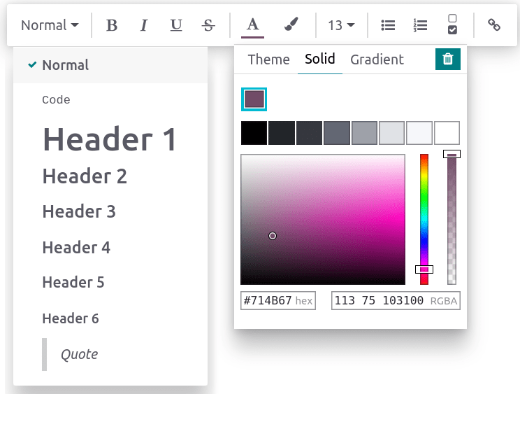

# Chỉnh sửa bài viết

## Add and style content

To start adding content, click anywhere on the page. Your cursor is automatically set to write the
article's first-level header. Once you are done writing the title, press **enter** on your keyboard
to move to the next line.

### Trình soạn thảo văn bản

To stylize the text using the text editor, select the text to format.

Then, you can:

- Change the style by clicking Normal. Doing so opens a dropdown menu with multiple
  styles to choose from (Normal, Code, Header 1 → Header 6, Quote);
- Format the text. Click B to put it in bold, I to put it in italic,
  U to underline, and S to strikethrough;
- Change the font color by clicking A or the background color by clicking the **pencil**
  icon:
  - To choose from a predefined theme color, click Theme and select the desired color.
  - To customize, click Solid and define a color using the wheel, by typing its hex
    code, or its RGBA values.
  - To use a gradient, click Gradient, choose a predefined gradient or click
    Custom to create a personalized gradient.
- To change the text's size, click the **size number** and select the desired size;
- Click the **lists** icons to turn the paragraph into an unordered list, an ordered list, or a
  checklist;
- Click the **chain** icon to insert or edit an URL link.

To format a whole paragraph, type `/` anywhere in the text. Doing so opens the **powerbox**, which
allows:

- Changing a paragraph into lists (unordered, ordered, checklists).
- Changing a paragraph into a header (1 → 6), normal text, `code`, or *quotes*.

### Hình nền

You can customize your article by adding a cover picture and an icon. Hover above the h1 title and
click Add Cover. A pop-up window opens to set a cover picture.

If your database and your Unsplash account are associated, the cover picture is automatically
selected based on the article's name. To modify it, hover over the picture to make the buttons
appear, click Change Cover, and select another image.

Retrieve images from different sources:

- Search the **Unsplash** database.
- Enter a picture's **URL**.
- **Upload** an image from a computer.

To remove the cover, hover over it to make the buttons appear and click Remove Cover.

#### NOTE
- To associate Unsplash with your database, please refer to
  [Unsplash](../../general/integrations/unsplash.md).
- The articles are responsive, and so are the cover pictures. As a result, the images cannot
  be repositioned manually to fit a particular screen, as they automatically resize
  depending on the device.

### Icon

To add an icon, hover above the h1 title and click Add Icon. Doing this sets a random
emoji automatically. To change it, click it and select one from the emoji window. To remove it,
proceed equally and click the red-circled x.

#### NOTE
- The emoji is also displayed before the corresponding article in the side panel hierarchic tree.
- Click the emoji on the side panel to change it without opening the related article.

## Lệnh

To use a command, type `/` and open the **powerbox**. Type the command's name or select from
multiple features to insert blocks, images, files, etc. Some of them, such as `/Image` or `/Article`
are common to all the apps, but others are inherent to the knowledge app and cannot be found or used
in any other application.

### List of commands

Commands are divided into multiple categories depending on their use.

Cấu trúc lương

| Lệnh                       | Sử dụng                              |
|----------------------------|--------------------------------------|
| Danh sách có dấu đầu dòng  | Create a bulleted list.              |
| Danh sách đánh số đầu dòng | Create a list with numbering.        |
| Danh sách chỉ mục          | Track tasks with a checklist.        |
| Bảng                       | Insert a table.                      |
| Dấu phân cách              | Insert an horizontal rule separator. |
| Trích dẫn                  | Thêm một blockquote section.         |
| Mã                         | Thêm một code section.               |
| 2 cột                      | Convert into 2 columns.              |
| 3 cột                      | Convert into 3 columns.              |
| 4 cột                      | Convert into 4 columns.              |

Định dạng

| Lệnh             | Sử dụng                      |
|------------------|------------------------------|
| Heading 1        | Big section heading.         |
| Heading 2        | Medium section heading.      |
| Heading 3        | Small section heading.       |
| Switch direction | Switch the text's direction. |
| Văn bản          | Khối đoạn văn bản            |

Truyền thông

| Lệnh     | Sử dụng          |
|----------|------------------|
| Hình ảnh | Insert an image. |
| Bài viết | Link an article. |

Điều hướng

| Lệnh     | Sử dụng                   |
|----------|---------------------------|
| Liên kết | Thêm một liên kết.        |
| Nút      | Thêm một nút.             |
| Cuộc hẹn | Thêm một cuộc hẹn cụ thể. |
| Lịch     | Lên lịch một cuộc hẹn.    |

Tiện ích

| Lệnh   | Sử dụng                       |
|--------|-------------------------------|
| 3 sao  | Insert a rating over 3 stars. |
| 5 sao  | Insert a rating over 5 stars. |

Kiến thức

| Lệnh               | Sử dụng                                                                                                                |
|--------------------|------------------------------------------------------------------------------------------------------------------------|
| Table of Content   | Add a table of content with the article's headings.                                                                    |
| Chỉ mục            | Show the first level of nested articles.                                                                               |
| Dàn ý              | Show all nested articles.                                                                                              |
| Kanban hạng mục    | Insert a kanban view of article items.                                                                                 |
| Danh sách hạng mục | Insert a list view of article items.                                                                                   |
| Tệp                | Embed a file that can be downloaded.                                                                                   |
| Mẫu                | Add a template section that can be inserted in messages, terms & conditions, or description in other applications. |

Khối cơ bản

| Lệnh   | Sử dụng                |
|--------|------------------------|
| Chữ ký | Insert your signature. |

## Content from other apps

Knowledge allows to retrieve content views from other applications. To do so, go to the targeted app
and create the desired view. Then, click Favorite ‣ Insert view in article and
select an article. The view is inserted at the bottom of the selected article.

#### IMPORTANT
Users who do **not** have access to the view will **not** be able to access it in **Knowledge**
even though they have access to the article containing the view.
