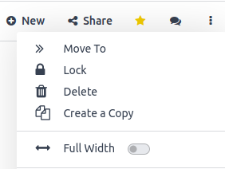
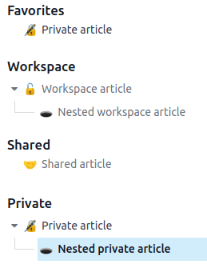

# Quản lý bài viết

Managing articles effectively is key to maximizing the value of your knowledge resources, whether
working on a research project, studying for an exam, or building a knowledge database for your
business. Knowledge allows you to fully manage your articles, from
[creation](#management-create) to [removal](#management-remove), through [sharing](#management-share) and [structure](#management-structure).

You can find most tools to manage articles by clicking the vertical ellipsis button (⋮)
at the right side of the top bar. From there, you can move, lock, delete, or duplicate an article.

## Creation, sharing, and removal of articles

### Tạo

To create articles, click the + New button on the right side of the top bar or the
+ button next to a category or another article.

### Sharing

You can share articles with internal or external users. To do so, open the share menu by clicking
Share in the top-right menu of articles.

#### Mời người dùng

To share articles with specific users (internal or external, such as a partner or a customer), click
Invite. This opens a pop-up window in which you can choose the Permission
[(i.e, access rights)](#management-categories) and enter the Recipients' name or
email.

You can also restrict a specific user from accessing the article by selecting No access
permission.

#### Chia sẻ online

To share articles **online**, activate the Share to web button. Doing so generates a URL
link anyone can use to view the article.

Additionally, the share menu displays the default permission for internal members along with all the
users who have been granted specific permission.

### Loại bỏ

To remove an article, you can either **delete** it or **archive** it.

To delete an article, open it and click the vertical ellipsis button (⋮) ‣
Delete. The article is moved to the trash for 30 days before being permanently deleted. To restore
it, click Open the Trash, select the article, and click Restore.

Để lưu trữ bài viết, nhấp Tìm kiếm, chọn (các) bài viết muốn lưu trữ và nhấp Tác vụ ‣ Lưu trữ ‣ Lưu trữ. Các bài viết đã lưu trữ sẽ bị ẩn khỏi menu tìm kiếm. Để khôi phục bài viết đã lưu trữ, thêm bộ lọc tùy chỉnh để hiển thị chúng (Tìm kiếm ‣ Bộ lọc ‣ Thêm bộ lọc tùy chỉnh, đặt Hoạt động là Không). Sau đó, chọn bài viết và vào Thao tác ‣ Bỏ lưu trữ.

## Structure of articles

Articles are organized into a hierarchical structure wherein the article on top is a parent article,
and those underneath are called nested articles. This structure allows the grouping of related
articles.

To establish this hierarchy, create new articles by clicking the + button next to the
parent-to-be article, or move existing articles by either dragging and dropping them under the
parent-to-be or by clicking the vertical ellipsis button (⋮), clicking Move
To on the toolbox and selecting the article to use as a parent.

### Danh mục

Additionally, articles are divided into four categories that can be found on the left sidebar. These
categories give articles default **access rights**.

- Favorites: You can set any article you can access as a favorite. To do so, click the
  star-shaped icon (★) in the top-right menu of articles. Marking articles as
  **favorites** is user-specific and does not affect other users.
- Workspace: Articles displayed in that category are available to all internal users.
  These users have the right to read, modify or share these articles.
- Shared: Articles displayed in that category are those you shared with internal users,
  external users, or shared with you.
- Private: Articles displayed in that category are only available to you.

