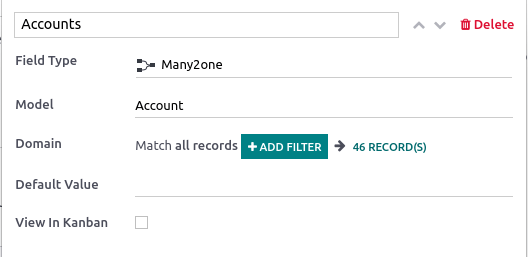

# Thuộc tính

Properties are fields containing data and that can be added to articles by any user with **write**
access. These fields are shared between all the child articles and article items under the same
parent.

#### NOTE
To be able to add properties, an article must be either a **child article** or an **article
item**.

## Add property fields

Hover above the first-level header to make the buttons appear. Click ⚙ Add
Properties ‣ Field Type, select the type and add a default value if needed. To make the fields
appear in **kanban views**, check View in Kanban as well. To validate and close the
property creation window, click anywhere.

The different types assess what the field content can be:

| Loại         | Người dùng                                     |
|--------------|------------------------------------------------|
| Văn bản      | Allows adding any content with no restriction. |
| Ô chọn       | Add a checkbox.                                |
| Số nguyên    | Allows adding integer numbers.                 |
| Số thập phân | Allows adding any number.                      |
| Ngày         | Allows selecting a date.                       |
| Date & Time  | Allows selecting a date and time.              |

Some **field types** need to be configured:

| Loại      | Người dùng                                                                                                                                                                                                                                                                                                                                                                     |
|-----------|--------------------------------------------------------------------------------------------------------------------------------------------------------------------------------------------------------------------------------------------------------------------------------------------------------------------------------------------------------------------------------|
| Lựa chọn  | Add a drop-down selection menu with restricted values that have been set at the property creation.  To set it up, click Add a Value next to the Values field. Enter predetermined values and press **enter** to validate; you can enter as many values as needed. Click anywhere to close the property creation window.                                    |
| Thẻ       | Allows creating and applying as many tags as needed.  Để thiết lập, nhập `new_tag` vào trường Thẻ và nhấn **enter** hoặc nhấp Tạo "new_tag". Nhấp vào bất kỳ đâu để đóng cửa sổ. Sau đó, thêm các thẻ vào trường thuộc tính bằng cách nhấp vào trường thuộc tính và chọn từ các thẻ đã tạo; nhập tên thẻ và nhấn **enter**; hoặc nhập tên thẻ mới để tạo ngay lập tức. |
| Many2one  | Choose from a list of records that result from a model's domain. You can only select one result.  To set it up, click Search a Model in the Model field, select the model. Match all records by clicking ## Record(s), or filter the results by clicking + Add Filter and show the records by clicking ## Record(s).                                       |
| Many2many | Choose from a list of records that result from a model's domain. You can select as many results as needed.  To set it up, click Search a Model in the Model field, select the model. Match all records by clicking ## Record(s), or filter the results by clicking + Add Filter and show the records by clicking ## Record(s).                             |

## Delete property fields

To remove a property, click the **pencil** icon next to the targeted property, then click
Delete ‣ Delete.

#### WARNING
Once a property field is deleted, you cannot retrieve it.

## Hide the property panel

To hide the property sidebar panel, click the gear (⚙) button.
