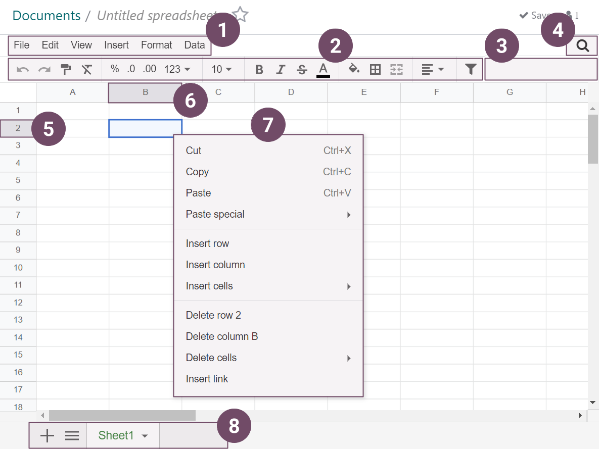

# Spreadsheet

* [Link Odoo data](applications/productivity/spreadsheet/insert.md)
* [Hàm](applications/productivity/spreadsheet/functions.md)
* [Mẫu](applications/productivity/spreadsheet/templates.md)
* [Bộ lọc chung](applications/productivity/spreadsheet/global_filters.md)

Spreadsheet lets you organize, analyze, and visualize your data in tabular form. Among others, you
can:

- [Insert and link your Odoo data (pivots, graphs, lists, and menus)](applications/productivity/spreadsheet/insert.md).
- [Use global filters](applications/productivity/spreadsheet/global_filters.md).
- [Use formulas and functions](applications/productivity/spreadsheet/functions.md).
- [Use default templates or create new ones](applications/productivity/spreadsheet/templates.md).
- Format data.
- Sort and filter data.

## Bảng thuật ngữ

Some of Spreadsheet's main  elements are highlighted and defined below.

1. Thanh menu
2. Thanh trên cùng
3. Thanh công thức
4. Nút bộ lọc
5. Header hàng
6. Header cột
7. Menu ô
8. Thanh dưới cùng
