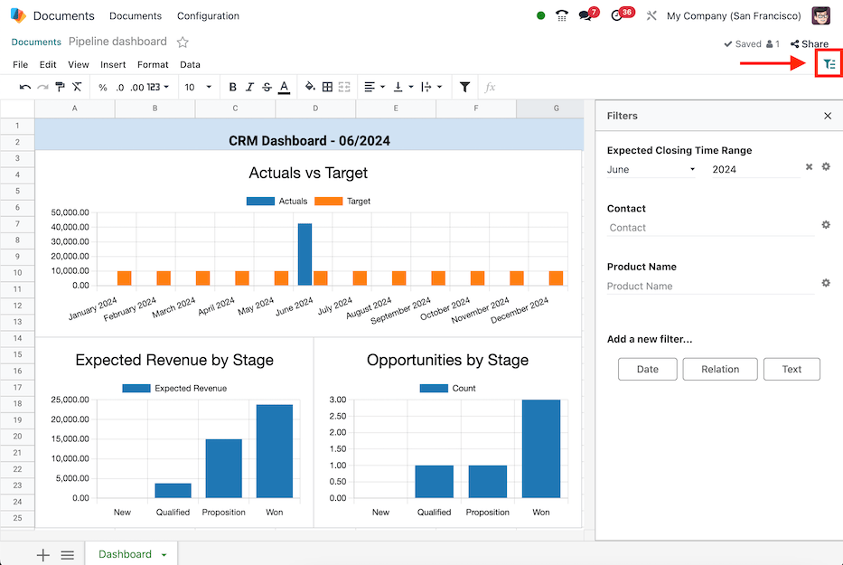

# Bộ lọc chung

Create dynamic views of [inserted data](insert.md), by mapping data source fields to *global
filters* in the Odoo **Spreadsheets** app.

#### NOTE

The global filters are represented by the  (global filter) icon, and enable data that was inserted\
via a pivot table, list, or chart to be filtered. Global filters differ from the _sort and_\
_filter_ feature for cell ranges represented by the (filter) icon.

## Thêm bộ lọc

Navigate to the Documents app and click on the desired spreadsheet, then open the (global filter) filter menu.

Create a new filter by selecting one of the buttons under the Add a new filter...\
section:

* [Date](global_filters.md#spreadsheet-global-filter-date): filter dates by matching data source date fields to\
  a time range (e.g., _Month / Quarter_, _Relative Period_, or _From / To_).
* [Relation](global_filters.md#spreadsheet-global-filter-relation): filter records by matching data source\
  fields to fields in a related model (e.g., _Lead/Opportunity_, _Sales Order_, or _Event_\
  _Registration_).
* [Text](global_filters.md#spreadsheet-global-filter-text): filter text by matching data source text fields to a\
  string of text (e.g., _Restrict values to a range_ and/or provide a _Default value_).

#### NOTE

Only filters that are able to be applied to the fields in the data source are shown.

### Ngày

The _Date_ global filter enables the filtering of data sources by a specific time range, to\
automatically filter on the current period, or to offset the time range relative to the period.

With the  (global filter) menu open, select the Date button to create a new date filter.\
The Filter properties menu displays the following fields for configuration below.

First, enter a name for the new date filter in the Label field.

Then, select one of the three period options in the Time range field:

* Month / Quarter: enables a drop-down menu of specific months and quarters of a year\
  (i.e., _Q1_, _Q2_, _January_, etc.).
* Relative Period: enables a drop-down menu of specific moving time frames (i.e., _Year_\
  _to Date_, _Last 7 Days_, _Last 30 Days_, etc.).
* From / To: enables _Date from..._ and _Date to..._ date selection fields to define a\
  specific time range (e.g., `06/05/2024` to `06/27/2024`).

Optionally, set a Default value for the Time range.

#### NOTE

The Default value field only appears for Month / Quarter or\
Relative Period ranges.

If the Month / Quarter range is selected, tick the Automatically filter on\
the current period checkbox to define the default period of either Month,\
Quarter, or Year.

Next, configure the Field matching for each data source. To do so, expand the section by\
clicking on the Field matching heading, to reveal a list of the data sources in the\
spreadsheet where each data source has two fields for matching:

* Date field: select a date field from the data source model to apply the time range to.
*   Period offset: (optionally) select an offset that shifts the time range by a relative\
    period.

    The options available are: Previous, Before Previous, Next,\
    After Next.

Lastly, once all the information is entered on the form, click the Save button. If any\
of the data source fields do not match the data type of _date_ (or _datetime_), an error is shown\
stating Some required fields are not valid.

### Quan hệ

The _Relation_ global filter enables the filtering of records in data sources by selecting a field\
from a related model.

With the  (global filter) menu open, select the Relation button to create a new relation\
filter. The Filter properties menu displays the following fields for configuration.

First, enter a name for the new relation filter in the Label field.

Then, select or search for a model from the Related model field.

Once a model is selected, the Default value and Field matching fields\
appear.

Optionally, set a Default value for the Related model. The available options\
are records of the model.

Next, configure the Field matching for each data source. To do so, expand the section by\
clicking on the Field matching heading, to reveal a list of the data sources in the\
spreadsheet where each data source has a field for matching.

Select a field from the data source model from which to apply the relation filter.

Lastly, once all the information is entered on the form, click the Save button. If any\
of the data source fields do not match the data type of the related model, an error is shown\
stating Some required fields are not valid.

### Văn bản

The _Text_ global filter enables the filtering of text by matching data source text fields to a\
string of text or to a range of predefined values.

With the  (global filter) menu open, select the Text button to create a new text filter.\
The Filter properties menu displays the following fields for configuration.

First, enter a name for the new text filter in the Label field.

Then, choose whether or not to Restrict values to a range by ticking the checkbox. Doing\
so, reveals a field to input a range within the spreadsheet. Either type in or select the range.

Next, configure the Field matching for each data source. To do so, expand the section by\
clicking on the Field matching heading, to reveal a list of the data sources in the\
spreadsheet where each data source has a field for matching.

Select a field from the data source model from which to apply the text filter.

Lastly, once all the information is entered on the form, click the Save button. If any\
of the data source fields do not match the data type of the related model, an error is shown\
stating Some required fields are not valid.

## Quản lý bộ lọc

Open the  (global filter) filter menu by navigating to the Documents app and\
clicking on the desired spreadsheet.

Existing global filters appear under the Filters section. Filters can be used\
individually, or at the same time.

To reset a filter with set values back to default, click on the (clear) icon next\
to the value in the filter.

To edit an existing filter, select the (gear) icon to open the filter's\
Filter properties menu. From here, edits can be made or the filter can be deleted by\
clicking the Remove button.
