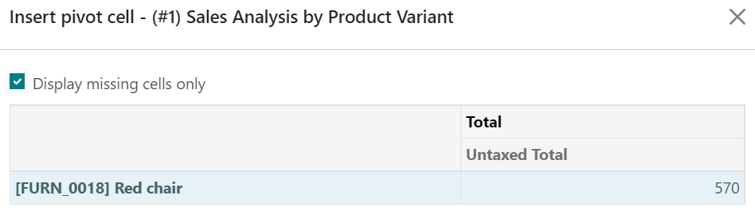

# Link Odoo data

You can insert and link several elements from your database in your spreadsheets, namely:

- pivot,
- biểu đồ,
- lists, and
- links to menus (i.e., a clickable link to a view of a specific model).

Before inserting [pivots](../../essentials/reporting.md#reporting-views-pivot), [graphs](../../essentials/reporting.md#reporting-views-graph), or
lists, ensure they are tailored to your needs, as some elements are more quickly - or only -
configurable in their respective view.

- To insert pivots and graphs, click Insert in spreadsheet from any pivot or graph view.
- To insert lists, click Favorites ‣ Insert list in spreadsheet from any list
  view.
- To insert links to menus, click Favorites ‣ Link menu in spreadsheet from any
  view.

In the pop-up box, either create a new spreadsheet by selecting Blank spreadsheet or
insert it in an existing one by selecting it and clicking Confirm.

#### NOTE
By default, new spreadsheets are saved under the Spreadsheet workspace of the
Documents app.

## Updating data

Once inserted in a spreadsheet, your data is kept up-to-date, reflecting any changes made to your
database. Reopening the spreadsheet reloads the linked data.

#### NOTE
To update pivots and lists data without reopening a spreadsheet, go to the menu bar and click
Data ‣ Refresh all data.

### Dữ liệu pivot

Using Refresh all data only updates existing pivot cells. If new cells need to be added,
go to the menu bar and click Data ‣ Re-insert pivot to fully update the pivot.
Alternatively, click Insert pivot, select the pivot, and tick Display missing
cells only to preview first the missing data.

> 

To change which records are [used by the pivot](../../essentials/search.md#search-preconfigured-filters), right-click on
a pivot cell, select See pivot properties, and click Edit domain.
