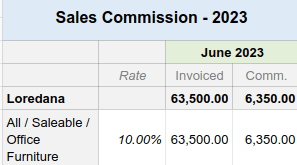

# Mẫu

Spreadsheet templates allow you to quickly create spreadsheets without starting from scratch.

Several pre-built templates are available when creating a new spreadsheet from the **Documents**
app, such as:

- [budget reports](#templates-budget-reports),
- [pipeline revenue reports](#templates-pipeline-reports), or
- [sales commission report](#templates-sales-commission).

You can also [save any spreadsheet as a template](#templates-save) and [manage and edit
existing templates](#templates-manage).

## Mẫu mặc định

### Accounting: budget reports

Budget reports compare a company's actual spending with its budget over a defined period. Two
templates are available: one uses quarterly intervals (Budget Report (Quarterly)), while
the other uses monthly intervals (Budget Report (Monthly)).

The cells under the Actuals column are automatically filled in with the amount of money
made and spent over the corresponding period (month or quarter). The data is taken from posted
journal items under [income and expense accounts](../../finance/accounting/get_started/chart_of_accounts.md#chart-of-account-type).

#### WARNING
Journal items under the Other Income account type are not considered when collecting
data.

To analyze your budget's performance, fill the cells under the Budget column with how
much money you expect to make (Income rows) and spend (Expenses rows) over
the related period and per account. Then, the performance (Perf.) column compares
Actuals data to their corresponding budget, expressed as a percentage.

Lastly, the Net Profit row represents the total Income minus the total
Expenses for the Actuals and Budget columns.

### CRM: pipeline revenue reports

Two pipeline revenue reports are available. The Pipeline Revenue Report (Monthly) is
dedicated to one-time revenue (), while the MRR/NRR
Pipeline Revenue Report (Monthly) covers recurring and non-recurring revenue ().

The cells under the Actuals column are automatically filled in with the amount of
monthly revenue from **won** opportunities.

To compute the revenue performance, fill in the monthly revenue targets.

- For the Revenue by Team sheet, fill in the cells under the Target columns
  for each sales team.
- For the Revenue by Salesperson sheet, open the Targets sheet and fill in
  the cells next to each salesperson. Use the Monthly Factor table below to adapt the
  main targets depending on the month of the year.

Then, the performance (Perf.) column compares Actuals data to their related
budget, expressed as a percentage.

Lastly, the Forecasted column gathers the monthly revenue of leads multiplied by their
Probability percentage.

#### NOTE
For actuals and forecasts:

- The Expected Closing date found on leads is used to assign them to a month.
- The recurring monthly revenue is used even if the recurring plan's number of months is set to
  a different value than 1 month. For example, a yearly plan's revenue is divided by 12 months.

### Sales: sales commission

This report presents the monthly commission earned or due to each salesperson.

The Rate column is pre-filled with the percentage rate from the Rates tab,
which can be customized for each product category according to the company's policy. Adjusting the
rate for a specific product category automatically updates the commission amount for that category.

The Invoiced column shows the total amount of untaxed invoices grouped by salesperson
and month.

Lastly, the Comm. column is computed by multiplying the invoiced amount with the rate
percentage.

## Save a spreadsheet as a template

Any spreadsheet can be saved as a template. From the menu bar, click File ‣ Save
as template. Modify the default Template Name if necessary and click
Confirm.

#### NOTE
Templates are available to all users on the database.

## Manage and edit templates

Manage templates by going to Documents ‣ Configuration ‣ Spreadsheet Templates.
Remove the My Templates [filter](../../essentials/search.md#search-preconfigured-filters) to view all
templates in the database.

To edit an existing template, click `✎ Edit` next to the desired template. Modifications are
automatically saved.
