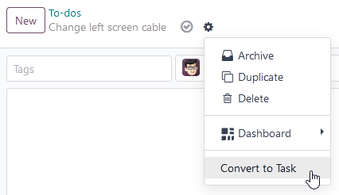
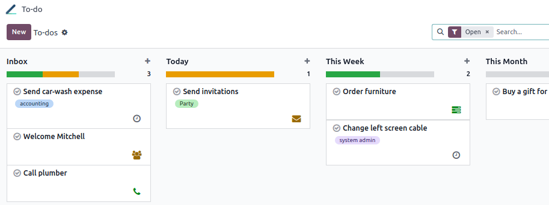
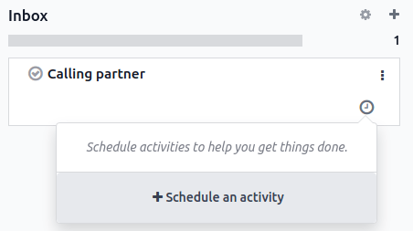
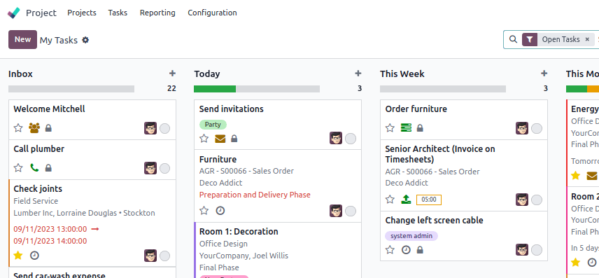

# Việc cần làm

To-do assists you in organizing and managing personal tasks.

## Creating to-dos

To create a to-do, click New or the plus button (➕) next to a stage name.
Add a title to your to-do, then click Add to save it or Edit to access more
options.

If you choose to Edit a to-do, you have the option to add Tags,
Assignees, or more information using the Odoo Editor.

#### NOTE
- Adding Assignees shares the to-do with the users selected.
- Type `/` in the editor box to structure and format your content. You can also add media, links,
  and widgets.

### Converting to-dos into project tasks

If you use the [Project app](../services/project.md), you can convert to-dos into project tasks.
To do so, open a to-do and click the gear button (⚙), then Convert to Task.

Next, select the Project, Assignees, and Tags, then click
Convert to Task. The to-do is now a project task and appears in the selected project.

## Managing the to-do pipeline

Your assigned **to-dos** are displayed on the app dashboard. You can drag and drop a to-do to move
it from one stage to another.

### Lên lịch hoạt động

To schedule an activity on a to-do, click the clock button on the app dashboard, then the
+ Schedule an activity button.

To create the activity:

- Select an Activity Type.
- Select a Due date.
- Choose who the activity should be Assigned to.
- Add a brief Summary if needed. You can add a more elaborate description in the
  Log a note box.

Click Schedule to complete the action.

#### NOTE
The To Do activity is *not* a to-do task. Selecting it does not create a to-do task.

### Viewing to-dos in the Project app

If you use the [Project app](../services/project.md), your to-dos also appear as private tasks
under the My Tasks view.

#### NOTE
A padlock icon is visible on your private tasks to quickly identify them among your project
tasks.
