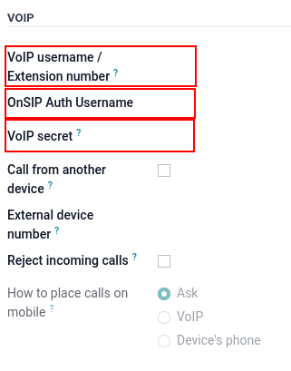

# VoIP services in Odoo with Axivox

## Đầu trang

Odoo VoIP (Voice over Internet Protocol) can be set up to work together with [Axivox](https://www.axivox.com/). In that case, an Asterisk server is **not** necessary, as the
infrastructure is hosted and managed by Axivox.

To use this service, [contact Axivox](https://www.axivox.com/en/contact) to open an account.
Before doing so, verify that Axivox covers the company's area, along with the areas the company's
users wish to call.

## Cấu hình

To configure Axivox in Odoo, go to the Apps application, and search for `VoIP`.
Then, install the VoIP module.

Next, go to Settings app ‣ General Settings ‣ Integrations section, and fill
out the Asterisk (VoIP) field:

- OnSIP Domain: set the domain created by Axivox for the account (e.g.,
  `yourcompany.axivox.com`)
- WebSocket: type in `wss://pabx.axivox.com:3443`
- VoIP Environment: set as Production

### Configure VoIP user in Odoo

Next, the user is configured in Odoo, which **must** take place for every Axivox/Odoo user using
VoIP.

In Odoo, go to Settings app ‣ Users & Companies ‣ Users, then open the desired
user's form to configure . Under the
Preferences tab, fill out the VOIP Configuration section:

- VoIP username / Extension number: (Axivox) SIP username
- OnSip Auth Username: (Axivox) SIP username
- VoIP Secret: (Axivox) SIP Password
- Call from another device: option to always transfer phone calls to handset
- External device number: SIP external phone extension
- Reject incoming calls: option to reject all incoming calls
- How to place calls on mobile: method to make calls on a mobile device

#### IMPORTANT
When entering the SIP Password into the user's Preferences tab, this
value **must** be typed out manually and **not** pasted in. Pasting in causes a `401 server
rejection error`.
