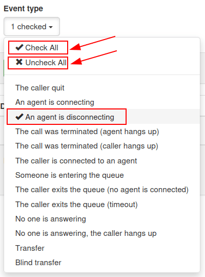

# Call queues

A call queue is a system that organizes and routes incoming calls. When customers call a business,
and all of the agents are busy, the call queue lines up the callers in sequential order, based on
the time they called in.

The callers then wait on hold to be connected to the next available call center agent.

Implementing a call queue system reduces stress for employees, and helps build brand trust with
customers. Many companies use call queues to set expectations with customers, and to distribute the
workload equally amongst employees.

This document covers the process required to configure call queues (with advanced settings), as well
as how to log into a call queue from the Odoo database.

#### SEE ALSO
[Music on-hold](vm_audio_messages.md#voip-axivox-music-on-hold)

## Add a queue

To add a call queue in Axivox, navigate to the [Axivox management console](https://manage.axivox.com). In the left menu, click Queues. Next, click
Add a queue. Doing so reveals a blank New queue form with various fields to
fill out.

### Tên

Once the New queue page appears, enter the Name of the queue.

### Internal extension

Choose an Internal extension for the queue. This is a number to be dialed by users of
the database to reach the login prompt for the queue.

### Chiến lược

Next, is the Strategy field. This field determines the call routing of received calls
into this queue.

The following choices are available in the Strategy drop-down menu:

- Call all available agents
- Calls the agent who has received the call for the longest time
- Calls the agent who has received the least call
- Call a random agent
- Call agents one after the other
- Call agents one after the other starting with the first in the list

Choose a strategy that best meets the company's needs for customers in the queue.

### Maximum waiting time in seconds

In the Maximum waiting time in seconds field, determine the longest time a customer
waits in the queue before going to a voicemail, or wherever else they are directed to in a dial
plan. Enter a time in seconds.

### Maximum duration of ringing at an agent

In the Maximum duration of ringing at an agent field, determine the longest time an
individual agent's line rings before moving on to another agent, or moving to the next step in the
dial plan. Enter a time in seconds.

#### SEE ALSO
For more information on dial plans, visit:

- [Dial plan basics](dial_plan_basics.md)
- [Advanced dial plans](dial_plan_advanced.md)

### Adding agents

The final two fields on the New queue form revolve around adding agents. Adding
Static agents and Dynamic agents are two pre-configured methods for adding
agents onto the call queue during the configuration.

#### Static agents

When Static agents are added, these agents are automatically added to the queue without
the need to log in to receive calls.

#### Dynamic agents

When Dynamic agents are added, these agents have the ability to log into this queue.
They are **not** logged-in automatically, and **must** log in to receive calls.

Be sure to Save the changes, and click Apply changes in the upper-right
corner to implement the change in production.

## Agent connection

There are three ways call agents can connect to an Axivox call queue:

1. Dynamic agents connect automatically.
2. Manager logs in specific agent(s), via the [Axivox management console](https://manage.axivox.com).
3. Agent connects to the queue in Odoo, via the *VoIP* widget.

#### SEE ALSO
See the documentation on setting [Dynamic agents](#voip-axivox-dynamic-agents) in the [Axivox management
console](https://manage.axivox.com).

### Connect via Axivox queue

After the initial configuration of the call queue is completed, with the changes saved and
implemented, a manager can log into the [Axivox management console](https://manage.axivox.com) and
connect dynamic agents to the queue manually.

To connect an agent, click Queues, located in the left-hand column. Doing so reveals the
Queues dashboard, with a few different columns listed:

- Name: name of the queue.
- Extension: number of the extension to be dialed to reach the queue.
- Agent Connection: number to dial to log into the queue.
- Agent disconnection: number to dial to log out of the queue.
- Connected Agents: name of agent connected to the queue.

The following buttons are also available on the Queues dashboard:

- Connect an agent: manually connect an agent to the queue.
- Report: run a report on the queue.
- Delete: delete the queue.
- Edit: make changes to the settings of the queue.

When agents are connected to the queue, or are live with a customer, they are displayed under the
Connected Agents column.

If they are static agents, they **always** show up as connected.

Connect an agent by clicking the orange button labeled, Connect an agent. Then, select
the desired agent's name from the drop-down menu, and click Connect.

#### SEE ALSO
For more information on static and dynamic agents, see this documentation:

- [Static agents](#voip-axivox-static-agents)
- [Dynamic agents](#voip-axivox-dynamic-agents)

#### Báo cáo

Click Report to check on the reporting for a particular queue, in order to see who
connected when, and what phone calls came in and out of the queue. This information is showcased on
a separate Queue report page, when the green Report button is clicked.

Reports can be customized by date in the Period field, and specified in the
From and to fields. The information can be organized by Event
type, and Call ID.

When the custom configurations have been entered, click Apply.

Each report can be exported to a  file for further use and
analysis, via the Export to CSV button.

When the Event type field is clicked, a drop-down menu appears with the following
options:

- The caller quit
- An agent is connecting
- An agent is disconnecting
- The call was terminated (agent hangs up)
- The call was terminated (caller hangs up)
- The caller is connected to an agent.
- Someone is entering the queue
- The caller exits the queue (no agent is connected)
- The caller exits the queue (timeout)
- No one is answering
- No one is answering, the caller hangs up
- Transfer
- Blind Transfer

There is no limit to how many options can be selected from the Event type drop-down
menu.

Clicking Check all selects all the available options from the drop-down menu, and
clicking Uncheck all removes all selections from the drop-down menu.

To select an individual Event type, click on the desired option in the drop-down menu.

### Connect to queue on Odoo

Dynamic agents can connect manually to the Axivox call queue from the Odoo *VoIP* widget, once the
*VoIP* app is configured for the individual user in Odoo.

#### SEE ALSO
[VoIP services in Odoo with Axivox](axivox_config.md)

To access the Odoo *VoIP* widget, click the ☎️ (phone) icon in the upper-right corner of
the screen, from any window within Odoo.

#### SEE ALSO
For more information on the Odoo *VoIP* widget, see this documentation: [VoIP widget](../voip_widget.md)

For an agent to connect to the call queue, simply dial the Agent connection number, and
press the green call button 📞 (phone) icon in the *VoIP* widget. Then, the agent hears
a short, two-second message indicating the agent is logged in. The call automatically ends
(disconnects).

To view the connected agents in a call queue, navigate to the [Axivox management console](https://manage.axivox.com), and click Queues, located in the left-hand column.

Then, click the green Refresh button at the top of the Connected agents
column. Any agent (static or dynamic) that is connected to the queue currently, appears in the
column next to the queue they are logged into.

To log out of the queue, open the Odoo *VoIP* widget, dial the Agent disconnection
number, and press the green call button 📞 (phone) icon. The agent is disconnected from
the queue after a short, two-second message.

To manually log a dynamic agent out of a call queue, navigate to the [Axivox management console](https://manage.axivox.com), and click Queues, located in the left-hand column. Then,
click the green Refresh button at the top of the Connected agents column.

To disconnect an agent manually, click the red Disconnect button, and they are
immediately disconnected. This can be helpful in situations where agents forget to log out at the
end of the day.
