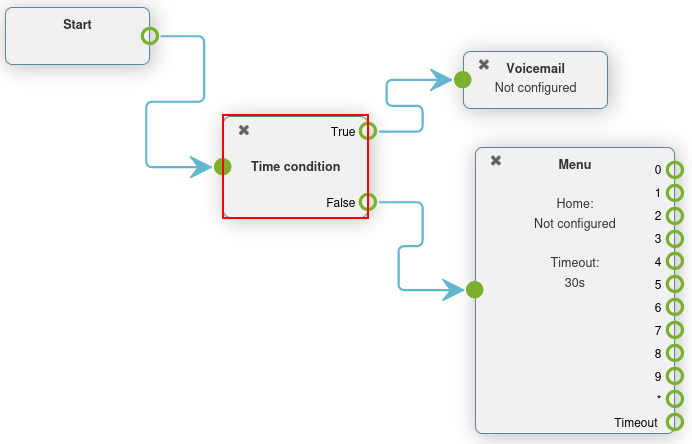
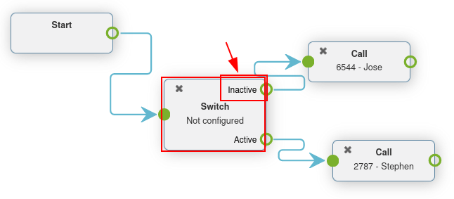

# Advanced dial plans

Typically, companies have a lot of incoming calls every day, but many do not want their teams to\
answer calls 24 hours a day, 7 days a week.

By using Axivox advanced dial plan features, the process can be automated, and routing can be set up\
for all scenarios. This way, customers are never left waiting, or frustrated, because they cannot\
get in touch with anyone.

By utilizing the advanced elements in dial plans, companies can automate call routing for certain\
days or times, like company holidays. Companies can also allow callers to enter extensions\
themselves, and get transferred automatically using a digital receptionist. This way, an\
administrative team does **not** have to be available around the clock.

There is even the option to route callers, depending on where they are calling from in the world,\
thus maximizing efficiency.

#### IMPORTANT

For more information on basic dial plans, and how to add elements, visit [Dial plan basics](dial_plan_basics.md).

#### WARNING

Using a browser add-on for spelling may hinder the use of the visual editor in dial plans. Do**not** use a translator with the Axivox management console.

## Advanced elements

In Axivox dial plans (as described in [Dial plan basics](dial_plan_basics.md)), there are two advanced elements that\
can be used.

* Record: recording feature is enabled (requires plan change, enabled in Axivox\
  settings).
* Caller ID: replace the caller ID by the called number or free text.

To add one of these elements, navigate to the Dial plans page, located in the menu on\
the left side of the [Axivox management console](https://manage.axivox.com).

Next, click on the Visual Editor button to the right of the desired dial plan to edit\
it. Finally, open the New element drop-down menu, select the element, and click\
Add.

For more information, visit [Dial plans](dial_plan_basics.md#voip-axivox-dial-plans).

#### IMPORTANT

The Record element records calls that are routed through this element, and requires\
an additional plan change in Axivox.

To enable recording on Axivox, navigate to Settings in the [Axivox management console](https://manage.axivox.com). Then, go to the Recording drop-down menu, near the bottom\
of the page. From there, select Enabled from the drop-down menu to enable recording\
using the Record element in a dial plan.

The Caller ID element allows for the replacement of the caller ID downstream, after\
routing.

Upon adding the Caller ID element to the dial plan, and double-clicking it to configure\
it, two options appear.

The first is a Free text field, where any text can be input to replace the caller ID.\
The second option is Replace the caller ID by the called number. This option replaces\
the caller's ID with the Incoming number.

## Basic routing elements

Basic routing elements in Axivox dial plans provide extension-based routing. This can be done by\
adding either a _Menu_ to numerically link the dial-by-numbers to an action, or by using a _Digital_\
_Receptionist_ to automatically route or listen for an extension, based on a key input from the\
caller.

The main difference between the two elements is that the _Digital Receptionist_ does **not** need to\
be pre-configured numerically with actions. Instead, it acts as a virtual receptionist.

* Menu: add a dial-by-number directory and configured downstream actions (not\
  terminal). For example, a dial-by-numbers function could feature an element, wherein clicking '2'\
  takes the caller to the element linked to '2' on the Menu element in the dial plan.
* Digital Receptionist: attach a virtual dispatcher to listen for extensions.

Để thêm một trong các phần tử này, hãy đi đến trang Kế hoạch quay số, nằm trong menu bên trái của `bảng điều khiển quản lý Axivox <https://manage.axivox.com>_`. Tiếp theo, nhấp vào nút Trình chỉnh sửa trực quan bên phải kế hoạch quay số để chỉnh sửa kế hoạch đó. Sau đó, mở menu thả xuống Phần tử mới, chọn phần tử cần thêm và nhấp Thêm.

For more information, visit [Dial plans](dial_plan_basics.md#voip-axivox-dial-plans).

### Digital receptionist scenario

The _Digital Receptionist_ element is a listen-feature that accurately routes callers through a dial\
plan, based on the extension they enter, via the key pad.

Set a _Digital Receptionist_ to eliminate the need of a team, or live receptionist, to be on-call\
all the time. With that element in place, calls now reach their destination, without a real person\
interjecting.

After adding the Digital Receptionist element to a dial plan, connect the appropriate\
endpoints, and double-click on the element to set the Timeout on the\
receptionist pop-up window that appears.

The Timeout can be set in `5` second increments, from `5` seconds to `60` seconds.

#### IMPORTANT

The Digital Receptionist element **requires** a Play a file element on\
either side of it, to explain what action to take, and when a wrong extension is entered.

#### IMPORTANT

Dial plan elements can be configured by double-clicking them, and selecting different features\
of the Axivox console to them.

For example, an Audio message needs to be made, and then selected in a\
Play a file or Menu element.

For more information, see this documentation [Tin nhắn thoại](vm_audio_messages.md#voip-axivox-audio-messages).

## Advanced routing elements

Advanced routing elements route calls automatically as they are received into the incoming\
number(s). This can be configured using geo-location, whitelisting, or time-based variables. Calls\
pass through a filter prior to their final destination, and are routed, based on the set\
variable(s).

The following are advanced routing elements:

* Dispatcher: create a call filter to route traffic, based on the geo-location of the\
  caller ID.
* Access List: create a tailored access list, with VIP customer preference.
* Time Condition: create time conditions to route incoming traffic around holidays, or\
  other sensitive time-frames.

Để thêm một trong các phần tử này, hãy đi đến trang Kế hoạch quay số, nằm trong menu bên trái của `bảng điều khiển quản lý Axivox <https://manage.axivox.com>_`. Tiếp theo, nhấp vào nút Trình chỉnh sửa trực quan bên phải kế hoạch quay số để chỉnh sửa kế hoạch đó. Sau đó, mở menu thả xuống Phần tử mới, chọn phần tử cần thêm và nhấp Thêm. Để biết thêm thông tin, hãy truy cập [Dial plans](dial_plan_basics.md#voip-axivox-dial-plans).

### Dispatcher scenario

A _Dispatcher_ element is a dial plan feature that directs calls, based on region or geo-location.\
In most cases, the Dispatcher element in a dial plan is linked to the Start\
element, in order to filter or screen calls as they come into an incoming number.

Double-click the Dispatcher element in the Dialplan Editor pop-up window to\
configure it.

This element checks numbers (routed through this element), according to regular expressions. To add\
a regular expression, click Add a line on the bottom of the Dispatcher\
pop-up window.

Then, under Name, enter a recognizable name to identify this expression. This is the\
name that appears in the Dispatcher element on the dial plan showcased in the\
Dialplan Editor pop-up window.

In the Regular expression field, enter the country code, or area code, which Axivox\
should route for incoming calls. This is especially helpful when a company would like to filter\
their customers to certain queues, or users based on the customer's geo-location.

To specify all numbers behind a certain country code, or area code, include `d+` after the country\
code, or country code + area code.

When the desired configurations are complete on the Dispatcher pop-up window, be sure to\
click Save.

Upon doing so, the Dispatcher element appears with different routes available to\
configure, based on the Regular Expressions that were set.

Attach these routes to any New element in the Dialplan Editor pop-up window.

By default, there is an Unknown path that appears on the Dispatcher element\
after setting at least one Regular Expression.

Calls follow this route/path when their number does not match any Regular Expression set\
on the Dispatcher element.

### Time condition scenario

When a Time Condition element is added to a dial plan, it has a simple True\
and False routing.

After adding the Time Condition element to a dial plan, double-click it to configure the\
variables. Hour/Minute, Days of the week, Day of the month, and\
Month can all be configured.

If the time which the caller contacts the incoming number matches the set time conditions, then the\
True path is followed, otherwise the False path is followed.

The Time Condition element is especially useful for holidays, weekends, and to set\
working hours. When a caller reaches a destination where they can be helped, either with a real\
person or voicemail, this reduces wasted time and hangups.

#### IMPORTANT

To set the Timezone that the Time Condition operates under, navigate to[Axivox management console](https://manage.axivox.com), and click Settings in the\
menu on the left. Then, set the Timezone using the second field from the bottom, by\
clicking the drop-down menu.

### Access list scenario

An _Access List_ element in a dial plan allows for the routing of certain numbers, and disallows\
(denies) other numbers.

After adding an Access List element to a dial plan, it can be configured by\
double-clicking on the element directly in the Dialplan Editor pop-up window.

Two fields appear where regular expressions can based in the Allow and Deny\
fields of the Access List pop-up window.

After setting the Allow and Deny fields with regular expressions or numbers,\
click Save on the Access List pop-up window.

Then, on the Access list element in the dial plan, three paths (or routes) are available\
to link to further actions.

Unknown calls can be routed through the regular menu flow by adding a Menu element, and\
connecting it to the Unknown path. Refused calls can be routed to the\
Hang up element. Lastly, Authorized callers can be sent to a specific\
extension or queue.

## Switches

A _Switch_ element in Axivox is a simple activated/deactivated route action.

These can be activated or chosen quickly, allowing for quick routing changes, without altering the\
dial plan.

Alternate routes can be configured, so that in a moments notice, they can be switched to. This could\
be for new availability, or to adjust traffic flow for any number of reasons.

Axivox allows for a simple on/off switch, and a multi-switch, which can have several paths to choose\
from.

* Switch: a manual on/off control that can divert traffic, based on whether it is opened\
  (on) or closed (off).
* Multi-Switch: a mechanism to create paths, and turn them on and off, to divert\
  incoming calls.

### Basic switch

A Switch can be set in the [Axivox management console](https://manage.axivox.com) by\
navigating to Switches in the left menu. To create a new switch click Add a\
switch from the Switches dashboard, configure a Name for it, and click\
Save.

Then, toggle the desired switch to either On or Off, from the\
State column on the Switches dashboard.

This On / Off state automatically routes traffic in a dial plan, in which\
this switch is set.

The traffic travels to the Active route when On is toggled in the switch.\
The call traffic travels to the Inactive route when Off is toggled in the\
switch.

Changes can be made on the fly, just be sure to click Apply changes to implement the\
them.

#### Add a switch to dial plan

To add a Switch to a dial plan, navigate to [Axivox management console](https://manage.axivox.com), and click on Dial plans in the left menu. Then, click\
Visual Editor next to the desired dial plan to open the Dialplan Editor\
pop-up window.

Then, from the New element drop-down menu, select Switch, and then click\
Add. Double-click on the element to further configure the Switch element.

### Multi-switch

A _Multi-Switch_ element in Axivox is a switch where multiple paths can be configured, and switched\
between.

To configure and set a Multi-Switch element, navigate to [Axivox management console](https://manage.axivox.com). Then, click on the Switches menu item in the left menu.

Toggle to the Multi-switch tab to create, or set, a pre-configured\
Multi-Switch element.

To create a new Multi-Switch, click Create new. Then, enter a\
Name for the element, and then enter the Available choice. Enter one\
Available choice per line. Do **not** duplicate any entries.

Remember to click Save when done.

To select the State of the Multi-Switch, click the drop-down menu next to\
the Multi-Switch name, under the Multi-switch tab on the\
Switches dashboard.

The State chosen is the route that is followed in the dial plan. The State\
can be edited on the fly, just be sure to click Apply changes.

#### Add a multi-switch to dial plan

To add a Multi-Switch element to a dial plan, navigate to [Axivox management console](https://manage.axivox.com), and click Dial plans in the left menu.

Then, select or create a dial plan. Next, click Visual Editor on the desired dial plan.

On the Dialplan Editor pop-up window that appears, click on the New element\
drop-down menu, and select Multi-Switch. Then, click Add. Double-click on\
the element to further configure the Switch element.

