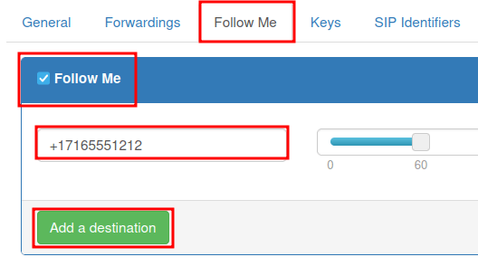
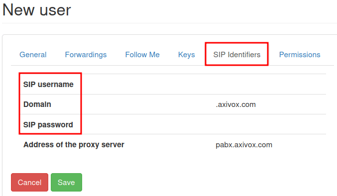

# Manage users in Axivox

Managing Axivox  users is an important part of setting up
 in an Odoo database. Each Axivox user has a unique name,
phone number and/or extension, and a voicemail. This way, they can be reached in a variety of
convenient ways.

Axivox users are organized in a simple, straightforward way in the Axivox console, so an
administrator can manage users quickly and easily.

#### NOTE
This documentation covers how to configure everything through a provider called, Axivox.
Depending on the chosen VoIP provider, the processes to manage users may be different.

## Tổng quan

Begin at the Axivox management console by navigating to [https://manage.axivox.com](https://manage.axivox.com). Log in with the appropriate administrator credentials.

#### NOTE
Actions in the Axivox management console **must** be double-saved, in order for the changes to
take effect. To save any changes, click Save in the individualized changes screen.
Then, to implement those changes, click the Apply Changes button in the upper-right
corner of the console.

### Incoming numbers

Incoming numbers are all the numbers a company is paying to use to receive calls.

Click on Incoming numbers from the menu on the left of the Axivox management
console. Doing so reveals the Incoming numbers page, where all the incoming numbers are
listed, along with their Destination and SMS information.

The Destination determines the action that is taken, or the path the caller follows when
dialing said numbers.

To edit the Destination, click the Edit button to the far-right of the
incoming number line to be modified. Then, on the Edit number page that appears, the
Destination type for voice call can be changed.

The options available in the Destination type for voice call drop-down menu are as
follows:

- Not configured
- Extension
- Dial plan
- Thư thoại
- Hang up
- Conference

Depending on the selection made in the Destination type for voice call drop-down menu, a
second, selection-specific drop-down menu is populated with further configuration options.
Additionally, more fields are revealed, based on the selection made in the Destination
type for voice call drop-down menu.

Once the desired configurations are complete, click Save, then click Apply
changes in the upper-right corner to implement them.

## Người dùng mới

Every employee using  at the company needs an Axivox user
account associated with them.

To view existing users in the Axivox management console, click Users from the menu on
the left of the console. Every user has a Number, Name, option for a
Voicemail, and an Outgoing number specified.

To create a new user in the Axivox console, click Add a user to reveal a New
user form. The following tabs are available for configuring the new user:

- General: basic information, including the extension of the user, can be set.
- Forwardings: internal forwards on 'no answer' or busy signals.
- Follow Me: external forward configuration.
- Keys: set hot-keys within the  system.
- SIP Identifiers:  username and password for
  external configuration.
- Permissions: set access rights for users in the Axivox management console.

### General tab

Under the General tab of the New user form, in the Extension
field, input an extension that is unique to the user. This is the number internal users dial to
reach a specific employee.

In the Name field, input the employee name.

Next, fill out the Email address of the user field. A valid email address for the
employee should be added here, where the user receives business emails.

In the GSM number field, enter an alternative number at which the user can be reached.
Be sure to include the country code.

#### NOTE
A country code is a locator code that allows access to the desired country's phone system. The
country code is dialed first, prior to the target number. Each country in the world has its own
specific country code.

For a list of comprehensive country codes, visit: [https://countrycode.org](https://countrycode.org).

In the Voicemail field, select either Yes or No from the
drop-down menu.

In the Directory field, the administrator has the option to leave it blank, by making no
changes, or selecting Default from the drop-down menu. The Directory is used
in the *Digital Receptionist* feature element of a dial-plan.

At the bottom of the General tab, there are two separate options with selection boxes.

The first option is This user can receive multiple calls at the same time. By selecting
this option, users are able to receive calls when on another call.

The second option, This user must log-in to call, provides the option to make it
mandatory for the user to log in.

#### NOTE
If a company uses physical VoIP phones on desks, and wants their employees to be able to log in
from *any* phone or desk in the office, they would make the selection for This user
must log-in to call.

Once the desired configurations are complete, click Save, then click Apply
changes in the upper-right corner.

### Forwardings tab

Under the Forwardings tab of the New user form, a company can decide what
happens if someone calls a user, and the call is not answered.

#### IMPORTANT
Forwardings are disabled when the Follow Me option is enabled.

For example, under the Forwarding on no answer field, when the button for Add
a destination is selected, the option to add a specific user or phone number is revealed. After
entering the Destination, a specific time frame can be selected by sliding the
seconds bar to the desired ring time.

Additional Destinations can be added on with different ring times.

#### NOTE
Ring times can be staggered, so the call is forwarded to another user after the first user does
not pick up the call. The option to Send to voicemail as a last resort is available
to the administrator, should the Destinations not pick up.

Under the Forwarding on busy field, an administrator can Add a destination.
When clicked, they can then set the Destination (user) and time frame. Should the
original user's  extension, or incoming number, be busy,
the call is forwarded to the destination(s).

When the desired configurations are complete, click Save, then click Apply
changes in the upper-right corner of the page.

### Follow Me tab

When the Follow Me option is selected, under the Follow Me tab of the
New user form, no Forwardings can be made.

Also, when the Follow Me option is selected, the Add a destination button
can be selected to add users, or a destination phone number, to the original user's account. That
way, these added numbers ring when a call is received.

After entering the Destination, a specific time frame can be made by sliding the
seconds bar to the desired ring time. Additional Destinations can be added
with different ring times.

#### NOTE
The original user's  number does **not** ring with
this option selected. Ring times can also be staggered, so the call is forwarded to another user
after the first user does not pick up the call.

#### IMPORTANT
The Odoo mobile app, or another  mobile client, allows
for simultaneous ringing of the user's extension or incoming number. For more information, visit
the [VoIP Mobile Integrations](applications/productivity/voip/devices_integrations.md) documentation.

Once all desired configurations are complete, click Save, then click Apply
changes in the upper-right corner.

### Keys tab

Under the Keys tab of the New user form, speed dial actions for the user can
be configured. Some more advanced options are available, as well.

The following options are available to set to numerical values `1-20`.

These actions can be set on each number:

- Not configured: the default action, which is nothing.
- BLF (Busy lamp fields): this action shows the status of other users' phones connected
  to the Axivox phone system. This is primarily used on a desk-phone.
- Quick Call: this action allows for a speed-dial of an external number.
- Line: this action allows the user to call another user.
- Switch: this action allows the user to switch between calls from a desk-phone.
- Pickup: this action allows the user to pick up an incoming call from a desk-phone.

Once all the desired configurations are complete, click Save, then click
Apply changes in the upper-right corner.

#### IMPORTANT
Many of the preceding options have secondary options available, as well, that can be used to link
a user, or external phone number. These **must** be filled out in conjunction with the initial
action.

#### NOTE
The Number of keys field can be changed by entering in the desired numerical value in
the Number of keys field, located at the top of the Keys tab of the
New user form.

### SIP Identifiers tab

*SIP*, which stands for Session Initiation Protocol telephony, allows one to make and receive calls
through an internet connection. The SIP Identifiers tab on the New user
form, contains credentials needed to configure Axivox users in Odoo and/or a different  mobile client.

#### SEE ALSO
See the documentation on configuring Axivox, using the SIP identifiers:

- [Use VoIP services in Odoo with Axivox](applications/productivity/voip/axivox/axivox_config.md)
- [Axivox Mobile Integrations](applications/productivity/voip/devices_integrations.md)

Under the SIP Identifiers tab, the SIP username field represents the user's
information that was entered in the Extension field, under the General tab.

The Domain field is assigned to the company by the Axivox representative.

The value in the SIP Password field is unique for every Axivox user. This value is used
to sign into Axivox on Odoo, and for any mobile  clients.

The value listed in the Address of the proxy server field is typically:
`pabx.axivox.com`, but is subject to change by Axivox, so be sure to check the SIP
Identifiers tab for the most accurate value.

Once all desired configurations have been made, click Save, then click Apply
changes in the upper-right corner.

### Permissions tab

Under the Permissions tab of a New user form, a Username and
Password can be entered for the user.

Beneath those fields, the following permissions can be granted to Axivox users for portal access:

- User portal access
- Quản lý người dùng
- Quyền quản trị viên
- Quản lý số điện thoại
- User group management
- Phone number management
- Dial plan management
- Pickup group management
- Switch management
- Conference management
- Queue management
- Voicemail management
- Audio messages management
- Music on hold management
- Directory management
- Call list
- Connected user list
- Cài đặt chung
- Apply changes button
- Tải xuống hoá đơn
- Thông tin hoá đơn
- Quản lý danh sách hạn chế
- Conference participant management

To access credentials for the Axivox user portal, navigate to the top of the
Permissions tab. Then, copy the Username, and enter the correct
Password for the individual user. There is a minimum of 8 characters for a user
password.

#### NOTE
These are the same permissions granted to the Axivox administrator that are listed in the menu on
the left in the Axivox management console. Should a selection state No, or
No access, then the menu option does **not** populate for the user.

Once all the desired configurations are complete, click Save, then click
Apply changes in the upper-right corner.

Upon finishing the setup for a new user, an [Incoming numbers](#voip-axivox-incoming-number) can be linked.

## Nhóm người dùng

A user group is a grouping of Axivox users that can be linked to a queue for call center
capability.

To begin using user groups, navigate to [https://manage.axivox.com](https://manage.axivox.com).

Then, log in with the appropriate administrator credentials. From the menu on the left of the Axivox
administrative panel, click into User Groups.

To add a user group from the User Groups page, click Add a group.

Next, name the group, by entering text into the Name field. Then, add a member to the
group by typing the first few letters of the user's name into the Members field. The
user populates in a drop-down menu below the field. Then, click on the desired user, and they are
added to the user group.

Repeat this process to add more users to the group.

Once all desired configurations are complete, click Save, then click Apply
changes in the upper-right corner.
