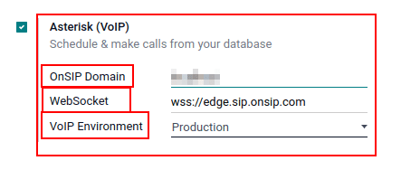
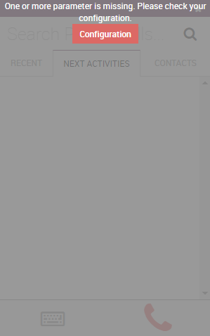

# Use VoIP services in Odoo with OnSIP

#### IMPORTANT
OnSIP  services are only available in the **United
States** (US). OnSIP  services are widely available in
the lower-48, contiguous United States. In Alaska or Hawaii, charges for service can be higher.

Additionally, a  billing address, and  credit
card are required to use the service.

Before setting up an account with OnSIP, the business will need to make sure the business
telephone numbers are portable to OnSIP.

OnSIP makes every attempt to work with all telephone service providers. However, certain local or
regional guidelines may preclude the company's current provider from releasing the number.

## Đầu trang

Odoo *VoIP* can be set up to work together with [OnSIP (Odoo Landing Page)](https://info.onsip.com/odoo/). OnSIP is a VoIP provider. An account is needed with OnSIP in order
to use this service.

Before setting up an account with OnSIP, make sure the company's home area, and the areas that will
be called, are covered by OnSIP services.

After opening an OnSIP account, follow the configuration procedure below to configure it on an Odoo
database.

## Cấu hình

To configure the Odoo database to connect to OnSIP services, first navigate to the
Apps application from the main Odoo dashboard. Then, remove the default `Apps`
filter from the Search... bar, and search for `OnSIP`.

Next, activate the VOIP OnSIP module.

### Odoo VoIP setting

After installing the *VOIP OnSIP* module, go to the Settings app, scroll down to
the Integrations section, and locate the Asterisk (VoIP) fields. Then,
proceed to fill in those three fields with the following information:

- OnSIP Domain: the domain that was assigned when creating an account on [OnSIP](https://www.onsip.com/).
- WebSocket: `wss://edge.sip.onsip.com`
- VoIP Environment: Production

### Odoo user setting

Next, the user needs to be set up in Odoo. Every user associated with an OnSIP user **must** also be
configured in the Odoo user's settings/preferences.

To do that, navigate to Settings app ‣ Manage Users ‣ Select the User.

On the user form, click Edit to configure the user's OnSIP account. Then, click the
Preferences tab, and scroll to the VoIP Configuration section.

In this section, fill in the fields with OnSIP credentials.

Fill in the following fields with the associated credentials listed below:

- Voip Username = OnSIP Username
- OnSIP Auth Username = OnSIP Auth Username
- VoIP Secret = OnSIP SIP Password

When these steps are complete, navigate away from the user form in Odoo to save the configurations.

Once saved, Odoo users can make phone calls by clicking the ☎️ (phone) icon in the
top-right corner of Odoo.

#### SEE ALSO
Additional setup and troubleshooting steps can be found on [OnSIP's knowledge base](https://support.onsip.com/hc/en-us).

### Cuộc gọi đến

The Odoo database also receives incoming calls that produce pop-up windows in Odoo. When those call
pop-up windows appear, click the green 📞 (phone) icon to answer the call.

To ignore the call, click the red 📞 (phone) icon.

#### SEE ALSO
[VoIP widget](voip_widget.md)

### Khắc phục sự cố

#### Missing parameters

If a *Missing Parameters* message appears in the Odoo widget, make sure to refresh the Odoo browser
window (or tab), and try again.

#### Số không chính xác

If an *Incorrect Number* message appears in the Odoo widget, make sure to use the international
format for the number. This means leading with the international country code.

A country code is a locator code that allows access to the desired country's phone system. The
country code is dialed first, prior to the target number. Each country in the world has its own
specific country code.

For example, `16505555555` (where `1` is the international prefix for the United States).

#### SEE ALSO
For a list of comprehensive country codes, visit: [https://countrycode.org](https://countrycode.org).

## OnSIP on mobile phone

In order to make and receive phone calls when the user is not in front of Odoo on their computer, a
softphone app on a mobile phone can be used in parallel with Odoo *VoIP*.

This is useful for convenient, on-the-go calls, and to make sure incoming calls are heard. Any SIP
softphone will work.

#### SEE ALSO
- [Devices and integrations](devices_integrations.md)
- [OnSIP App Download](https://www.onsip.com/app/download)
