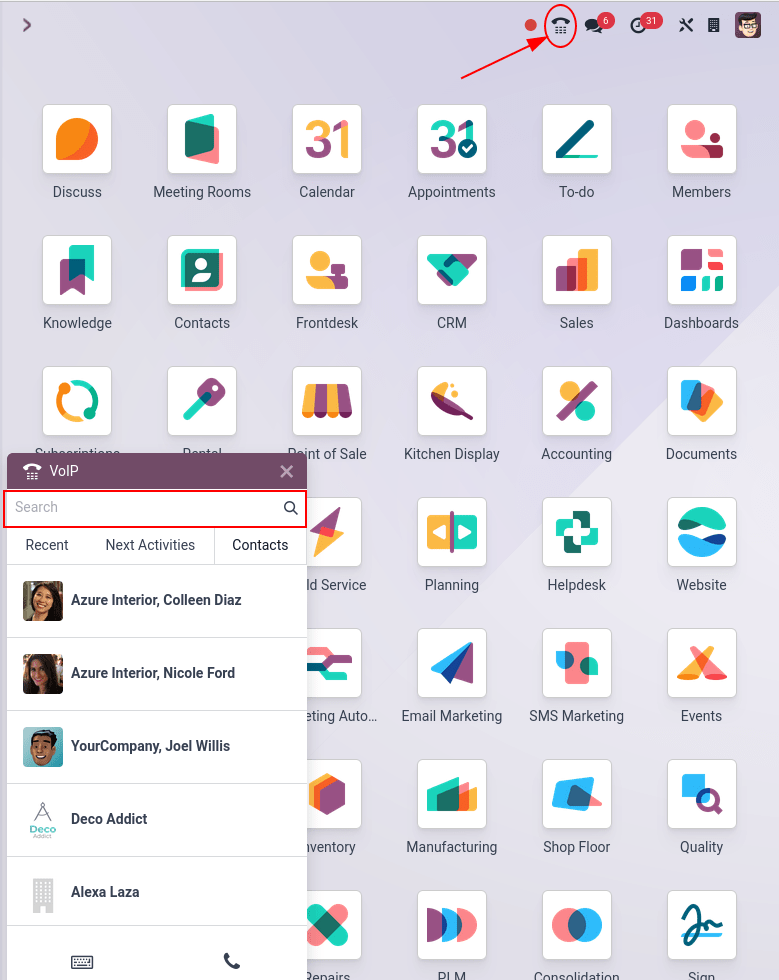
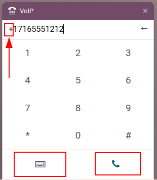
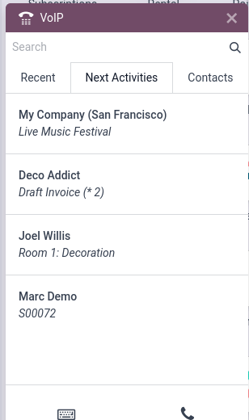
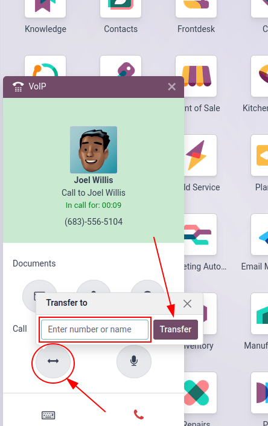

# Make, receive, transfer, and forward calls

Calling prospective clients, customers, or colleagues is an essential part of any business. A
company also needs to be available when customers call, in order to build trust and make
connections.

This document covers how to make, receive, transfer, and forward calls with Odoo *VoIP*.

## Gọi điện

Starting on the Odoo dashboard, a call can be made by opening the phone widget in the the
upper-right corner, which is represented by a ☎️ (phone) icon.

Then, a user can click on the Contacts tab, and click into any contact in the database
to make a call.

Additionally, one can also use the Search bar in the VOIP pop-up window to
find any desired contact.

To manually make a call, click the ⌨️ (keyboard) icon, and proceed to manually key in
the desired number. Do not forget to lead with the + (plus) icon, followed by the
international country code.

After entering the full number, with the required + (plus) icon prefix and country code,
click the green 📞 (phone) icon to start the call. When finished, click the red
📞 (phone) icon to end the call.

## Nhận cuộc gọi

An incoming call automatically opens the *VoIP* widget, when a user is using the Odoo database.
Should the database be open in another tab, a sound plays (the sound **must** be activated on the
device).

Once back to the tab, the calling screen of the *VoIP* phone widget appears.

Click the green 📞 (phone) icon to pick up the call, or the red 📞 (phone)
icon to reject the call.

## Thêm vào danh sách cuộc gọi chờ

All the contacts and customers that need to be called can be seen in one place with the Odoo *VoIP*
phone widget, under the Next activities tab.

To add a call to the Next activities tab, click the green 📞 (phone) icon,
while in kanban view of the *CRM* application.

To remove them from the call queue, hover over the opportunity that has a call scheduled, and click
the red 📞 (phone) icon that appears with the - (minus) icon.

When navigating back to the *VoIP* phone widget, **only** the calls that are scheduled immediately
for that day appear in the queue under the Next Activities tab of the *VoIP* pop-up
widget.

The Next Activities tab of the *VoIP* phone widget is integrated with the following Odoo
apps: *CRM*, *Project*, and *Helpdesk*.

A call can be added in the chatter of records within those applications.

To manually add a call, via the chatter, click Activities (next to the 🕗
(clock) icon). Under Activity Type, select Call from the drop-down menu
that appears.

Next, set a Due Date, and add a Summary.

Lastly, change the Assigned to field to the person that should make the call. Whomever
is set in this last field (Assigned to) has this call show up in their Next
Activities call queue in the Odoo *VoIP* phone widget.

#### IMPORTANT
Only calls for the immediate day (today's date) appear in the Next Activities tab of
the *VoIP* phone widget for that specific user.

If specified, click Save or Open Calendar to complete the scheduling of the
call.

## Transfer calls

A call can be transferred from one user to another in the Odoo *VoIP* phone widget. However, this
can **only** occur after speaking to the caller first. Without picking up the call in the Odoo
*VoIP* phone widget, the only way to transfer a call is automatically though the provider
console/portal.

#### SEE ALSO
For more information on transfers, visit [Forwardings tab](applications/productivity/voip/axivox/manage_users.md#voip-axivox-forwardings-tab).

To transfer a call within the Odoo *VoIP* phone widget, first, answer the call using the green
📞 (phone) icon.

Once the incoming call is answered, click the ↔ (left-right arrow) icon. Then, enter the
extension of the user the call should be forwarded to. Finally, click Transfer to route
the call to that phone number.

## Forward calls

To forward a call within the Odoo *VoIP* phone widget, first, answer the call using the green
📞 (phone) icon. Once the incoming call is answered, click the ↔ (left-right
arrow) icon.

Then, enter the full phone number of the user the call should be forwarded to. Finally, click
Transfer to route the call to that phone number.

#### SEE ALSO
For more information on forwarding, visit [Forwardings tab](applications/productivity/voip/axivox/manage_users.md#voip-axivox-forwardings-tab).
