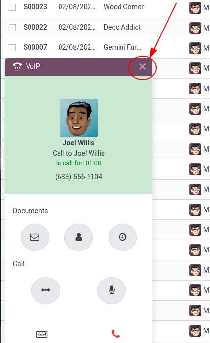
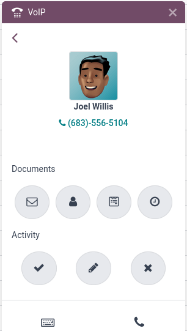

# VoIP widget

The *VoIP* widget is an add-on made available to Odoo users through the *VoIP* module. It is used to
incorporate virtual telephony into the database. The widget is the control center for making and
managing calls in Odoo.

## Phone calls

To make phone calls while in the Odoo database, click the ☎️ (phone) icon, located in
the top navigation bar.

When clicked, a VOIP pop-up widget appears in the lower-left corner of the Odoo
database. The widget allows users to freely navigate throughout the database, while making and
receiving calls.

When receiving calls in Odoo, the VOIP widget rings,and displays a notification. To
close the widget, click the X (close) icon in the upper-right of the widget's screen.

#### NOTE
The  number is the one provided by Axivox. It can be
accessed by navigating to [https://manage.axivox.com/](https://manage.axivox.com/). After
logging into the portal, go to Users ‣ Outgoing number (column).

## Khắc phục sự cố

## Tab

In all, there are three tabs (Recent, Next Activities, and
Contacts) present in the *VoIP* widget, which are used for managing calls and day-to-day
activities in Odoo.

### Gần đây

Under the Recent tab of the *VoIP* widget, the call history for the user is available.
This includes incoming and outgoing calls. Any number can be clicked to begin a call.

### Hoạt động tiếp theo

Under the Next Activities tab of the *VoIP* widget, a user can see any activities
assigned to them, and which ones are due to be completed for the day.

Click an activity from this tab to perform any actions including: Sending an email, accessing their
contact, scheduling another activity, or accessing a linked record (such as a Sales Order,
Lead/Opportunity, or Project Task).

The user can also mark the activity as complete, edit the details of the activity, or cancel it.

To call the customer related to a scheduled activity, click the 📞 (phone) icon, or
click the ⌨️ (keyboard) icon to dial another number for the customer.

Some other icons appear in the *VoIP* widget, categorized by two sections: Document and
Activity.

Under the Document section, from right to left:

- ✉️ (envelope) icon: sends an email
- 👤 (person icon) icon: redirects to the contact card
- 📄 (document) icon: redirects to the attached record in Odoo
- 🕓 (clock) icon: schedule an activity

Under the Activity section, from left to right:

- ✔️ (checkmark) icon: mark activity as done
- ✏️ (pencil) icon: edit the activity
- ✖️ (cancel) icon: cancel the activity

### Liên hệ

Under the Contacts tab of the *VoIP* widget, a user can access a contact in the
*Contacts* app.

Any contact can easily be called by clicking into the contact from the *VoIP* widget's
Contacts tab.

A search feature is also available in the upper-right side of the widget, represented by a
🔍 (magnifying glass) icon.
