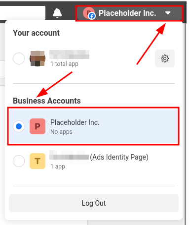
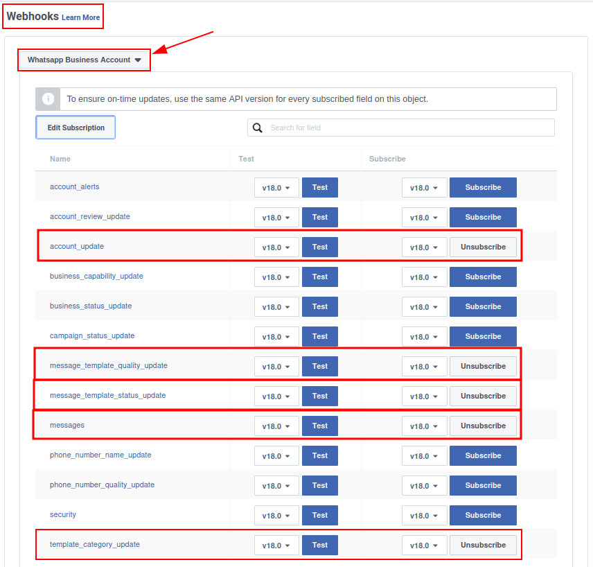
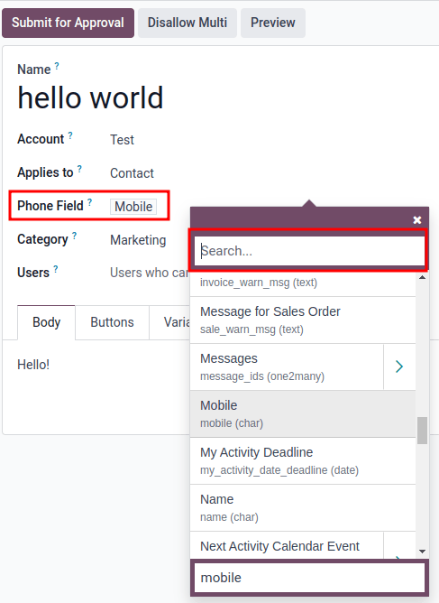
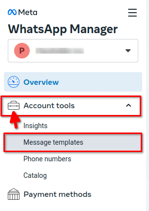
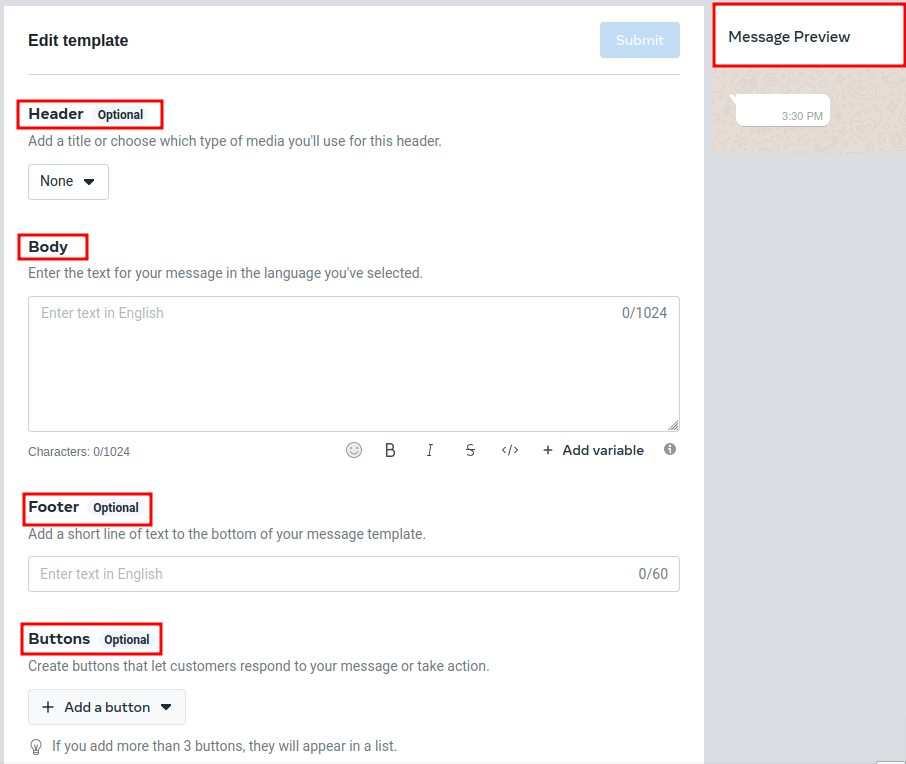
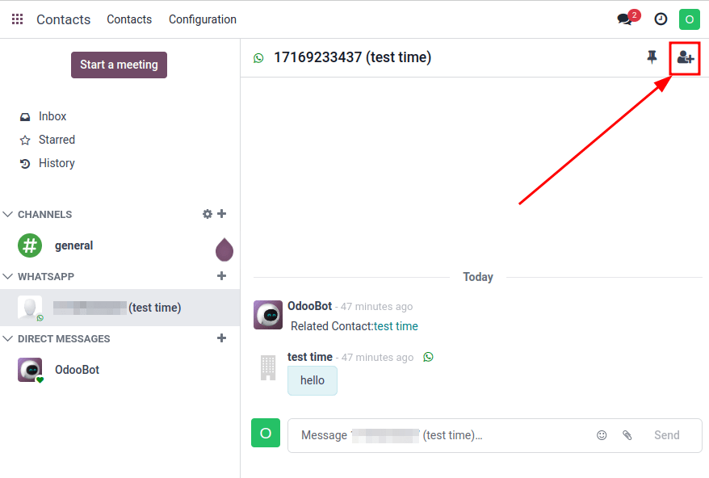

# WhatsApp

**WhatsApp** is an instant messaging and voice-over-IP app that allows users to send messages, make
calls, and share content. Businesses can use [WhatsApp Business](https://developers.facebook.com/products/whatsapp/) to communicate with their customers by text,
send documents and provide support.

#### WARNING
WhatsApp is an Odoo Enterprise-only application that does not work in Odoo Community edition. To
sign up for Odoo Enterprise edition, click here: [Odoo Free Trial](https://www.odoo.com/trial).

#### SEE ALSO
For more information on migrating from Odoo Community version to Odoo Enterprise version see this
documentation: [Chuyển từ Community sang Enterprise](../../administration/on_premise/community_to_enterprise.md).

With the **Odoo WhatsApp** app, a company can connect a WhatsApp Business Account (WABA) to an Odoo
database, which allows for the following:

- Receive and reply to WhatsApp messages directly from an Odoo database
- Create new templates with dynamic placeholders/variables
- Send pre-approved templates that use dynamic variables, such as:
  - Quotations from the Sales app
  - Receipts and invoices from the Point of Sale app
  - Tickets from the Events app

#### SEE ALSO
- [Meta Business: create message templates for the WhatsApp Business account](https://www.facebook.com/business/help/2055875911147364).
- [Meta Business: connect a phone number to the WhatsApp Business account](https://www.facebook.com/business/help/456220311516626).
- [Meta Business: change the WhatsApp Business display name](https://www.facebook.com/business/help/378834799515077).

WhatsApp là một dịch vụ nhắn tin được vận hành bởi Meta, công ty mẹ của Facebook. WhatsApp thường được sử dụng như một công cụ liên lạc phổ biến tại nhiều quốc gia và bởi nhiều doanh nghiệp. Tài liệu này sẽ hướng dẫn cách tích hợp Tài khoản WhatsApp Business với Odoo. Tài khoản Meta của công ty được cấu hình trong Odoo thông qua kết nối .

Liên kết WhatsApp trong Odoo hỗ trợ hai luồng: do công ty khởi tạo và do khách hàng khởi tạo. Công ty có thể bắt đầu một cuộc trò chuyện bằng cách gửi một mẫu tin nhắn đến một hoặc nhiều người. Sau khi mẫu tin nhắn được gửi đi, người nhận có thể phản hồi để bắt đầu cuộc trò chuyện giữa người gửi và người nhận (một cửa sổ trò chuyện trong ứng dụng *Thảo luận* sẽ hiển thị nếu khách hàng phản hồi trong vòng 15 ngày).

If the discussion is initiated by the client (e.g. by sending to the company's public WhatsApp
number), then Odoo will open a group chat with all operators responsible for this WhatsApp channel.

## WhatsApp configuration in a Meta

A WhatsApp integration with Odoo uses a standard 
connection, and is configured on Meta in the following steps:

1. Create a Meta business account
2. Create a Meta developer account
3. Setup an *app* and WhatsApp *product* on Meta's developer console
4. Test the API connection.

Once connected, messages are then sent and received through Odoo's *Discuss* application using the
WhatsApp .

### Meta business account setup

Để tạo tài khoản Doanh nghiệp với Meta (chủ sở hữu Facebook), truy cập: [Trình quản lý kinh doanh của Facebook](https://business.facebook.com/overview). Bắt đầu bằng cách nhấp Tạo tài khoản, sau đó nhập tên doanh nghiệp, tên quản trị viên và địa chỉ email công việc. Tiếp theo nhấp Tiếp theo, một cửa sổ bật lên sẽ xuất hiện yêu cầu xác nhận địa chỉ email. Sau khi xác nhận, nhấp Hoàn tất để đóng cửa sổ.

Next, follow the instructions in the email sent by Facebook to confirm the creation of the business
account and to complete the setup process.

#### SEE ALSO
[Set up a Meta business account](https://www.facebook.com/business/help/1710077379203657?id=180505742745347).

#### IMPORTANT
If the business account is linked to a personal Facebook account then the administrator must
toggle between the personal account to the business account for the remainder of the
configuration.

To toggle to the business account navigate to the [Facebook Developer Console](https://developers.facebook.com) and click on the *account name* in the upper right corner.
Under the Business Accounts heading, click on the desired business that the WhatsApp
configuration should take place in. This will be the account for which Odoo will send and receive
WhatsApp messages.

#### IMPORTANT
In order to create a Meta business account, the user must already have a personal Facebook
account that has existed for a minimum of one hour prior to setting up the Facebook Business
account. Trying to create the business account prior to this time will result in an error.

### App creation

On the [Meta for Developers](https://developers.facebook.com) dashboard, sign in with the Meta
developer account. If no account is configured yet, link a Facebook account to create a Meta
developer account.

#### NOTE
A Facebook *developer* account is different than a Facebook *business* account. While developer
accounts are made up of personal Facebook accounts, business accounts are **not** as they
represent a business and manage all of the business's assets in Meta, such as apps.

#### SEE ALSO
[Set up the WhatsApp Business Platform](https://www.facebookblueprint.com/student/collection/409587/path/360218).

Click on My Apps in the top right corner after successfully signing in to the Meta
developer account. This will redirect the administrator to all the apps the developer has configured
in this specific developer account. Click on Create App to begin the process of
configuring a new Meta application.

### App type

Trên trang Tạo ứng dụng, chọn Khác trong phần Tìm kiếm thứ gì khác?, sau đó nhấp Tiếp theo để chuyển đến trang khác nhằm chọn loại ứng dụng. Tiếp theo, nhấp vào tùy chọn đầu tiên trong danh sách dưới nhãn Chọn loại ứng dụng, có tiêu đề Kinh doanh. Lựa chọn này cho phép tạo và quản lý  WhatsApp.

Now, click Next to configure the app, as desired. When the app *type* has been
configured, the administrator will move onto the app *details* section.

### App details

On the Details section of the Create an app process, enter `Odoo` in the
field under the Add an app name label.

#### NOTE
The app name can be changed at a later time in the settings, if necessary.

#### WARNING
Trademarks and branded elements may not be used in this text section. These include the Meta
group of companies. Do not include the word: `WhatsApp` or the system will flag this in error.

Next, enter the developer email address in the field under the App contact email label.

Lastly, set the Business Account - Optional field to the Meta business account profile,
using the drop-down menu. To finish, click Create app. This action will create the app
and prompts the *Meta Platform Terms* and *Developer Policies* agreements.

To accept the agreements, enter the Facebook password for security purposes, and click
Submit to finalize the app creation. The browser will then direct to the Meta
for Developers dashboard.

#### NOTE
If the Meta business account is prohibited from advertising, claiming an app won't be allowed. To
resolve this issue navigate to [https://business.facebook.com/business](https://business.facebook.com/business) for assistance.

For more information, see [Meta's documentation on advertising restrictions](https://www.facebook.com/business/help/975570072950669).

### Add a WhatsApp product to the app

Now that the basic structure of the app has been created, a product will need to be added to the
app. Begin by accessing the Meta app dashboard by navigating to
[https://developers.facebook.com/apps](https://developers.facebook.com/apps), and clicking on the app that is being configured.

On the next page: since WhatsApp will be used, click Set up next to the box containing
WhatsApp, located towards the bottom of the page.

#### SEE ALSO
[Meta's WhatsApp developer documentation](https://developers.facebook.com/docs/whatsapp/).

The page then directs to the configuration page for the WhatsApp Business Platform API.
Use the drop-down menu to select the Meta business to be configured for the Select a Meta
Business Account option, and then click Continue to confirm the selection.

#### NOTE
When Continue is clicked, the administrator agrees to Meta's terms and conditions as
linked on the Meta App Dashboard.

#### NOTE
Once the WhatsApp product is added to the app, Meta will provide a WhatsApp test phone number
with 5 test messages.

### Start using the WhatsApp API

After finishing the previous WhatsApp product wizard, and clicking Continue, the browser
should have directed to the WhatsApp Quickstart page; this Quickstart page
is where to begin configuring the WhatsApp API by adding a phone number and then sending an initial
test message.

#### NOTE
If the browser isn't on the Quickstart page for WhatsApp, navigate to
[https://developers.facebook.com/apps](https://developers.facebook.com/apps) and click on the app that is being configured, (the
app name is `Odoo` if the instructions above were followed).

Then, in the menu on the left-hand side of the page, click the v (menu toggle) icon
next to the WhatsApp section heading. A small menu will open, containing the
following options:

- Bắt đầu nhanh
- Thiết lập API
- Cấu hình

Click the Quickstart option, and then click Start using the API.

#### Thiết lập API

Sau khi nhấp vào Bắt đầu sử dụng API, trang sẽ chuyển đến phần Thiết lập API. Giờ đây, sau khi đã tạo số kiểm thử, bạn có thể gửi một tin nhắn thử để xác nhận rằng WhatsApp đang hoạt động đúng cách. Để bắt đầu, hãy đi đến phần trên trang có nhãn Gửi và nhận tin nhắn và nhấp vào menu thả xuống bên cạnh mục Đến, trong phần Bước 1 Chọn số điện thoại.

Now, select the only option available: Manage phone number list. Follow the steps and
add up to five numbers to send the free test messages to. After entering the appropriate country
code and phone number, click on Next.

#### IMPORTANT
Adding a phone number to send to in this step will allow for a successful test to be sent by the
terminal. This is critical to ensure the WhatsApp 
is working.

A verification code from WhatsApp Business is then sent to the phone number, which needs to be input
on the next screen to verify ownership of the number. Enter the verification code and click
Next to verify the number.

#### Send a test message via terminal

Next, send a test message via the terminal. Under the section labeled Step 2 Send
messages with the API, click Send Message. A test message will then be sent to the
phone number that was set in the previous section.

Upon successfully receiving the message to the number, move onto the next section to produce and
configure webhooks.

## WhatsApp configuration in Odoo

Các bước tiếp theo được cấu hình trong phần này đều nằm trong cơ sở dữ liệu Odoo. Một vài giá trị khác nhau như mã token, số điện thoại và các ID tài khoản cần được cấu hình trong Odoo. Cần có các giá trị này để tạo URL gọi lại và Token xác minh webhook, đây là các yếu tố sau đó sẽ được dùng để cấu hình các webhook (nhằm mục đích nhận lại tin nhắn vào cơ sở dữ liệu).

In Odoo, navigate to WhatsApp app ‣ Configuration ‣ WhatsApp Business Accounts.
Then click New to configure the WhatsApp business account in Odoo.

In another browser tab, navigate to https://developers.facebook.com ‣ My Apps ‣
WhatsApp ‣ API Configuration, and then copy the following values from the Meta developer console
into the corresponding fields in Odoo:

| Tên          | Bảng điều khiển Meta         | Giao diện Odoo   |
|--------------|------------------------------|------------------|
| Điện thoại   | Phone number ID              | Phone Number ID  |
| Token        | Temporary access token       | Token truy cập   |
| ID ứng dụng  | ID ứng dụng                  | ID ứng dụng      |
| ID tài khoản | WhatsApp Business Account ID | ID tài khoản     |

To retrieve the App Secret, navigate to the Meta developer console,
[https://developers.facebook.com/apps](https://developers.facebook.com/apps) and select the app that Odoo is being configured in. Then
in the left-side menu, under App settings, select Basic.

Next, click Show next to the field App secret, and enter the account
password to verify ownership. Copy the App secret and then paste that copied value into
the App Secret field on the Odoo WhatsApp Business Account configuration
dashboard.

To complete the setup of the WhatsApp business account in Odoo, click Test Connection. A
successful message in green will populate in the upper-right corner of the dashboard if the
configuration is set correctly.

### Cấu hình webhook

Để cấu hình webhook cho WhatsApp trong Odoo, hãy truy cập [https://developers.facebook.com/apps](https://developers.facebook.com/apps) và chọn ứng dụng mà Odoo đang được cấu hình. Tiếp theo, dưới tiêu đề menu WhatsApp ở bên trái màn hình, nhấp vào mục menu Thiết lập API. Cuối cùng, đi đến phần được đánh dấu Bước 3: Cấu hình webhook để nhận tin nhắn và nhấp vào Cấu hình webhook.

On the Webhook configuration page, click on Edit, where both the
Callback URL and Webhook Verify Token values from the Odoo will be added.

#### NOTE
Both the Callback URL and Webhook Verify Token values were automatically
populated after clicking on Test Connection in the previous step.

In a separate browser window, retrieve the necessary values in Odoo by navigating to
WhatsApp app ‣ Configuration ‣ WhatsApp Business Accounts and select the
account that is being configured. Locate the values under the section labeled Receiving
Messages.

Copy and paste the Callback URL from Odoo into the Callback URL field in
Meta. Similarly, copy and paste the Webhook Verify Token into the Verify
Token field on the Meta developer console, as well.

Finally, click Verify and save to record the values in the Meta developer console.

#### Trường webhook

Now input individual webhook fields into Meta's developer console, under the Webhook
fields section. Click Manage and when the pop-up window appears, check the boxes in the
Subscribe column for the following *field names*:

- account_update
- message_template_quality_update
- message_template_status_update
- tin nhắn
- template_category_update

After making the selections, click Done.

The finished Webhooks configuration will appear like this in the Meta developer console:

#### IMPORTANT
The Webhook fields will only appear once the subscription is confirmed using the
Callback URL and Webhook Verify Token.

#### SEE ALSO
[Meta's WhatsApp documentation on setting webhooks](https://developers.facebook.com/docs/whatsapp/cloud-api/guides/set-up-webhooks).

#### Add phone number

Để cấu hình số điện thoại sử dụng cho WhatsApp trong Odoo, hãy quay lại Meta Developer Console (<[https://developers.facebook.com/apps](https://developers.facebook.com/apps)>_) và chọn ứng dụng mà Odoo đang được cấu hình. Dưới tiêu đề menu WhatsApp ở phía bên trái màn hình, nhấp vào mục menu API Setup (Thiết lập API). Tại đây, tìm đến phần Step 5: Add a phone number (Bước 5: Thêm một số điện thoại) và nhấp vào Add phone number (Thêm số điện thoại).

In the fields, enter a Business name as well as a Business website or profile
page.

Complete filling out the business information by next selecting the country that the company does
business in from the drop-down menu in the Country section. Add an address if desired,
however, this information is optional. After adding the location, click Next to
continue.

The following page contains information for the WhatsApp Business profile. Complete the
following sections, accordingly:

- WhatsApp Business Profile Display Name
- Múi giờ
- Danh mục
- Business description (optional)

Once these sections are complete, click Next. The page refreshes and then prompts the
administrator to Add a phone number for WhatsApp in the respective field. Here, enter
the phone number to configure in WhatsApp.

#### SEE ALSO
[Migrate an Existing WhatsApp Number to a Business Account](https://developers.facebook.com/docs/whatsapp/cloud-api/get-started/migrate-existing-whatsapp-number-to-a-business-account).

Next, choose a verification method for the phone number. Select either Text message or
Phone call, and then click Next proceed.

The phone number entered will receive either a text or a phone call by WhatsApp with a code,
depending on the verification method chosen. Enter that verification code into the
Verification code field and click Next to finish.

#### WARNING
If a payment method hasn't been added this will be necessary to proceed. [Visit Meta's
documentation on how to add a payment method in Meta's Business Manager](https://www.facebook.com/business/help/915454841921082?id=180505742745347). This is part of
Meta's fraud detection system, in order to ensure that the account/company are real a payment
method is required to proceed.

#### SEE ALSO
[Meta for Developers: Add a Phone Number](https://developers.facebook.com/docs/whatsapp/cloud-api/get-started/add-a-phone-number).

#### Token vĩnh viễn

After configuration and testing are complete, a permanent token should be created to replace the
Temporary token.

#### SEE ALSO
[Meta for Developers: System User Access Tokens](https://developers.facebook.com/docs/whatsapp/business-management-api/get-started#system-user-access-tokens).

Begin by navigating to [https://business.facebook.com/](https://business.facebook.com/) and then go to Business
settings ‣ User ‣ System Users. Select an existing system user or create a new system user by
clicking on Add.

Assets now must be added to the system user and then a permanent token can be generated.

Nhấp vào Thêm tài sản, và khi cửa sổ bật lên xuất hiện, chọn Ứng dụng dưới mục Chọn loại tài sản. Sau đó, chọn ứng dụng Odoo và bật quyền bằng cách chuyển sang *Bật* trong tuỳ chọn Toàn quyền kiểm soát. Thiết lập quyền mới này bằng cách nhấp vào Lưu thay đổi, khi đó một cửa sổ xác nhận sẽ xuất hiện, xác nhận việc thêm tài sản vào người dùng hệ thống. Kết thúc bằng cách nhấp vào Xong.

Next, the permanent token will be generated. Click on Generate new token, and a pop-up
window will appear asking which app this token should be generated for. Select the App
that this token is for. Then determine the expiration date of either 60 days or
Never.

Finally, when Meta asks which permissions should the system user allow, add all of the following
permissions:

- WhatsApp_business_messaging
- WhatsApp_business_management

When permissions are set, click Generate token. Copy the token value that populates on
the screen that follows.

With that token value, update the Access Token field in the WhatsApp business account in
Odoo by navigating to WhatsApp app ‣ Configuration ‣ WhatsApp Business
Accounts.

## Go live with the Meta app

Finally, to launch the app, the Meta app must be set to Live in the Meta developer
console. Navigate to [https://developers.facebook.com/apps](https://developers.facebook.com/apps) and click on the app that is being
configured. In the top menu, toggle the App Mode field from Development to
Live.

#### IMPORTANT
If the app status is not set to *live*, then the database will only be able to contact the test
numbers specified in the developer console.

#### WARNING
Phải thiết lập URL chính sách quyền riêng tư để ứng dụng được cài đặt hoạt động. Truy cập bảng điều khiển dành cho lập trình viên Meta, [https://developers.facebook.com/apps](https://developers.facebook.com/apps) và chọn ứng dụng mà Odoo đang được định cấu hình. Sau đó, sử dụng menu ở phía bên trái màn hình, đi tới Cài đặt ứng dụng ‣ Cơ bản. Sau đó, nhập địa chỉ siêu liên kết chính sách quyền riêng tư vào trường URL Chính sách quyền riêng tư của biểu mẫu. Nhấp vào Lưu thay đổi để áp dụng chính sách quyền riêng tư cho ứng dụng.

Once the app has gone live in the Meta developer console, a confirmation email is sent to the
administrator.

## Mẫu WhatsApp

WhatsApp templates are saved messages that are used repeatedly to send messages from the database.
They allow users to send quality communications, without having to compose the same text repeatedly.

Creating different templates that are tailored to specific situations lets users choose the right
message for the right audience. This increases the quality of the message and the overall
engagement rate with the customer.

WhatsApp templates can be created on both the Odoo and Meta consoles. The following process will
overview the process for creating templates in Odoo and then afterward in Meta.

#### IMPORTANT
WhatsApp has an approval process that must be completed before the template can be used.
[Meta template approval](#productivity-whatsapp-approval).

### Creating templates in Odoo

To access and create WhatsApp templates, begin by navigating to the WhatsApp app ‣
Templates dashboard.

At the bottom of an individual template's form, there are three tabs: Body,
Buttons, and Variables; these three tabs combined create the WhatsApp
template.

The text is entered into the Body tab, and dynamic content that is called out in the
Body tab is specified in the Variables tab. Every piece of dynamic content
(e.g., placeholders) in the message (body) is specifically called out and specified in the
Variables tab.

Mẫu là những bố cục được tạo sẵn giúp người dùng gửi các tin nhắn chuyên nghiệp đến khách hàng. Những mẫu này có thể chứa dữ liệu động, sẽ được điền vào tin nhắn cuối cùng bằng cách sử dụng các biến được thiết lập trong phần cấu hình của mẫu. Ví dụ, tin nhắn có thể bao gồm tên của người nhận, đề cập đến sản phẩm cụ thể, hoặc tham chiếu đến một đơn bán hàng – chỉ là vài ví dụ về những biến tiện lợi và có tác động.

To create a WhatsApp template, go to the WhatsApp app ‣ Templates dashboard and
click New. On the form, enter a Name for the template, and select a
Language.

#### IMPORTANT
In order to complete this next task, administrator access rights are needed to edit the
Applies to field. See this [access rights documentation](../general/users/access_rights.md) for more information.

In the Account drop-down menu, select the *WhatsApp business account* in Odoo that this
template should link to. Next, under the Applies to field select the *model* the server
action will apply to for this template.

#### WARNING
Often when changing the model or Applies to field, the Phone Field may
produce an error The Phone Field should always be set to the `Phone` or `Mobile`
model.

To search available fields, type in the front-end name in the Search... box.  This will
find a result from all of the available fields for the model (Applies to) that the
template is created for.

#### NOTE
In order to find specific fields, multiple levels may need to be navigated in the search results
box. Use the > (right chevron) and ⬅️ (left arrow) icons to navigate
between the menu levels.

Thay đổi Danh mục cho phù hợp với Marketing, Tiện ích hoặc Xác thực. Trong hầu hết trường hợp sẽ sử dụng hai tùy chọn đầu, trừ khi người dùng muốn gửi yêu cầu đặt lại mật khẩu hoặc nội dung liên quan bảo mật. Chọn Marketing nếu gửi nội dung khuyến mại và chọn Tiện ích nếu gửi thông điệp giao dịch thông thường (VD: đơn bán hàng, vé sự kiện,...).

#### IMPORTANT
Specifying an incorrect category can cause a flag/rejected status from Meta during the approval
process.

Add any Users that are allowed to use this template. In the right-side column, a
Header type can be configured along with a Header message, as well.

The available Header types are as follows:

- Văn bản
- Hình ảnh
- Video
- Tài liệu
- Location (variables need to be set)

Navigate to the Body tab to configure the main message of the template.

When all the necessary changes are made to the template, click on the Submit for
approval button in the upper-left corner. This will cause the status of the template to change to
Pending.

The status will remain in Pending until a decision has been made by Meta, whereby a
confirmation email will then be sent indicating that the template has been approved (or rejected).
The templates will then need to be synced from the Odoo database.

See this section for more information on [syncing templates](#productivity-whatsapp-sync).

#### Nút

Buttons can be added into the message from the Buttons tab. Enter the Type
(either Visit Website, Call Number, or Quick Reply), and then
specify the Button Text, Call Number or Website URL (including
Url Type), depending on the Type of button.

#### NOTE
Buttons can also be added on the Meta business console. See Meta's WhatsApp template dashboard by
navigating to [https://business.facebook.com/wa/manage/home](https://business.facebook.com/wa/manage/home). Then go to
Account tools ‣ Message templates.

#### Using placeholders and variables

Dynamic variables reference certain fields within the Odoo database to produce unique data in the
WhatsApp message when using a template. Dynamic variables are encoded to display fields from within
the database, referencing fields from within a model.

Dynamic variables can be added in to the Body by adding placeholders in the
*text*. To add a placeholder in the *message body* enter the following text `{{1}}`. For the second
placeholder enter `{{2}}` and increase incrementally as more placeholders are added to the text.

#### SEE ALSO
[Mẫu WhatsApp](#productivity-whatsapp-templates).

These placeholders must be configured on the Variables tab of the template before
submitting for approval from Meta. To edit the dynamic variables on a template, first change the
Type to Field of Model. This allows Odoo to reference a field within a model
to produce unique data in the message being sent.

Next, edit the Field of the dynamic variables. The Applies to field in the
template should be edited prior to ensure the correct model and field are referenced.

To search the available fields, type in the front-end name of the field in the search box. This will
find a result from all of the available fields for the model (Applies to) that the
template is created for. There may be multiple levels that need to be configured.

#### WARNING
Customizing WhatsApp templates is out of the scope of Odoo Support.

#### Meta template approval

After updating the dynamic variables on the template, the template needs to be submitted to Meta for
approval again. Click Submit for Approval to start the approval process. An email will
be sent to the administrator of the Meta account when the template has been approved.

Following the approval from Meta, sync the templates again in the Odoo database. See this
documentation: [Đồng bộ mẫu](#productivity-whatsapp-sync).

#### Đồng bộ mẫu

Các mẫu tin nhắn phải được đồng bộ trên cơ sở dữ liệu Odoo sau khi được đội ngũ Meta phê duyệt. Để thực hiện việc này, trước tiên hãy đi đến Ứng dụng WhatsApp ‣ Cấu hình ‣ Tài khoản WhatsApp Business và chọn cấu hình cần đồng bộ. Trong phần Gửi tin nhắn, cuối trang, nhấp vào Đồng bộ mẫu. Meta sẽ cập nhật các mẫu đã được phê duyệt để chúng có thể được sử dụng với các ứng dụng khác nhau trong cơ sở dữ liệu.

A successful message in green appears in the upper-right corner with the number of templates
updated.

### Creating templates in Meta

First, navigate to [Meta's WhatsApp template dashboard](https://business.facebook.com/wa/manage/home), and then go to Account tools ‣
Message templates.

To create a WhatsApp template, click on the blue Create template button, and then select
the Category. The options listed include: Marketing, Utility,
and Authentication. In most instances the first two options will be used, unless the
user would like to send a password reset or something security related.

Enter the Name of the template and then select the Language for the
template.

#### NOTE
Multiple languages can be selected by typing the language name(s) and selecting the other
languages as needed.

After making the appropriate selections, click on Continue in the upper-right corner.
The page redirects to the Edit template page. Here the Header,
Body, Footer and Buttons are configured. To the right of the
template is a preview of what the template will look like in production.

When all the necessary changes are made to the template, click on the Submit button in
the upper-right corner. A confirmation window appears to confirm the language— click
Confirm to approve and then another window appears stating that the template will be
submitted to Meta for review and approval.

The Status of the template will remain in In review until a decision has
been made by Meta. Once an email confirmation is received approving the template, the templates will
need to be synced from within the Odoo database.

#### SEE ALSO
For more information on configuring templates on the Meta developer console visit [Meta's
WhatsApp template documentation](https://developers.facebook.com/docs/whatsapp/business-management-api/message-templates/).

## Thông báo

Notifications in WhatsApp are handled similar to a message conversation in Odoo. A pop-up window
appears with the received conversation from the customer. By default, notifications are set in the
WhatsApp business account configuration in Odoo.

Notification settings can be adjusted by navigating to WhatsApp app ‣
Configuration ‣ WhatsApp Business Accounts. From there, select the account and scroll down to the
Control section where notifications are handled. Under the Notify users
heading, type in the field which user(s) should be notified for this particular WhatsApp channel.

#### NOTE
Khi một cuộc trò chuyện được khởi tạo giữa người dùng và khách hàng, các thông báo sẽ không được gửi đến tất cả người dùng đã được chỉ định trong cấu hình tài khoản WhatsApp Business. Chỉ những người dùng đang tham gia cuộc trò chuyện mới nhận được thông báo. Nếu người dùng không phản hồi trong vòng 15 ngày, khi khách hàng trả lời sau 15 ngày đó, tin nhắn sẽ lại được gửi đến tất cả người dùng được chỉ định trong cấu hình WhatsApp.

## Adding users to chat

Users can be added to a WhatsApp chat by expanding the WhatsApp pop-up window. WhatsApp
conversations are located in the *Discuss* app. Click on the 👤+ (add user) icon next to
it, and a window appears to invite users to the conversation.

## WhatsApp API FAQ

### Xác minh

As of February 1, 2023, if the Meta app requires advanced level access to permissions, a complete
business verification may need to be completed. This includes submitting office business documents
to Meta. [See this documentation](https://developers.facebook.com/docs/development/release/business-verification).

#### SEE ALSO
[Meta's WhatsApp access verification documentation](https://developers.facebook.com/docs/development/release/access-verification/).

### Lỗi mẫu

Editing templates can cause tracebacks and errors unless the exact process is followed above, here:
([Mẫu WhatsApp](#productivity-whatsapp-templates)).

#### Duplicate validation error

When syncing the templates there may be an instance when there are multiple templates with the same
name on Meta's business manager and in Odoo. This causes a duplicate validation error. To correct
this issue, rename the duplicate template name on Odoo and sync the templates once again by
following the steps here: [Đồng bộ mẫu](#productivity-whatsapp-sync).

### Lỗi token

#### Lỗi người dùng

Should the temporary token not be replaced with a permanent token a user error will populate in Odoo
when testing the connection after sending fails. To correct this issues see
[Token vĩnh viễn](#productivity-whatsapp-token).

#### System user error 100

Should the system user be an Employee when setting up the permanent token, a user error
100 will populate.

To correct this error, create an Admin system user, following the process outlined here:
[Token vĩnh viễn](#productivity-whatsapp-token).

