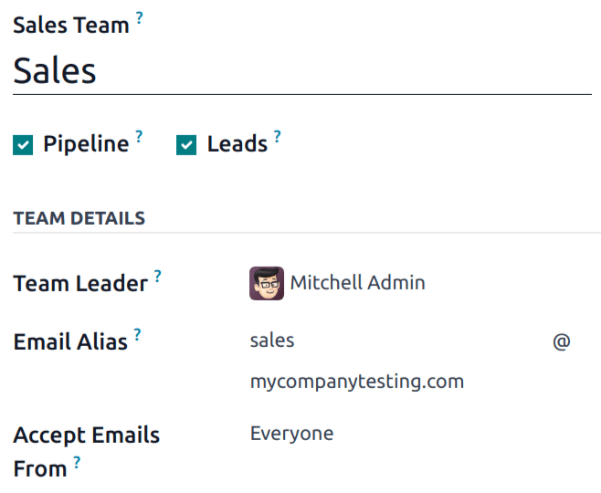
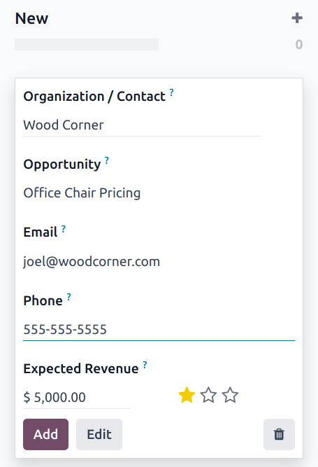

# Create leads (from email or manually)

Leads can be added to the *CRM* app from custom email aliases, and by manually creating new
records. This is in addition to the leads and opportunities created in the app through the
[website contact form](opportunities_form.md).

First, ensure the *Leads* feature is enabled in the database by navigating to CRM
app ‣ Configuration ‣ Settings. Tick the Leads checkbox, then click
Save.

## Cấu hình email aliases

Each sales team has the option to create and utilize their own unique email alias. When messages
are sent to this address, a lead (or opportunity), is created with the information from the
message.

To create or update a sales teams' email alias, navigate to CRM app ‣
Configuration ‣ Sales Teams. Click on a team from the list to open the team's details page.

In the Email Alias field, enter a name for the email alias, or edit the existing name.
In the Accept Emails From field, use the drop-down menu to choose who is allowed to send
messages to this email alias:

- Everyone: messages are accepted from any email address.
- Authenticated Partners: only accepts messages from email addresses associated with a
  a partner (contact or customer) record.
- Followers only: only accepts messages from those who are following a record related to
  the team, such as a lead or opportunity. Messages are also accepted from team members.
- Authenticated Employees: only accepts messages from email addresses that are connected
  to a record in the *Employees* app.

### Leads created from email

Leads created from email alias messages can be viewed by navigating to CRM app ‣
Leads. Click a lead from the list to open it, and view the details.

The email received by the alias is added to the *chatter* thread for the lead. The subject line of
the message is added to the title field, and the Email field is updated with the
contact's email address.

#### NOTE
If the *leads* feature is **not** enabled on the database, messages to the email alias are added
to the database as opportunities.

#### SEE ALSO
[Communication in Odoo by email](../../../general/email_communication.md)

## Manually create leads

Leads can be added directly to the *CRM* app by manually creating a new record. Navigate to
CRM app ‣ Leads to view a list of existing leads.

At the top-left of the list, click New to open a blank Leads form.

In the first field of the new form, enter a title for the new lead. Next, enter a Contact
Name, and a Company Name.

#### NOTE
If a lead is [converted to an opportunity](convert.md), the Company Name field is
used to either link this opportunity to an existing customer, or to create a new customer.

### Manually create opportunities

To manually create an opportunity, navigate to CRM app ‣ Sales ‣ My Pipeline.
At the top-left of the page, click New to create a new opportunity Kanban card. In the
Organization/Contact field, enter the name of the company the opportunity is for.

Choose a name, and enter it in the Opportunity field. *This is a required field.* When
manually creating an opportunity, it is helpful to add a name that relates to the details of the
opportunity.

Enter the contact information for the opportunity in the Email and Phone
fields.

In the Expected Revenue field, enter an estimated value for the opportunity.

#### NOTE
The information in the Expected Revenue and priority fields can be used to track
performance for individual salespeople, and on a team basis. See
[Expected revenue report](../performance/expected_revenue_report.md) and [Assign leads with predictive lead scoring](../track_leads/lead_scoring.md) for more
information.

Then, use the <i class="fa fa-star-o"></i> (star) icons to assign a priority.

- <i class="fa fa-star-o"></i> <i class="fa fa-star-o"></i> <i class="fa fa-star-o"></i>: low priority
- <i class="fa fa-star"></i> <i class="fa fa-star-o"></i> <i class="fa fa-star-o"></i>: medium priority
- <i class="fa fa-star"></i> <i class="fa fa-star"></i> <i class="fa fa-star-o"></i>: high priority
- <i class="fa fa-star"></i> <i class="fa fa-star"></i> <i class="fa fa-star"></i>: very high priority

#### NOTE
Assigning a priority changes the order of leads in Kanban view, with higher priority leads
displayed first.

Once all the necessary information has been entered, click Add.

