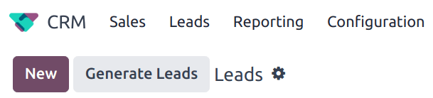

# Khai thác lead

*Lead mining* is a feature that allows *CRM* users to generate new leads directly into their Odoo
database. To ensure lead qualification, lead mining output is determined by a variety of filtering
criteria, such as the country, the company size, and the industry.

## Cấu hình

To get started, go to CRM app ‣ Configuration ‣ Settings, and tick the
Lead Mining checkbox to activate the feature. Then, click Save.

## Tạo lead

After the *Lead Mining* setting is activated, a new button called *Generate Leads* is available to
use in the upper-left corner of the *CRM* *Pipeline* (CRM app ‣ Sales ‣ My
Pipeline).

Lead mining requests are also available through CRM app ‣ Configuration ‣ Lead
Mining Requests, or through CRM app ‣ Leads ‣ Leads, where the
Generate Leads button is also available.

Click the Generate Leads button, and a pop-up window appears, offering a variety of
criteria by which to generate leads.

Choose to generate leads for Companies to get company information only, or choose
Companies and their Contacts to get company information and individual employee contact information.

#### NOTE
When targeting Companies and their Contacts, additional options are available to filter contacts based on
Role or Seniority.

Additional filtering options include the following:

- Countries: filter leads based on the country (or countries) they are located in.
- States: further filter leads based on the state in which they are located, if
  applicable.
- Industries: filter leads based on the specific industry they work in.
- Filter on Size: tick this checkbox to specify the number of employees at the company.
  This generates a field labeled Size. Fill in the blanks to create a range for the
  desired company size.
- Sales Team: choose which Sales Team the leads will be assigned to.
- Salesperson: choose which member of the Sales Team the leads will be assigned to.
- Default Tags: choose which tags are applied directly to the leads once found.

#### IMPORTANT
Make sure to be aware of the latest EU regulations when receiving contact information. Get more
information about the General Data Protection Regulation on [Odoo GDPR](http://odoo.com/gdpr).

### Xem lead

After leads are generated, they are assigned to the designated salesperson and team. To view
additional information regarding the lead, select one from the list, and click to open it.

In the chatter thread for the lead, additional information is provided. This can include the number
of employees, the technology used by the company, the timezone, and direct contact information.

#### NOTE
If Leads are **not** enabled for the database, then leads are generated as
*opportunities*, and added to the pipeline for the designated salesperson.

To enable the Leads feature, navigate to CRM app ‣ Configuration
‣ Settings, and tick the Leads checkbox. Then, click Save.

## Định giá

Lead mining is an *In-App Purchase* feature, and each generated lead costs one [credit](../../../essentials/in_app_purchase.md#in-app-purchase-credits).

#### IMPORTANT
Generating Companies and their Contacts costs one additional credit for each contact generated. See here for complete
pricing information: [Lead Generation by Odoo IAP](https://iap.odoo.com/iap/in-app-services/167?).

To buy credits, navigate to CRM app ‣ Configuration ‣ Settings. In the
Lead Generation section, under the Lead Mining feature, click Buy
Credits.

Credits may also be purchased by navigating to the Settings app. In the
Contacts section, under the Odoo IAP feature, click View My
Services.

#### NOTE
Enterprise Odoo users with a valid subscription get free credits to test  features before
purchasing more credits for the database. This includes demo/training databases, educational
databases, and one-app-free databases.

#### SEE ALSO
[Mua hàng trong ứng dụng (IAP)](../../../essentials/in_app_purchase.md)
