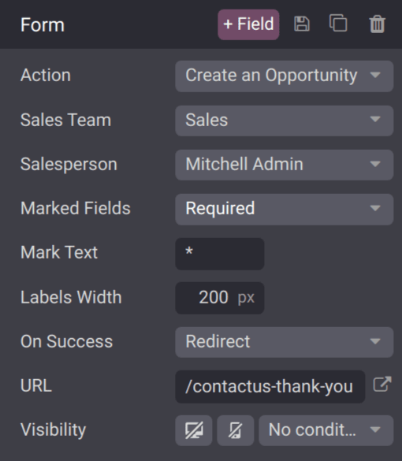
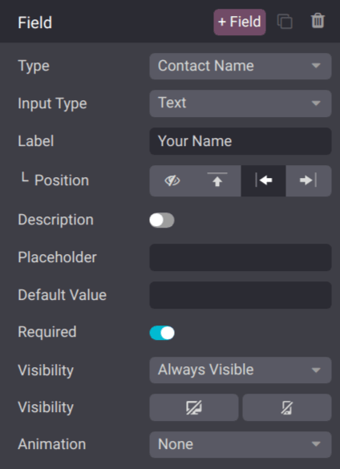

# Create opportunities from web contact forms

Adding a contact form to a website makes it easy to convert visitors into leads and opportunities.\
After a visitor submits their information, an opportunity can be created automatically, and assigned\
to a designated sales team and salesperson.

## Customize contact forms

By default, the _Contact Us_ page on an Odoo website displays a preconfigured contact form. This\
form can be customized, as needed, to suit the needs of a specific sales team.

Truy cập vào Ứng dụng Trang web ‣ Liên hệ chúng tôi, sau đó nhấp Chỉnh sửa ở góc trên bên phải màn hình để mở trình chỉnh sửa web. Nhấp vào khối dựng biểu mẫu trong phần nội dung trang web để mở cài đặt cấu hình biểu mẫu trên thanh bên phải. Các tùy chọn sau có sẵn để tùy chỉnh biểu mẫu liên hệ từ phần Từ của thanh bên phải:

* Action: the default action for a contact form is Send an Email. Select\
  Create an Opportunity from the drop-down list to capture the information in the _CRM_\
  app.
* Sales Team: choose a sales team from the drop-down menu that the opportunities from\
  this form should be assigned to. This field **only** appears if the Action field is\
  set to Create an Opportunity.
* Salesperson: if the opportunities should be assigned to a specific salesperson, select\
  them from the drop-down menu. If no selection is made in this field, the opportunities are\
  assigned based on the team's existing rules.
* Marked Fields: use this field to alter how the form handles marked fields. The default\
  option is to treat marked fields as Required, which is the recommended setting.
* Mark Text: choose how Marked Fields should be identified. The default\
  character is an asterisk (`*`).
* Labels Width: use this field to alter the pixel width of the labels, if desired.
* Khi thành công: chọn cách trang web phản ứng sau khi khách hàng gửi biểu mẫu thành công. Không có gì giữ nguyên khách hàng ở màn hình hiện tại, đồng thời thêm thông báo xác nhận rằng biểu mẫu đã được gửi thành công. Chuyển hướng chuyển hướng khách hàng đến một trang mới, dựa trên địa chỉ được cung cấp trong trường URL bên dưới. Hiện thông báo thay thế biểu mẫu bằng thông báo cấu hình sẵn để báo cho khách hàng rằng sẽ có người phản hồi họ sớm nhất có thể.
* URL: if Redirect is selected in the On Success field, enter\
  the URL for the webpage, where customers should be directed after successfully submitting a form.
* Visibility: use the drop-down menu to add any visibility conditions for this field, if\
  desired.

#### IMPORTANT

If _leads_ are activated in _CRM_ settings, selecting Create an Opportunity generates\
a lead instead. To activate leads, navigate to CRM app ‣ Configuration ‣\
Settings, and tick the Leads checkbox. Then, click Save.

### Customize contact form fields

In addition to the settings for the form, the settings for each field can be customized, as well.\
With the web editor menu still open, click into a field to open the Field configuration\
settings section on the sidebar. The following options are available to customize a field:

* Type: choose a custom field option or an existing field type.
* Input Type: determine the type of information customers should input. Available\
  options are Text, Email, Telephone, or Url. The\
  selection made in this field limits the format that customers can use when entering information.
* Label: enter the name for the field.
* Position: choose the way the label is aligned with the rest of the form. The label can\
  be hidden, above the field, to the left of the field, or right adjusted and closer to the field.
* Description: slide the toggle to add a description for the field, which can provide\
  additional instructions to customers. Click under the field on the form to add the description.
* Placeholder: enter an example to help users know how to input information where\
  formatting is important, such as a phone number or email address.
* Default Value: enter a value to include in the form, by default, if the customer does\
  not provide information in the field. _It is not recommended to include a default value for_\
  _required fields_.
* Required: slide the toggle to mark this field as required if it **must** be filled in\
  for every submission.
* Visibility: select when this field should be visible. Use the button on the left to\
  choose whether to show or hide this field on a desktop users. Use the button on the right to\
  choose whether to show or hide this field to mobile users.
* Animation: select if this field should have any animation.

## Xem cơ hội

After a customer submits a contact form, and an opportunity is created, it is assigned based on the[form settings](opportunities_form.md#crm-customize-contact-form). To view opportunities, navigate to\
CRM app ‣ Sales ‣ My Pipeline.

#### NOTE

If leads are activated on the database, contact form submissions are generated as leads, not\
opportunities. To activate leads, navigate to CRM app ‣ Configuration ‣\
Settings, and tick the Leads checkbox. Then, click Save.

Navigate to CRM app ‣ Leads to view the newly-created leads.

On the My Pipeline dashboard, click on an opportunity card in the Kanban view to open\
the opportunity record. The information submitted by the customer is visible on the opportunity\
record.

#### NOTE

As the contact form fields are customizable, the fields on the opportunity record, where the form\
information is stored, varies accordingly.

If the preconfigured contact form is used, the _Subject_ field is added to the Title\
field, and the content in the Notes field, which is labeled as Your\
Question, is added to the Internal Notes tab.

#### SEE ALSO
- [Manage sales teams](../pipeline/manage_sales_teams.md)
- [Convert leads into opportunities](convert.md)
- [Assign leads with predictive lead scoring](../track_leads/lead_scoring.md)
- [Website forms](../../../websites/website/web_design/building_blocks/dynamic_content.md#website-dynamic-content-form)
