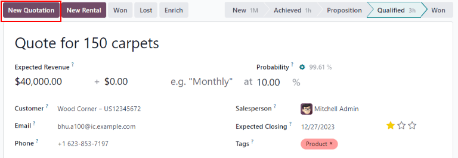
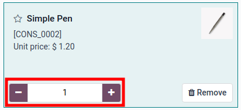

# Create and send quotations

Once a qualified lead has been converted into an opportunity, the next step is to create and deliver
a quotation. This process can be easily handled through Odoo's *CRM* application.

## Create a new quotation

To create a new quotation, open the CRM app, revealing the Pipeline
page on the main *CRM* dashboard.

From here, click on any opportunity to open it. Review the existing information and update any
fields, if necessary.

#### NOTE
If a quotation has already been created for this opportunity, it can be found by clicking on the
Quotations smart button at the top of the top of the form. The number of existing
quotations is listed on the smart button, as well.

At the top-left of the form, click the New Quotation button.

#### IMPORTANT
The **Sales** application **must** be installed for the New Quotation button to
appear.

#### IMPORTANT
The Customer field is **not** required on the opportunity form.

However, customer information must be added or linked before a quotation can be sent. If the
Customer field is left blank on the opportunity, clicking the New
Quotation button opens a pop-up window with the following options:

- Create a new customer: creates a new customer record, using any available
  information provided on the opportunity form.
- Link to an existing customer: opens a drop-down field with existing customer names.
  Select a name to link this new quotation to an existing customer record.
- Do not link to a customer: the quotation will **not** be linked to a customer, and
  no changes are made to the customer information.

Once this button is clicked, a new quotation form appears. Confirm the information in the top half
of the form, and update any missing or incorrect fields:

- Customer: the company or contact for whom this quotation was created.
- Referrer: if this customer was referred by another customer or contact, select it from
  the drop-down menu in this field.
- Invoice Address: physical address where the invoice should be sent.
- Delivery Address: physical address where any products should be delivered.
- Quotation Template: if applicable, select a pre-configured [quotation template](../../sales/send_quotations/quote_template.md) from this field.
- Expiration: date when this quotation is no longer valid.
- Quotation Date: creation date of draft/sent orders, confirmation date of confirmed
  orders. Note that this field is only visible if [Developer mode (debug mode)](../../../general/developer_mode.md) is active.
- Recurring Plan: if this quotation is for a recurring product or subscription, select
  the recurring plan configuration to be used.
- Pricelist: select a pricelist to be applied to this order.
- Payment Terms: select any applicable payment terms for this quotation.

### Chi tiết đơn hàng

After updating the customer, payment, and deadline information on the new quotation, the
Order Lines tab can be updated with the appropriate product information.

To do that, click Add a product in the Order Lines tab.

Next, type the name of an item into the Product field to search through the product
catalog. Then, select a product from the drop-down menu, or create a new one by selecting
Create or Create and Edit.

After selecting a product, update the Quantity, if necessary. Confirm the information in
the remaining fields.

To remove a line from the quotation, click the <i class="fa fa-trash-o"></i> (trash can) icon.

To organize products into sections click Add a section and type a name for the section.
Then, click the <i class="oi oi-draggable"></i> (drag) icon to the left of the name and drag to
move the section to the appropriate location. Move each product using the same method to finish
organizing the quotation order lines.

#### Danh mục sản phẩm

To quickly add numerous products to the quotation, click the Catalog button to open the
product catalog.

All products in the database are listed as cards and can be sorted in the left panel by
Product Category and Attributes.

To add a product, click the <i class="fa fa-shopping-cart"></i> Add button on the product card.
Set the quantity of the item using the <i class="fa fa-plus"></i> (add) or <i class="fa fa-minus"></i>
(subtract) buttons, or type the quantity in the number field between the two buttons.
To remove an item, click the <i class="fa fa-trash"></i> Remove button on the product card.

Once all product quantities are set, click the Back to Quotation button to return to the
quotation. The items selected in the product catalog now appear in the Order Lines tab.

## Preview and send quotation

To see a preview of the quotation as the customer will see it, click the Preview button.
Doing so opens a preview in the Customer Portal.

After reviewing the customer preview, click Return to edit mode to return to the
quotation form in the backend.

When the quotation is ready to deliver to the customer, click the Send by Email button.

Doing so opens a pop-up window with a pre-configured email message. Information from the quotation,
including the contact information, total cost, and quotation title are be imported from the
quotation.

A PDF of the quotation is added as an attachment to the email.

#### NOTE
A pre-loaded template is used to create the email message. To alter the template, click the
internal link to the right of the Load template field, located at the bottom of the
email pop-up window.

To select a new template, select an option from the Load template drop-down menu.

Proceed to make any necessary changes to the email, then click Send. A copy of the
message is added to the *Chatter* of the of the record.

After a quotation is sent, the originating opportunity's Quotations smart button updates
with a new count. This quotation, and all other quotations can be accessed through this smart
button at the top of the opportunity in the *CRM* app.

Any quotations attached to the opportunity that are confirmed, and have therefore been converted to
sales orders, will be deducted from the number listed on the Quotations smart button.
Instead, the value of the sales order will appear in the Orders smart button located in
the same control panel.

## Mark an opportunity won or lost

In order to keep the pipeline up to date and accurate, opportunities need to be identified as *won*
or *lost* once a customer has responded to a quotation.

To mark an opportunity as *won* or *lost*, return to the opportunity using the breadcrumbs at the
top-left of the quotation form. Or navigate to CRM app ‣ Sales ‣ My Pipeline
and click on the correct opportunity to open it.

At the top-left of the form, click on either the Won or Lost button.

If the opportunity is marked *won*, a green Won banner is added to the record, and it is
moved to the Won stage.

Marking an opportunity as *lost*, via the Lost button opens a Mark Lost
pop-up window, where a Lost Reason can be entered.

From the Lost Reason drop-down field, choose an existing lost reason. If no applicable
reason is available, create a new one by entering it into the Lost Reason field, and
clicking Create.

Additional notes and comments can be added in the Closing Note field.

When all the desired information has been entered in the Mark Lost pop-up window, click
Mark as Lost.

Upon clicking Mark as Lost, the pop-up window disappears, and Odoo returns to the
opportunity form, where a new red Lost banner is now present in the upper-right corner
of the opportunity.

Once an opportunity is marked as *lost*, it is no longer considered active, and it is removed from
the pipeline.

In order to view a *lost* opportunity from the pipeline, click the down arrow icon to
the right of the search bar, and select either Lost or Archived from the
drop-down menu that appears.

#### IMPORTANT
While opportunities that have been marked as *lost* are considered *Archived*, be advised that,
in order for an opportunity to be included as *lost* in reporting, it **must** be specifically
marked as *lost*, not *Archived*.
