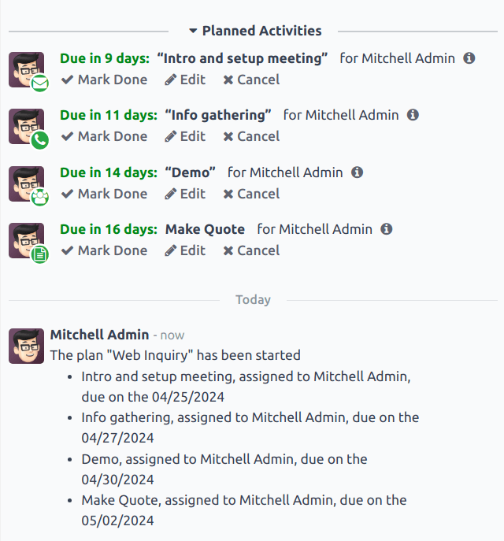

# Utilize activities for sales teams

*Activities* are follow-up tasks tied to a record in an *Odoo* database. Activities can be scheduled
on any page of the database that contains a chatter thread, Kanban view, list view, or activities
view of an application.

## Loại hoạt động

A set of preconfigured activity types is available in the *CRM* app. To view the list of available
activity types, navigate to the CRM app ‣ Configuration ‣ Activity Types.

#### NOTE
Additional activity types are available within the database, and can be utilized through
different applications. To access the complete list of activity types, go to the
Settings app, then scroll to the Discuss section, and click
Activity Types.

The preconfigured activity types for the *CRM* app are as follows:

> - Email: adds a reminder to the chatter that prompts the salesperson to send an email.
> - Call: opens a calendar link where the salesperson can schedule time to call the
>   contact.
> - Meeting: opens a calendar link where the salesperson can schedule time to have a
>   meeting with the contact.
> - To Do: adds a general reminder task to the chatter.
> - Upload Document: adds a link on the activity where an external document can be
>   uploaded. Note that the *Documents* app is **not** required to utilize this activity type.

#### NOTE
If other applications are installed, such as *Sales* or *Accounting*, other activity types are
made available in the *CRM* app.

### Create a new activity type

To create a new activity type, click New at the top-left of the page to open a blank
form.

At the top of the form, start by choosing a Name for the new activity type.

#### Cài đặt hoạt động

##### Tác vụ

Trường *Tác vụ* xác định mục đích của hoạt động. Một số tác vụ kích hoạt các hành vi cụ thể sau khi một hoạt động được lên lịch.

- Nếu chọn Tải tài liệu lên, liên kết để tải tài liệu lên sẽ được thêm trực tiếp vào hoạt động theo kế hoạch trong cửa sổ trò chuyện.
- Nếu chọn Cuộc gọi điện thoại hoặc Cuộc họp, người dùng sẽ có tùy chọn mở lịch để lên lịch thời gian cho hoạt động này.
- Nếu chọn Yêu cầu chữ ký, một liên kết sẽ được thêm vào hoạt động theo kế hoạch trong cửa sổ trò chuyện để mở ra một cửa sổ bật lên yêu cầu chữ ký.

#### NOTE
Các tác vụ có thể chọn cho một loại hoạt động sẽ khác nhau, tùy vào ứng dụng hiện được cài đặt trong cơ sở dữ liệu.

##### Người dùng mặc định

Để tự động phân công hoạt động này cho một người dùng cụ thể khi loại hoạt động này được lên lịch, hãy chọn tên từ menu thả xuống Người dùng mặc định. Nếu trường này được để trống, thì hoạt động sẽ được phân công cho người dùng tạo hoạt động đó.

##### Tóm tắt mặc định

Để thêm ghi chú bất cứ khi nào loại hoạt động này được tạo, hãy nhập chúng vào trường Tóm tắt mặc định.

#### NOTE
Thông tin trong các trường Người dùng mặc định và Tóm tắt mặc định có sẵn khi một hoạt động được tạo. Tuy nhiên, bạn có thể thay đổi chúng trước khi lên lịch hoặc lưu hoạt động.

#### Hoạt động tiếp theo

To automatically suggest, or trigger, a new activity after an activity has been marked complete, the
Chaining Type must be set.

##### Suggest next activity

In the Chaining Type field, select Suggest Next Activity. Upon doing so, the
field underneath changes to: Suggest. Click the Suggest field drop-down menu
to select any activities to recommend as follow-up tasks to this activity type.

In the Schedule field, choose a default deadline for these activities. To do so,
configure a desired number of Days, Weeks, or Months. Then,
decide if it should occur after completion date or after previous activity
deadline.

This Schedule field information can be altered before the activity is scheduled.

When all configurations are complete, click Save.

#### NOTE
If an activity has the Chaining Type set to Suggest Next Activity, and
has activities listed in the Suggest field, users are presented with recommendations
for activities as next steps.

##### Trigger next activity

Setting the Chaining Type to Trigger Next Activity immediately launches the
next activity once the previous one is completed.

If Trigger Next Activity is selected in the Chaining Type field, the field
beneath changes to: Trigger. From the Trigger field drop-down menu, select
the activity that should be launched once this activity is completed.

In the Schedule field, choose a default deadline for these activities. To do so,
configure a desired number of Days, Weeks, or Months. Then,
decide if it should occur after completion date or after previous activity
deadline.

This Schedule field information can be altered before the activity is scheduled.

When all configurations are complete, click Save.

#### NOTE
When an activity has the Chaining Type set to Trigger Next Activity,
marking the activity as *Done* immediately launches the next activity listed in the
Trigger field.

## Theo dõi hoạt động

To keep the pipeline up to date with the most accurate view of the status of activities, as soon as
a lead is interacted with, the associated activity should be marked as *Done*. This ensures the next
activity can be scheduled as needed. It also prevents the pipeline from becoming cluttered with
past due activities.

The pipeline is most effective when it is kept up-to-date and accurate to the interactions it is
tracking.

## Kế hoạch hoạt động

*Activity plans* are preconfigured sequences of activities. When an activity plan is launched, every
activity in the sequence is scheduled automatically.

To create a new plan, navigate to CRM app ‣ Configuration ‣ Activity Plan.
Click New at the top-left of the page to open a blank Lead Plans form.

Enter a name for the new plan in the Plan Name field. On the Activities to
Create tab, click Add a line to add a new activity.

Select an Activity Type from the drop-down menu. Click Search More to see a
complete list of available activity types, or to create a [new one](#crm-create-new-activity-type).

Next, in the Summary field, enter any details to describe the specifics of the activity,
including instructions for the salesperson or information due upon the completion of the activity.
The contents of this field are included with the scheduled activity, and can be edited later.

In the Assignment field, select one of the following options:

> - Ask at launch: activities are assigned to a user when the plan is scheduled.
> - Default user: activities are always assigned to a specific user.

If Default user is selected in the Assignment field, choose a user in the
Assigned to field.

Next, configure the timeline for the activity. Activities can be scheduled to occur either before
the plan date or after. Use the Interval and Units fields to set the
deadline for this activity. Lastly, in the Trigger field, select whether the activity
should occur before or after the plan date.

Repeat these steps for each activity included in the plan.

### Launch an activity plan

To launch an activity plan on a *CRM* opportunity, navigate to CRM app and click on
the Kanban card of an opportunity to open it.

At the top-right of the chatter, click Activities to open the Schedule
Activity pop-up window.

In the Plan field, select the desired activity plan to launch. This generates a
Plan summary, listing out the activities included in the plan. Select a Plan
Date using the calendar popover. This updates the Plan summary with deadlines based on
the intervals configured on the [activity plan](#crm-activity-plans).

Select a user in the Assigned To field. This user is assigned to any of the activities
on the plan were configured with Ask at launch in the Assignment field.

Click Schedule.

The details of the plan are added to the chatter, in addition to each of the activities.

#### SEE ALSO
- [Hoạt động](applications/essentials/activities.md)
