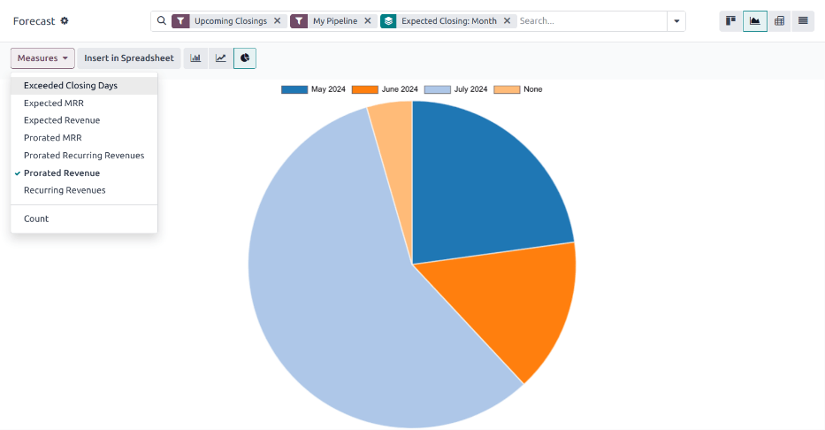

# Báo cáo dự báo

The *Forecast* report in the *CRM* app allows users to view upcoming opportunities and build a
forecast of potential sales. Opportunities are grouped by the month of their expected closing date,
and can be dragged-and-dropped to adjust the deadline.

To access the *Forecast* report, navigate to CRM app ‣ Reporting ‣ Forecast.

## Navigate the forecast report

The default Forecast report includes opportunities assigned to the current user's
pipeline, and are expected to close within four months. It also shows opportunities without an
assigned expected closing date. The opportunities are grouped by month in a <i class="oi oi-view-kanban"></i>
(Kanban) view.

### Expected closing date

Opportunities are grouped by the date assigned in the *Expected Closing* field on an opportunity
form. To change this date directly from the Forecast page, select the Kanban card for
the desired opportunity, then click and drag the card to the desired column.

#### NOTE
Khung thời gian mặc định cho dự báo là *tháng*. Có thể thay đổi khung thời gian này bằng cách nhấp vào biểu tượng <i class="fa fa-caret-down"></i> (down) icon bên cạnh thanh Tìm kiếm... ở đầu báo cáo. Trong menu thả xuống xuất hiện, dưới mục Nhóm theo, nhấp vào Ngày kết thúc dự kiến để mở rộng danh sách các tùy chọn có sẵn, rồi chọn khoảng thời gian mong muốn từ danh sách.

After an opportunity is added to a new month, the *Expected Closing* field on the opportunity form
is updated to the *last* date of the new month.

### Doanh thu theo tỷ lệ

At the top of the column for each month on the Forecast reporting page, to the right of
the progress bar, is a sum of the prorated revenue for that time frame.

The prorated revenue is calculated using the formula below:

$$
\text{Expected Revenue} \times \text{Probability} = \text{Prorated Revenue}
$$

As opportunities are moved from one column to another, the column's revenue is automatically updated
to reflect the change.

#### SEE ALSO
For more information on how probability is assigned to opportunities, see
[Assign leads with predictive lead scoring](../track_leads/lead_scoring.md)

## Xem kết quả

Click the <i class="fa fa-area-chart"></i> (area chart) icon to change to graph view. Then, click
the corresponding icon at the top of the report to switch to a <i class="fa fa-bar-chart"></i> (bar
chart), <i class="fa fa-line-chart"></i> (line chart), or <i class="fa fa-pie-chart"></i> (pie
chart).

Click the <i class="oi oi-view-pivot"></i> (pivot) icon to change to the pivot view, or the <i class="oi oi-view-list"></i> (list) icon to change to the list view.

#### SEE ALSO
To save this report as a *favorite*, see [Yêu thích](../../../essentials/search.md#search-favorites).
